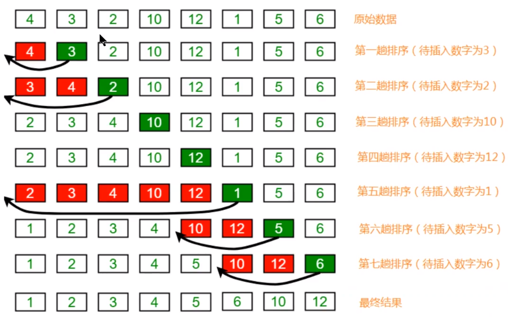

# 简单排序

根据某一项进行数据进行排序

基本实现方式：先书写API，然后在进行实现，将算法封装为API。

## Comparable接口介绍

我们一般的排序，是数据，但是更多的是对象，所以就需要知道comparable。

## 冒泡排序

> 思想：冒泡排序，比较N-1次然后将数据，前一个与后一个比较，将合适的数据放到合适的位置。

### 冒泡API设计

1.构造函数：Bubble():创建对象

2.成员方法：

```java
greater(Comparable v,Comparable w);
sort(Comparable[] a);
exch(Comparable[] a,int i,int j);
```

### 冒泡性能

> 讨论性能一般都是以最快的为准，在冒泡中也以逆序进行讨论。加入6，5，4，3，2，1。这是最坏的情况，他的最终结果是什么呢？？？

```java
//比较次数
(N-1)+(N-2)+(N-3)+……+1 = N^2/2 - N/2
//交换次数
(N-1)+(N-2)+(N-3)+……+1 = N^2/2 - N/2
```

所以最终的结果是：

```java
N^2/2 - N/2 + N^2/2 - N/2 = N^2 - N
一般的我们只取最高项，所以结果为N^2
```

### 附录：冒泡代码实现

```java
public class Bubble {
    /**
     * 对数组进行排序
     * @param a
     */
    public static void sort(Comparable[] a){
        //冒泡次数
        for (int i = a.length - 1; i > 0 ; i--) {
            //冒泡最大的索引
            for (int j = 0; j < i; j++) {
                //比较索引和索引j+1
                if (greater(a[j],a[j+1])){
                    exch(a,i,j);
                }
            }
        }
    }

    /**
     * 比较大的数据
     * @param v
     * @param w
     * @return
     */
    public static boolean greater(Comparable v,Comparable w){
        return v.compareTo(w)>0;
    }

    /**
     * 数据元素进行交换
     * @param a
     * @param i
     * @param j
     */
    private static void exch(Comparable[]a,int i,int j){
        Comparable temp ;
        temp = a[i];
        a[i] = a[j];
        a[j] = temp;
    }
}
```

## 选择排序

> 思想：简单说就是最小的值，次小的值，放到开始或者结尾。

### 选择API设计

1.构造函数：Select():创建对象

2.成员方法：

```java
greater(Comparable v,Comparable w);
sort(Comparable[] a);
exch(Comparable[] a,int i,int j);
```

### 选择排序性能分析

> 讨论性能一般都是以最快的为准，在冒泡中也以逆序进行讨论。加入6，5，4，3，2，1。这是最坏的情况，他的最终结果是什么呢？？？

```java
//比较次数
(N-1)+(N-2)+(N-3)+……+1 = N^2/2 - N/2
//交换次数
N-1
```

所以最终的结果是：

```java
N^2/2 - N/2 + N - 1 = N^2 - N/2 + N - 1 = N^2
一般的我们只取最高项，所以结果为N^2
```

### 附录：选择代码实现

```java
public class SelectSort extends SortAbstr {
    public static void sort(Comparable[] a){
        int min = 0;
        //最后一个数据了，就不需要在比较了，所以是length-1
        for (int i = 0; i < a.length-1; i++) {
            min = i;
            //第一次从1开始，下来是2……
            for (int j = 1+i; j < a.length; j++) {
                if (greater(a[min],a[j])){
                    min = j;
                }
            }
            //如果数据没有变化，就不要浪费资源了
            if (min !=i){
                exch(a,i,min);
            }
        }
    }
}
```

## 插入排序



> 实现思想：
>
> 将数组分为未排序部分和已排序部分，先从为排序部分拿出数据，和已经排序的部分进行比较。


### 插入排序API设计

1.构造函数：
2.成员方法：

```java
greater(Comparable v,Comparable w);
sort(Comparable[] a);
exch(Comparable[] a,int i,int j);
```

### 性能

> 讨论性能

```java
//比较次数
(N-1)+(N-2)+(N-3)+……+1 = N^2/2 - N/2
//交换次数
(N-1)+(N-2)+(N-3)+……+1 = N^2/2 - N/2
//一共的比较次数为
N^2 - N
```

所以最终的结果是：

```java
性能的计算结果
一般的我们只取最高项，所以结果为N^2
```

### 附录：选择排序代码实现

```java
public class InsertSort extends SortAbstr {
    public void sort(Comparable[] a){
        //确定数据的开始和结尾开始数据是1，结尾为数组的最后一个元素
        for (int i = 1; i < a.length; i++) {
            //内循环，从最大的位置向最小的位置进行遍历
            for (int j = i; j >0 ; j--) {
                if (greater(a[j],a[j-1])){
                    exch(a,j,j-1);
                }else {
                    break;
                }
            }
        }
    }
}
```

## 总结

根据以上方式进行的创建，在时间复杂度都为N^2.如果数据非常大就不再实用。