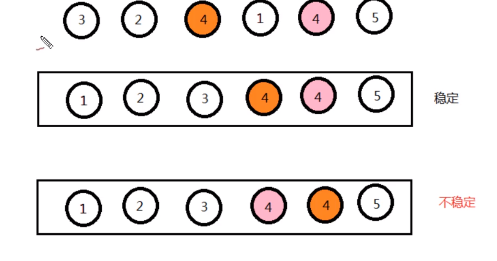

# 复杂排序

高级排序为了减少简单排序的问题，所以现在使用高级排序。

## shell排序

他是插入排序的扩展，插入排序每次只会移动一位，shell排序，可以将其一次移动多位。


希尔排序，每次不是与前一个比较，而是与前三个比较。

原理：将数据进行分组，对分组之后的数据进行排序。

选定一个增长量h，按照增长量h作为数据分组的依据，对数据进行分组。

减少增长量，最小减为1，重复即可 。


```java
int h=1;
while(h<数组的长度/2){
    h=2h+1;
}

减小规则 h=h/2;
```

### 性能分析

shell排序事前分析比较麻烦，并且涉及许多数学知识，所以通过事后分析的方式进行分析。

### 代码实现

```java

public class ShellSort extends SortAbstr {
    public static void sort(Comparable[] comparable){
        //求出h
        int h = 1;
        while (h<comparable.length/2){
            h = h*2+1;
        }

        while (h >= 1) {
            for (int i = h; i < comparable.length; i++) {
                for (int j = i; j > 0; j -= h) {
                    if (greater(comparable[j], comparable[j - 1])) {
                        exch(comparable, j, j - 1);
                    } else {
                        break;
                    }
                }
            }
            h /=2;
        }
    }

    public static void main(String[] args) {
//        Integer integer[] = {2,4,2,5,3,7,8};
//        sort(integer);
//        System.out.printf("integer arr"+ Arrays.toString(integer));
        int n = 100000;
        Integer[] arr = new Integer[n];
        for (int i = 0; i < n; i++) {
            arr[i] = n-i;
        }
        Long start = System.currentTimeMillis();
        sort(arr);
        System.out.println("end"+(System.currentTimeMillis() - start));
    }
}

```


## 归并排序

### 递归

在方法内部调用方法本身就叫递归。递归的层级不需要太深，如果太深就会出现栈溢出。


### 思想

归并排序就是对数据先进行分组，分的组在合成一个组，创建一个数组作为辅助数组，


## 稳定性

加入A元素和B元素是相等的，那么A元素和B元素交换了位置，就是不稳定的，如果没有交换位置就是稳定的。



如果只需要一次排序，那么就不需要考虑稳定性，如果是多次排序就需要考虑这个问题。

