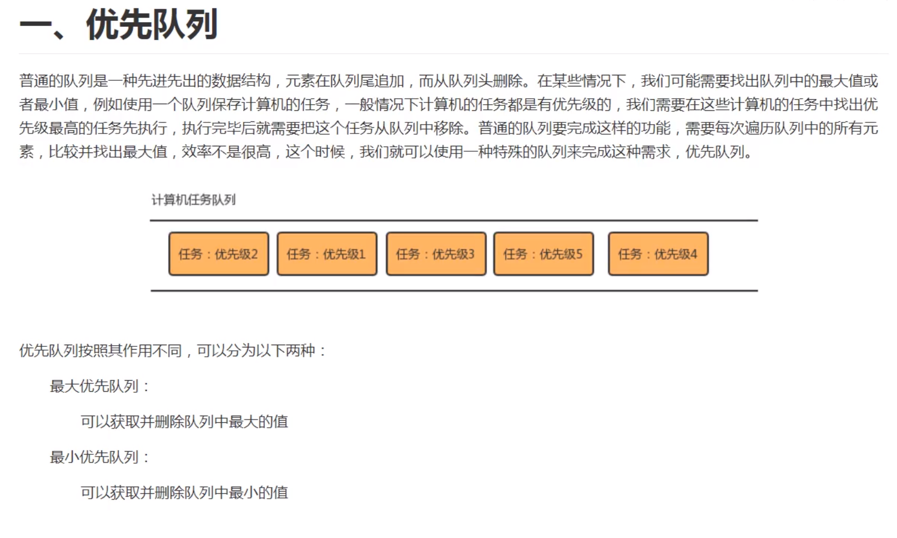

# 优先队列

## 优先队列和一般的区别？

优先队列可以不按照存储的顺序进行获取。应用场景比如优先级高的线程先执行。一般的就无法满足。

2-3结点，需要满足两个条件：2-结点（包含有一个键两个键）3-结点（包含两个键三个结点）

查找和二叉树一样，比当前结点小，走左边，大，走右边；遇到3-结点，大于小键走左边，大于大键走右边，居于中间走中间。

插入，2-结点中一个结点中右2个键，三个分支，如果插入元素大于2个，那么就进行分割。

2-3树，它会在每次插入元素之后，树依然保持平衡状态，树的高度是lgN，它可以在某些情况下降低树的高度。 

红黑树使用的思想就是2-结点，对这样的树进行编码，红黑树的对应关系，红树对应的是2-结点中的键，黑树队对应的是普通的键。所有的红节点在左边，黑结点在右边。

## 平衡

当删除或者是增加结点之后，红黑树就会破坏，可以使用左旋和右旋操作。

