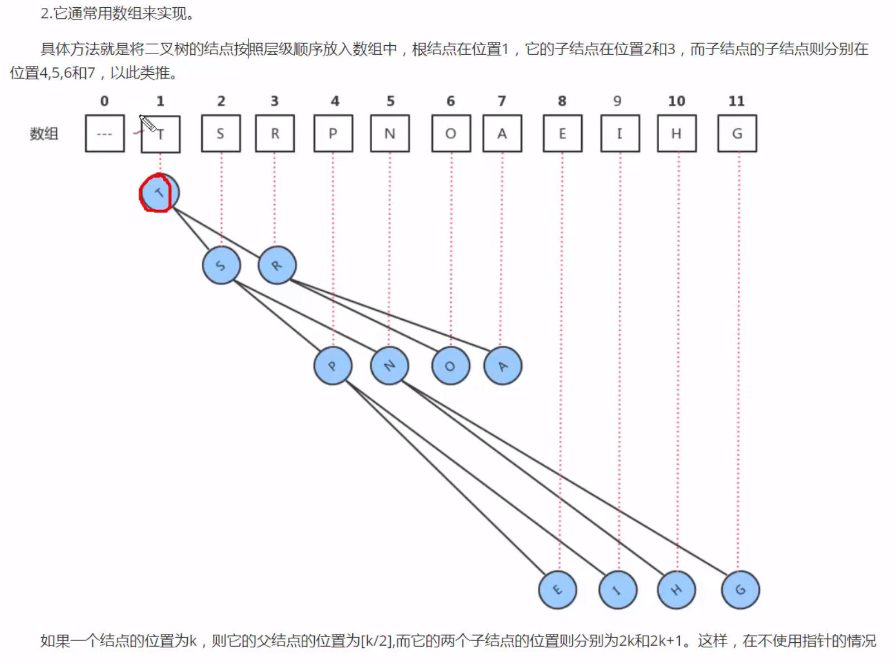
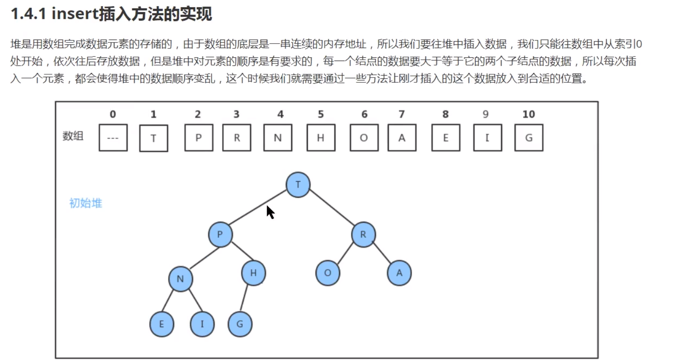
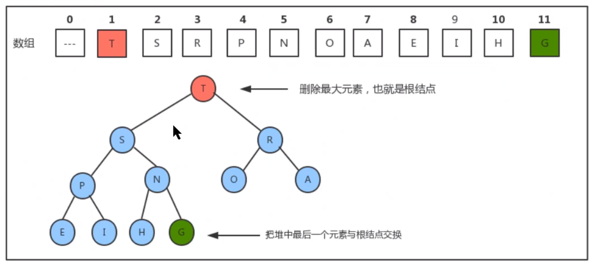
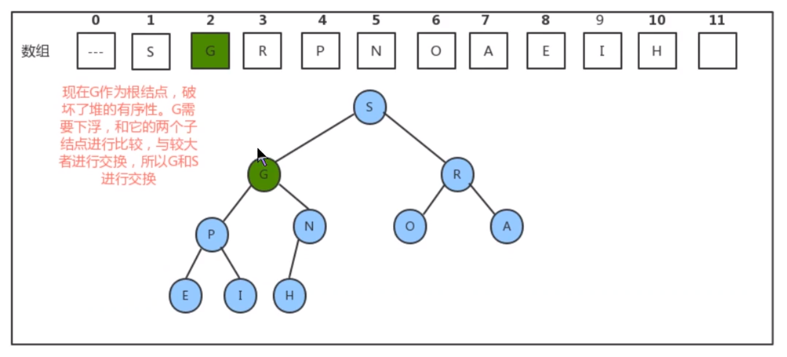
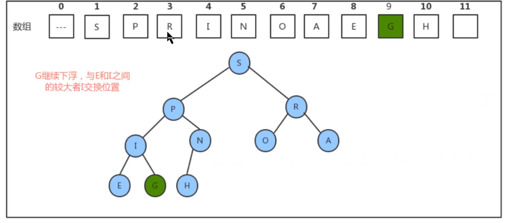
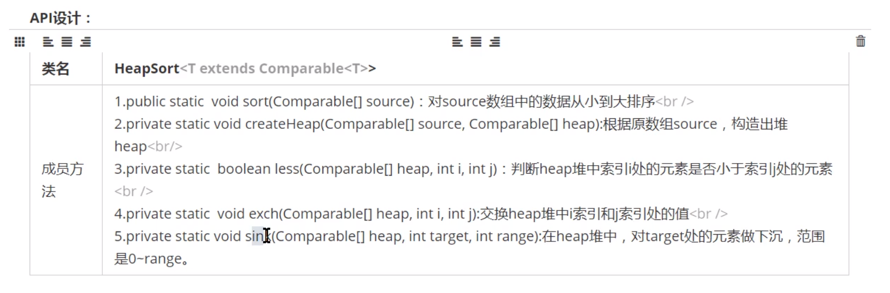

# 堆

堆是一种特殊的数据结构的统称，堆通常被看作是一棵完全二叉树。

## 堆的特性

1.完全二叉树 

2.使用数组来实现

3.左右子节点都小于父结点

## Api设计

swim和sink方法是的结点上浮和下沉，到达一个正确的位置。

## 堆的实现

### insert插入方法实现

现在是插入一个S，S插入在最后一个地方，但是现在不符合堆的特性，S和H进行比较，S>H，所以将它门进行交换，在将S和P进行比叫在进行交换（因为P原来的左右结点都是小于P的，所以子结点都小于P,即使结点上浮也不会有影响。）

上浮方法什么时候结束，一个一个结点进行比较，当条件达到1的时候就没有必要在比较了，如上图，s或者R和2运算结果为1，所以等于1就不需要在进行运算了，所以结束条件是while(h>1).

总结：数据的结点是一直的与父结点进行比较，如果大于父结点就进行交换。

### 删除元素的实现

 

1.如果要删除根节点，会最下方的一个结点与根结点进行交换，然后将最后一个结点进行删除。

2.将根节点的位置进行下沉

3.找出最大的哪一个，与根进行交换。 

4.接着找出G节点的两个子节点，然后找出一个大值，与它进行交换

5.重复上面的步骤。

## 堆排序

堆排序Api设计下“

堆排序，我们将数据复制到堆数组中，然后对堆进行调整。调整的步骤：

- 找出N/2处的结点
- 从N/2一直计算到1这个结点
- 如果大于子结点就交换，如果有子节点，那么就继续进行比较交换

