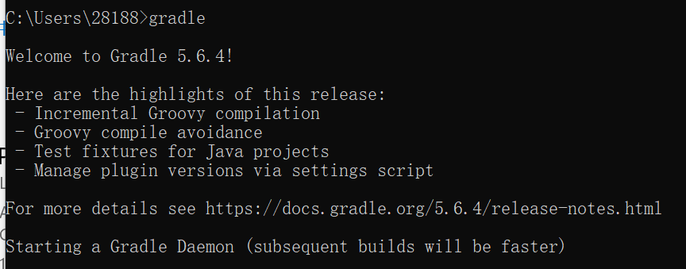

# gradle

gradle是一个构建系统系统工具，他的DSL基于Groovy实现， 可以很方便的进行系统的构建，它通过插件的方式进行构建，如果不能达到要求，也可以自己构建插件。
执行的时候会默认的加载build.gradle，

## 配置环境

安装java  配置JAVA_HOME




## HelloWorld

```java
//创建一个任务，目标打印出helloworld

tasks.register('hello') {
    doLast {
        println 'Hello world!'
    }
}

task wang{
    doLast{
        println "旺哥"
    }
}

tasks.register('HelloWorld') {
    doLast {
        println 'Hello world!'
    }
}
```


## wrapper

如果下面的参数不指定，那么就使用默认的版本。

- 指定wrapper版本

```java
gradle wrapper --gradle-version 2.4
```

- 指定下载gradle的位置

```java
gradle wrapper --gradle-distribution-url http://……
```

- 下来说文件，我们执行的时候，参数命令都会写入文件中

```java
distributionBase : 下载Gradle压缩包的存储目录
distributionPakth : 相对于base解压缩后的gradle目录
zipStoreBase : 存放zip
zipStorePath : 和path同目录，存放的是zip
distributionUrl : Gradle发行版压缩包的下载地址
```

**说点别的**

all和bin的区别?
> all是将所有的东西都下载了，比如说文档还有各类资源，源码。


使用脚本生成我们需要的gradle版本

```java
gradle wrapper
```


## 我们使用Task指定版本

我们在build中，我们生成的配置文件，是通过gradle生成的，那么我们可以通过任务的参数配置来配置它们。

```java
Task wrapper(type:Wrapper){
    gradleVerion = '2.4'
}
```


## 其他

它是对于gradle的一层包装，便于团队进行使用统一的版本构建，在开发过程中使用的都是这样的格式，而不是下载gradle的zip，wrapper在window下有一个批处理脚本，wrapper启动gradle进行一个检查，如果没有那么就从网址进行下载。

gradle提供了内置的wrapper帮助我们生成wrapper所需要的目录，在根目录输入gradle wrapper即可生成

- distributionBase:下载的Gradle压缩包解压后存储的目录


**补充：**all和bin的区别是，all包含了文档/示例等

```gradle
#Wed Jul 17 12:35:56 CST 2019
distributionBase=GRADLE_USER_HOME
distributionPath=wrapper/dists
zipStoreBase=GRADLE_USER_HOME
zipStorePath=wrapper/dists
distributionUrl=https\://services.gradle.org/distributions/gradle-4.6-bin.zip
=
```

这样可以构建任务，但是我们也可自己定义任务来达到指定版本的目的

```gradle
task wrapper(type:Wrapper){
    gradleVersion = '2.4'
}
```

## 日志

他们的日志也会分级别，我们只需要根据情况显示不同的级别即可。

- 日志级别
    - ERROR     
    - QUIET     重要
    - WARNING   警告
    - LIFECYCLE 进度
    - INFO      信息
    - DEBUG     调试

- 如何显示
    - gradle -e tasks
    - gradle -q tasks

### 输出堆栈信息

- 输出关键的堆栈信息 -s 
- 输出所有的堆栈信息 -S

**自己使用日志信息**

方式一：

println "日志信息"

方式二：

logger.quiet('xxx');


## Gradle命令行

**帮助：**

```gradle
./gradlew -?
./gradlew -h
```

**查看所有的任务：**

```gradle
:Tasks
```

**Gradle help任务**
