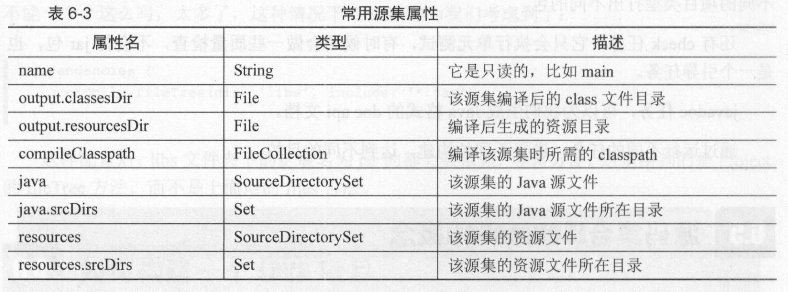
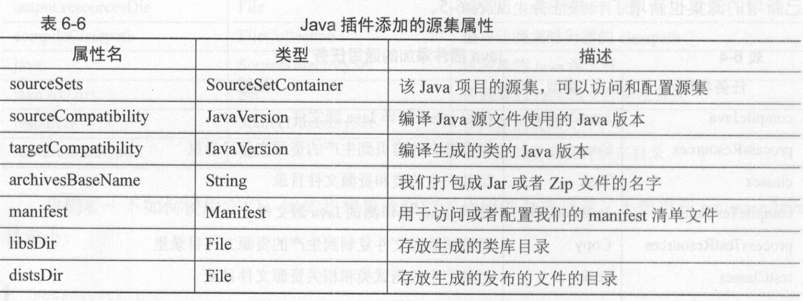

#  Java插件

java插件无非就是第三方依赖、设置仓库，源码位置、单元测试、打包。

使用方法：

```
apply plugin:'java'
```

java插件会进行一系列的默认配置，使用默认的好处就是不需要写很多自定义

## java插件的约定

目标结构

project

|-build.gradle

|- src

​		|-main

​		|	|-java

​		|    |-resouces

​		|- test

​		|	|-java

​		|	|-resoueces

默认的是这样，我们自己定义一个 

```java
apply plugin:'java'
sourceSets{
    vip{
        java{
            srcDir 'src/java'
        }
        rources{
            srcDir 'src/resouces'
        }
    }
}
```


## 配置第三方依赖

java配置第三方依赖，那么gradle如何操作呢 ？

- 配置仓库类型

  ```java
  repositories{
      mavenCentral()
  }
  ```

  配置了一个Maven中心仓库，或者是自己的私服

  ```
  repositories{
  	maven{
  		url 'http://www.maven.com'
  	}
  }
  ```

- 依赖 什么东西

  ```
  compile 依赖的名称
  
  ```

## 如何构建一个java项目

任何操作都是通过gradle驱动的，构建java项目也一样，java插件提供了很多任务，通过任务来构建项目。一般的我们执行`./gradlew build`最后生成一个jar。

任务还有：

- 编译 build
- 清楚 clean
- 编译打包 assemble

## 源码集合

是java管理资源和源码的概念，我们根据功能进行分组，比如test和main.

sourceSets属性和souurceSets闭包来完成配置。

```java'
apply plugin:'java'
sourceSets{
	main{
		//
	}
}
```




## 插件中的属性



## 多项目构建

多项目构建，多个gradle在一起构建，通过setting进行配置管理。每个项目都有build文件，通过它进行配置。可以在根目录中进行全局配置。


### 如何发布

基本就是通过配置将jar发布到本地目标、maven仓库中等。一个组件可以是一个jar/zip/war.

```java
apply plugin:'java'
    
task publishJar(type:jar)
artifacts{
    archives publishJar
}
```

还可以

```java
def publishFile = file('build/buildile')
```

配置之后就可以进行一个上传，将配置好的构建发布到指定目录、仓库等。

```java
apply plugin:'java'
task publishJar(type:jar)
version '1.0.0'
artifacts{
    archives publishJar
}

uploadArchives{
    repositories{
        flatDir{
            name 'libs'
            dirs "$projectDir/libs"
        }
    }
}
```


## idea和Eclipse

Gradle提供Idea和eclipse插件帮助我们生成不同配置，我们就可以使用不同的idea进行开发。


