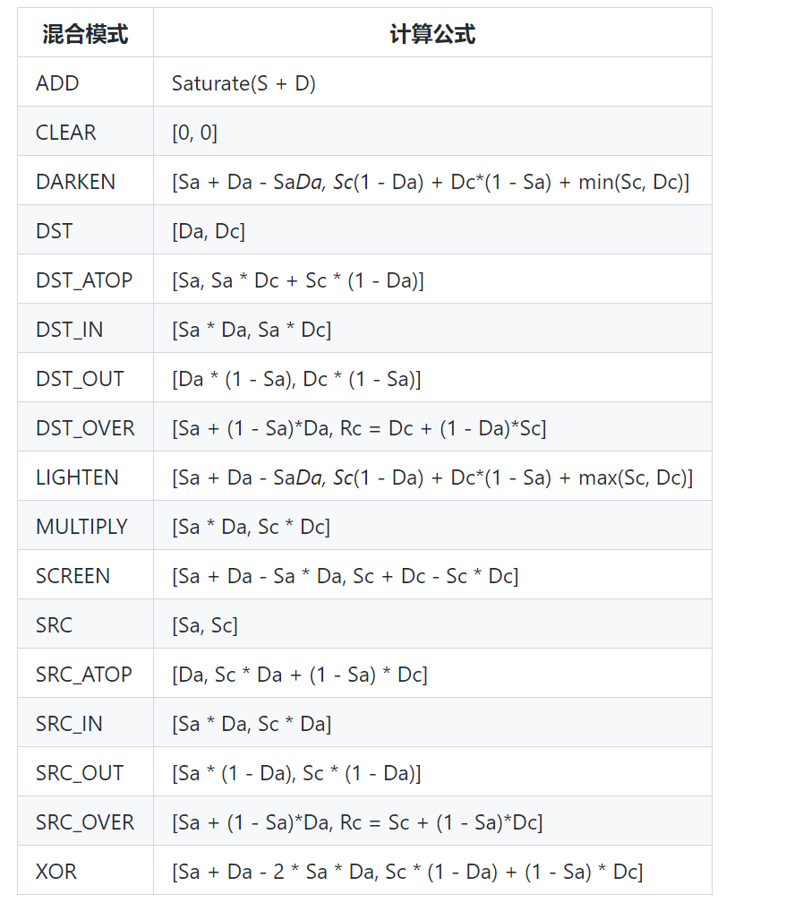
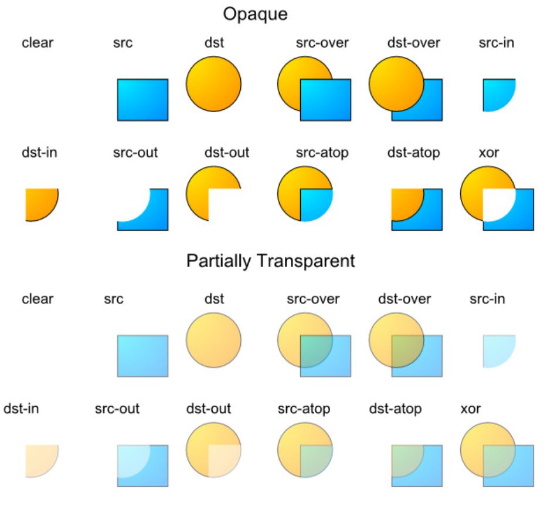

# Android中的颜色

支持的颜色 ：

- ARGB8888 （四通道高精度）
- ARGB4444   (四通道低精度)
- RGB565 （屏幕默认模式）
- Alpha8 仅有透明通道

字母表示那些通道，数值表示该类型多少位二进制类描述。一般的默认都是RGB555，我们有时候常用的是ARGB888或者ARGB444.

### 几种创建或者使用颜色的方式

1.java中定义颜色

```java
int color = GRAY;
```


## （重点)混合模式

颜色由通道，其中R表示透明度，显示屏没有办法透明，可以认为没有透明度。

混合模式的计算：

最终颜色 = 绘制颜色 + （1 - 绘制颜色透明的）* 原有的颜色。







