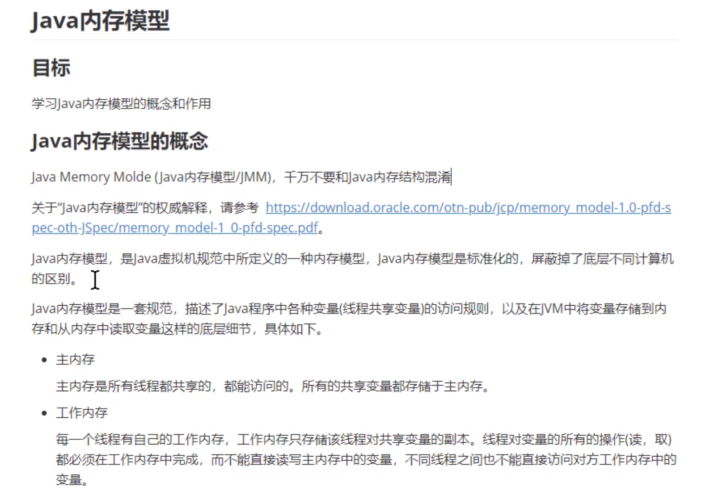

# synchronized

## 并发编程的三个问题

### 可见性

一个线程对共享数据进行修改，另一个会立即得到修改之后的值。

```java
/**
演示 可见性
*/
    public static boolean flag = true;

    public static void main(String[] args) throws InterruptedException {
        new Thread(()->{
            while (flag){
                
            }
        }).start();
        Thread.sleep(100);
        new Thread(()->{
            flag = false;
            System.out.println("修改值flag值！");
        }).start();
    }
```

两个线程，一个线程将变量值发生了改变，但是另一个线程无法 进行立即感知。

### 原子性

一次或者多次执行，都执行或者都不执行 。比如一个i++操作，将它里面的4步骤一次执行结束。

- 获取数据
- 生成常量
- 增加操作
- 将值赋值回去

```java
 Runnable incr = ()->{
            for (int i = 0; i < 100; i++) {
                //i++由多个步骤组成的
                // getstatic 
                //iconst_1
                //iadd
                //putstatic
                number++;            
            }
        };
        List<Thread> list = new ArrayList<>();
        for (int i = 0; i < 5; i++) {
            Thread t =  new Thread(incr);
            list.add(t);
        }

        for (Thread thread : list) {
            thread.join();
        }
```

一个线程在执行，没有保证两个线程都执行结束，出现问题。

### 有序性

有序性是指程序中代码的执行顺序，java在编译或者运行时会对代码进行优化，导致最终的执行顺序不是原来的编写顺序。

## java内存模型

先了解计算机的组成，并且学习缓存的作用。

### 计算机结构简介

冯诺依曼：计算机的5大组成部分

输入设备，输出设备，存储器，运算器，控制器

### CPU

计算机的核心，程序最终会变为指令让CPU去执行，处理程序中的数据。

### 内存

程序在内存中运行，并且存储运行时候的数据，提供给CPU处理。

### 缓存

CPU为处理内存和CPU速度之间的问题 ，会加一个缓存来保证自身运算速度的问题，会存在三级缓存。

## java内存模型




java内存模型的作用：是一套在多线程读写共享数据，对共享数据保证其可见性/有序性/原子性规则和保障的 。

（synchroized和volatile）


## 主内存与工作内存之间的交互


操作过程：将主内存中的共享变量加载到线程的内存中（副本），在线程中进行操作，结束之后将数据返回到主内存中。

### 实现步骤


（1）Read:读取共享变量

（2）Load:将共享变量加载大到内存中

（3）use:将值进行操作

（4）同步一下

（5）将值store保存

（6）写回内存

（7）如果执行了lock，会先将原来线程内存中的值清除掉

（8）unlock：会将值先返回到共享内存中。

## Synchronized的三大特性

synchronized保证在同一时刻最多只有一个线程执行该段代码，以达到保证并发安全的效果。

### synchronized与原子性

```java
synchronized(锁对象){

}
```

synchronized保证原子性的原理

syn一个线程拿到锁，其他的线程就无法在获取到锁，无法进入到同步代码块中。（必须是同一把锁）

### synchronized与可见性


原因：线程1先执行，获取到值为true，就开始不断的执行，然后线程2将变量值进行修改，然后返回到主内存，但是线程1依旧使用线程1内存里面的值。 

**解决办法：**使用volatile进行解决

线程2将数据返会到主内存之后，就会将其他线程中的值设置为失效

**解决方法二：**使用synchronized来解决

因为执行了lock就会刷新最新值

**解决方法三：**执行一条打印语句也会停止

因为打印语句中执行了synchronized，原因应该和前面的哪个一样。

### syn 与重排序

#### 为什么需要重排序

为例提高程序执行效率，编译器和CPU会对程序中代码进行重排序

#### as-if-serial语义

含义：不管编译器和CPU如何重排序，必须保证在单线程下程序的结果时正确的。

***不可以 重排序 的情况****

- 写后读

  ```java
  int a = 1;
  int b = a;
  ```

- 写后写

  ```java
  int a = 1;
  int b = a;
  ```

  

- 读后写

  ```java
  int a = 1;
  int b = a;
  int a = 2;
  ```

  **可以重排序**

  ```java
  int a = 1;
  int b = 2;
  int c = a 
  ```

#### syn如何保证重排序的


一句话很重要：重排序时在单线程下时正确的，本例中，syn两个块，都使用了同一个锁obj，所以只能一个一个线程执行，并不会出现重排序出现的问题。并不是重排序不存在，只是这个时候锁保证了重排序之后结果是正确的。


**方法二：**加上volatile


## synchronized特性

### 可重入

  #### 演示可重入

1.自定义一个线程类

2.在线程类的run方法中使用嵌套的同步代码块

3.使用两个线程来 执行


重入锁的含义：

一个锁1，使用锁1第一次进入代码块1，然后代码块1又存在一个锁，是代码块2，使用了同一把锁。


### 不可中断


### 演示synchronized不可中断

1.定义一个Runnable

2.在Runnable定义同步代码块

3.先开启一个线程来执行代码块，保证不退出代码块

4.后来一个线程执行同步代码块

5.停止第二个线程


即使执行了中断方法，但是代码也是不停止的。


### 演示lock的不可中断和可中断

lock.tryLock（time,单位）

这个是可以中断的锁，只会尝试time单位，然后就不进行执行。会返回一个Boolean值，表示获取到锁与否。


## synchronized原理的学习

### 反汇编


锁的位置：monitorenter和monitorexit,线程进来之后就会通过锁的对象与一个monitor关联，monitor存在owner（拥有锁的线程）和recursions（拥有线程的个数）。

一个线程执行之后到底synchronized这里就会判断是不是拥有自己，如果不是自己，就等待，

monitorexit：执行的时候之前一定存在一个monitorenter,并且执行了这一句会将计数器减去1.


异常表中，如果第6行出现异常，那么就会去执行16，然后就会执行一个monitorexit,也就是释放锁。


同步方法存在一个ACC_SYNCHRONIZED,它的作用是会隐式的调用方法monitorenter和调用moniterexit.]


对于syn无论是代码块也好，或者是syn方法也好，都是在代码块的开始和结束执行一次monitorentor和monitorexit.他存在两个成员变量：owner用来保存当前线程，使用recursions会保存线程获得锁的次数，计数器每次执行到exit就会将计数器减去1，直到减到0 ，然后他就释放了。

### 深入源码


## Jdk6 synchroized优化

### CAS概述和作用

CAS：比较相同在进行交换，现在CPU支持的方式对内存共享数据进行的操作的一种指令。

CAS的作用：CAS可以将比较和交换转为原子操作，直接由CPU保证，可以保证共享变量赋值时的原子操作。

依赖3个值：内存中的值V,旧的预估值X，要修改的新值B，如果旧预估值X等于内存值V，就将新值B保存到内存中。

### CAS原理

通过AtomicInteger源码查看unsafe类提供的原子操作

#### unsafe类介绍


- 获取unsafe
- 保证多线程可见性


执行过程：

1.先获取就的预估值var5.

2.比较内存值和预估值是不是相同

3.不相同为false,重新获取预估值

4，为true，就将预估值+1，得到新值。

## 乐观锁和悲观锁


悲观锁：总有刁民想害朕，每次都会将数据上锁，其他的都会堵塞，性能差。

乐观锁：其它不会来修改值，但是修改了也没啥关系，没有修改就更新，修改了就重新尝试。

## synchronized锁的变化过程


### java对象的布局

java对象布局：

在jvm中，对象在内存中的布局分为三个区域：对象头/实例数据和对其数据。


### 对其填充

- 对其填充不是必然的，但是也没有什么特别的意义，仅仅起着占位符的作用，因为Hotspot VM的自动内存管理要求起始地址是8字节的整数倍，对象的大小必须是8字节，如果是8字节，那么就对其了，如果不是就需要填充。

