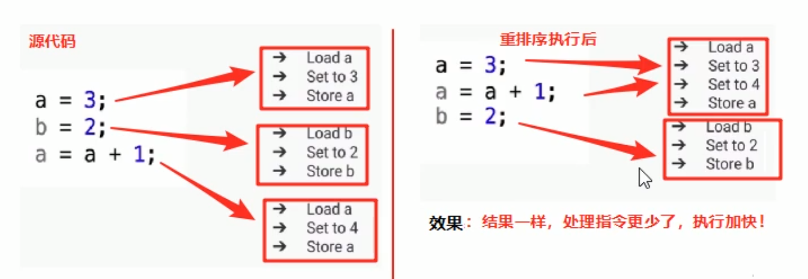
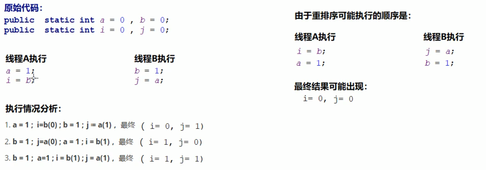
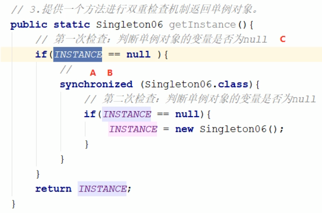
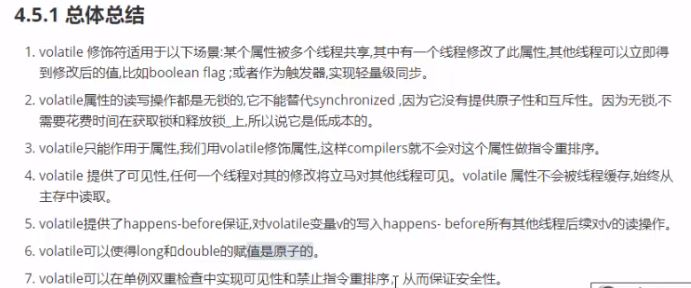

# volatile

这个部分主要通过以下方式进行，首先介绍volatile关键字的概述，根据内存来解释它的语义，以及不可见的内存语义，然后根据内存不可见的解决方法来提出自己的解决方案。

## 概述

多线程之下，多个线程修改共享的成员变量，会出现一个变量值发生变化了，另一个线程不能快速的看到该线程修改之后变量的最新值。

 ## 体验不可见

```java
package com.test;

public class Demo05 {
    public static void main(String[] args) {
        MyThread myThread = new MyThread();
        myThread.start();

        while (true){
            if (myThread.isFlag()){
                System.out.println("change flag!");
            }
        }
    }
}

class MyThread extends Thread{
    private boolean flag = false;
    @Override
    public void run() {
        try {
            Thread.sleep(1000);
        }catch (Exception e){

        }
        flag = true;
        System.out.println("set flag : " + true);
    }

    public boolean isFlag() {
        return flag;
    }

    public void setFlag(boolean flag) {
        this.flag = flag;
    }
}
```

正常分析，当线程修改完值之后，main就会顺利的执行，但是这里并没有，而是一直无法执行，说明了变量值发生变化了，但是并不可以立即感知到变化。

**分析:**

使用java虚拟机的内存面向来了解它的运行机制，JMM,不可以使用堆栈的简单方式来分析。

JMM描述了java程序的各种变量，以及jvm变量从读取，使用的一个过程。

## 共享的变量包括那些

- 实例变量，类变量，不会包括局部边框，局部变量不会包含在这一个部分里面。它是线程私有的。
- 线程的工作内存，保留者线程操作的副本变量
- 线程对数据的读写操作都必须在工作内存中完成，而不是直接的读写主内存的变量
- 不同线程之间也不可以访问对方的工作内存，如果需要变量的访问，需要通过主内存来进行转化。

## 变量不可见的解决方案

### 概述：

不可见的原因已经找到，一个线程修改的仅仅是自己的工作 内存，不会修改主内存，即使将值返回到主内存，也不一定可以解决问题，因为主内存的值，也不一定会被其他工作内存拿到。

解决方法：修改完成之后就使得其他的线程可知。

- synchronized本身就有这个功能，将数据读取，将数据写回主内存，通知其他内存的功能
- 使用volatile。

```java
package com.test;

import com.designpatten.obser.oberver.Oberver;

public class Demo05 {
    public static void main(String[] args) {
        MyThread myThread = new MyThread();
        myThread.start();

        while (true){
            synchronized (Demo05.class) {
                if (myThread.isFlag()){
                     System.out.println("change flag!");
                }
            }
//            if (myThread.isFlag()){
//                System.out.println("change flag!");
//            }
        }
    }
}

class MyThread extends Thread{
    private boolean flag = false;
    @Override
    public void run() {
        try {
            Thread.sleep(1000);
            flag = true;
        }catch (Exception e){

        }
        System.out.println("set flag : " + true);
    }

    public boolean isFlag() {
        return flag;
    }

    public void setFlag(boolean flag) {
        this.flag = flag;
    }
}
```

这个地方需要更改一个问题，synchronized仅仅只是在开始的时候lock，强制在内存中取数据，unlock的时候并不会使得其他的数据失效（之前好像在哪里看过说是失效的）

### volatile关键字可见性的原理

首先将数据加载到内存中，然后将值修改，立即的放回到主内存中，主内存通过总线机制来通知其他的线程，这个值已经发生了修改，使得其他现场的值失效。其他线程如果再次使用这个变量就会重新的从内存中取。

## Volatile不是原子操作

它只可以保证线程可以迅速的看到修改之后的值，并不会保证原子性。需要保证数据安全，还是需要使用锁。

**如何解决**：

- 使用锁机制
- 使用原子类

## Volatile禁止重排序

为了使得代码可以快速的执行，会对代码进行重排序，一般的会发生下面三个步骤：

- 编译器优化重排序：在不改变语义的情况下 ，进行重排序。
- 指令并行排序，在正确得到结果的情况下，会对代码重排序，然后进行并行处理。
- 内存的重排序




```java
重排序案例
package com.test;

public class Demo06 {
    private static int a = 0,b = 0;
    private static int i = 0,j =0;
    public static void main(String[] args) throws Exception{
       Thread t1 = new Thread(()->{
           a = 1;
           i = b;
       });
        Thread t2 = new Thread(()->{
            b = 1;
            j = a;
        });

        t1.start();
        t2.start();
        t1.join();
        t2.join();
    }
}

/**
 *
 * t1执行   a == 1;  b -> i   i =0 ;
 *         a == 1, b -> 1   j=1；
 * t2执行
 */
```

这个应该是不会出现重排序的问题，但是执行多次之后就会出现。i=0.j=0的现象。说明了虚拟机对指令进行了重排序。

**处理方法：**使用volatile修饰变量




## volatile内存语义

### volatile写读建立的happens-before关系

虚拟机为了加快执行速度，会对指令进行重排序，重拍之后就会出现这样和那样的问题。

jdk1.5开始，提出happen-before的概念，用来描述操作之间的内存可见性

### happen-before规则

### happen-before的案例

- happen-before B线程发生了修改会对A线程完全可见

  ```java
  a,b,c=0; 
  thread1{
      a=1;
      b=3;
      c=10;
  }
  thread2{
      sout(a+"  "+b+"  "+c);
  }
  
  如果给变量c加上volatile，如果thread2读取的时候发现c发生了变化，那么对之前的写操作都是可见。
      
  ```

  ## Volatile重排序小结

  1.volatile重排序规则

  - 写volatile变量时，无论前一个是什么，前面的都不可以重排序
  - 读volatile变量时，无论后面时什么，都不可以重排序
  - 先写volatile时，后续的变量都不可以重排序。 

  ## 高频面试题

  1.long和double的原子性

  它们都是64位的，如果在32位系统上，那么就会先读取高位在读取低位，分为两步执行

  0000 0000 0000 0000

  

  2.单例模式，使用双重锁检查，为什么还需要加上volatile关键字。

  创建一个对象的步骤：

  - 分配空间
  - 调用构造函数进行初始化。
  - 将地址返回给地址引用

  正常情况是这样的，没有问题

  

  **原因1：如果发生了重排序，c线程进来之后就会发现第一个不为null,那么就直接返回，这个时候仅仅返回了地址，但是并未进行实例化。会发生异常NPE异常。**

  **原因2：volatile保证线程之间的可见性，因为instace已经赋值之后，并不会保证就会立即的返回到主内存中所有实例还是null，就有可能再次的创建实例，然后结果出问题。**

  

  ## 扩展

  静态内部类实现一个类的初始化操作，在类初始化的时候，JVM会获取一个锁，这个锁可以同步多个线程对同一个类进行实例化。

  即使是多个线程，对类加载只加载一次，类初始化的方式进行加载

  缺点:使用的是静态的内部类，

  

  ## 使用场景

  - 适用于赋值的场景，而不会使用于原子操作的场景,在执行纯赋值的操作的时候是可以满足预期的。

  - 触发器：触发器就是在执行了某个操作之后会 使得前面的操作都会变为最新值，作为前面操作的一个触发器。
  - 

  ## synchronized和volatile

  - syn可以作为方法和代码块，volatile可以作为变量
  - syn可以保证原子性和可见性，可以保证线程安全。volatile只能保证可见性，并不会保证原子性
  - volatile可以保证代码不重新排序，双重锁检查中保证创建实例的安全性（NPE异常）。
  - volatile不可以保证原子性，它可以看做是syn的轻量版，没有原子操作的情况下，可以使用volatile代码syn

  

  

  

  


