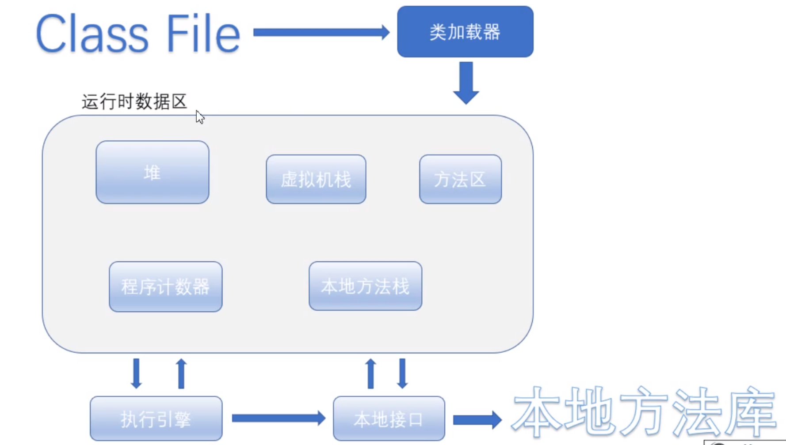
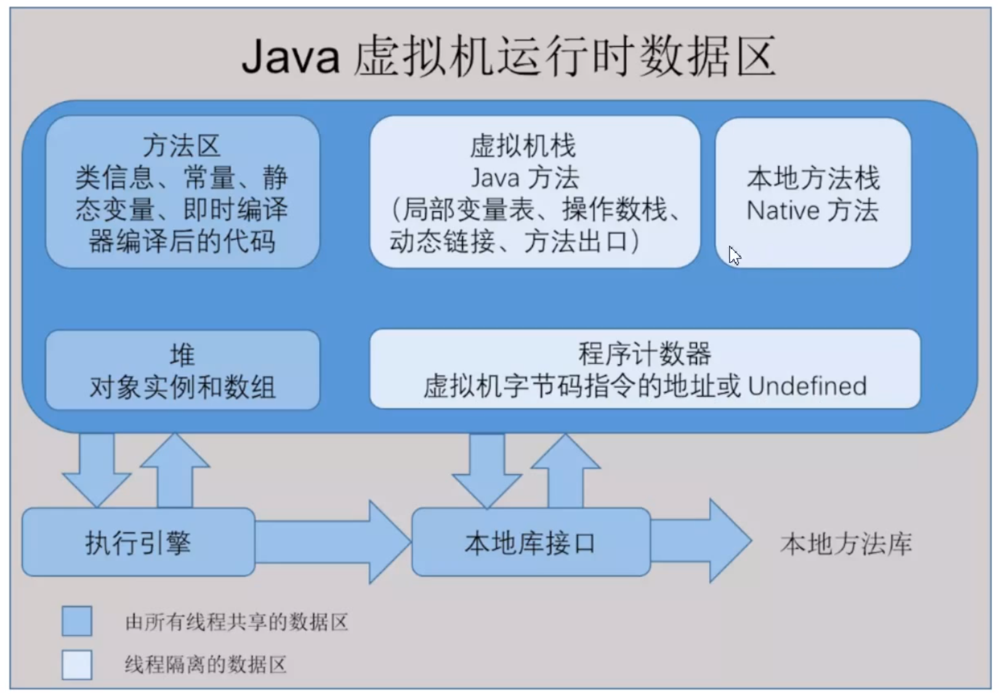
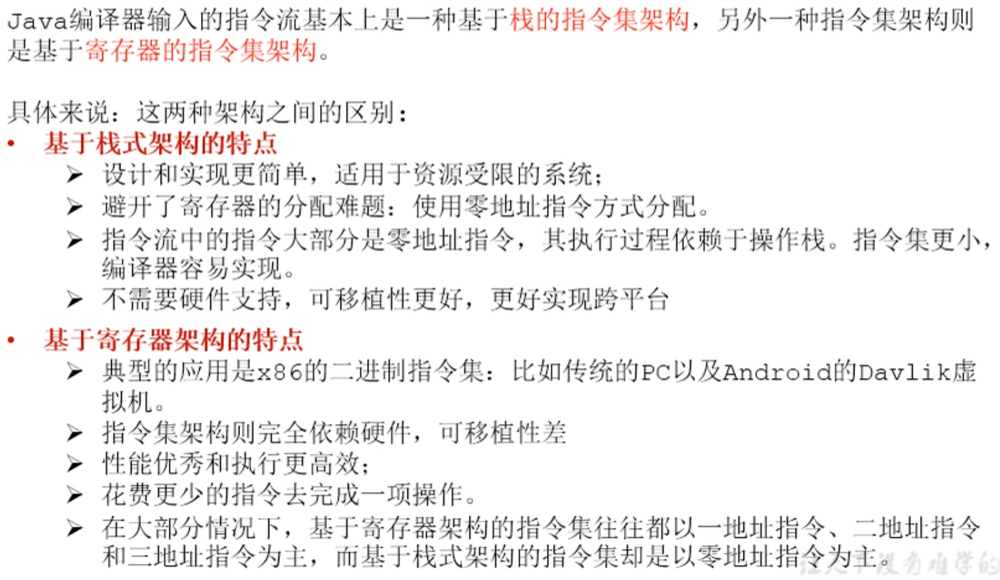
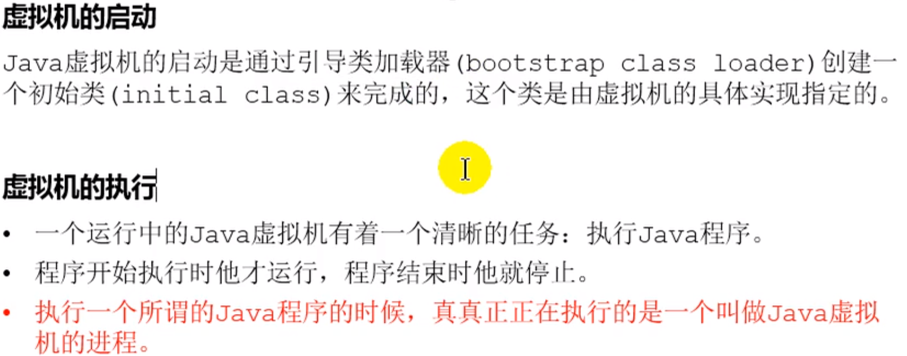
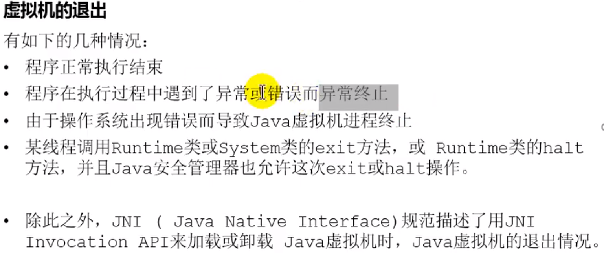

# jvm

## jvm的执行流程



class文件编译成字节码，通过类加载器进行加载，在运行数据区中进行分配空间等，执行时候需要一个执行引擎，调用本地接口。在本地库中将java变为操作系统可以执行的命令。




程序计数器指示程序执行的位置，程序计数器线程私有，并且不会发生内存溢出。

堆：存储数组和对象（new）会发生内存泄漏，是垃圾回收的主要部分。

虚拟机栈：入栈

```java
main(String[]args){
    int x1 = 2;
    int x2 =  3;
    int max = getMax(x1,x2);
    sout(max);
}

栈中先入栈main方法，然后入栈getMax()，输出结果，然后出栈。
```


本地方法栈：执行的是native方法，虚拟机栈是java方法，会发生内存溢出

方法区：

```java
static final 修饰的
    
String str1 = new String("xx");
String str2 = new String("XXX");
sout(str1 == str2); //false
sout(str1.intern() == str2.intern())//true
intern调用现在常量池中找，如果没有就放入一个
```

### 执行引擎

它是将字节码文件变为机器语言的。



解释：

- 只需要进行出栈和入栈操作。零地址的意思就是栈只会操作顶部的数据，并不会操作其他的数据，所有也不需要分配地址。不需要硬件支持是，在栈中，只需要u内存交互，不需要和硬件打交道。‘##

## 扩展

### 字节码文件

```java
int i = 2 + 3；//在编译的过程中就会变为5
    
 descriptor: ([Ljava/lang/String;)V
    flags: ACC_PUBLIC, ACC_STATIC
    Code:
      stack=1, locals=2, args_size=1
         0: iconst_5    //i值直接就是5
         1: istore_1
         2: return
      LineNumberTable:
        line 5: 0
        line 6: 2
      LocalVariableTable:
               
               
int a = 2;
int b = 3;
int c = a + b;
               
        10: iconst_2   第一个数
        11: istore_2   存储在2的位置
        12: iconst_3   第二个数
        13: istore_3   存储在3的位置
        14: iload_2    加载2
        15: iload_3    加载3
        16: iadd       加操作
        17: istore     4


```

### java虚拟机的生命周期

- 虚拟机的启动
- 虚拟机的执行
-  



