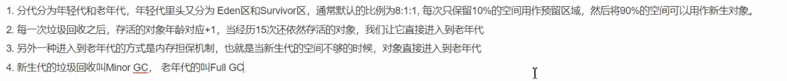

# 垃圾回收算法

## 判断对象已经死了

### 引用计数器

增加一个引用+1，减少一个引用-1，当为0的时候，就表示不在被任何对象所引用了。

### 可达性分析算法

明确：什么是GCroots？什么样的才可以看作是GCroots

- 栈中的引用
- 方法区的中的常量
- 方法区中的静态属性
- 本地方法栈中的引用对象

从GC roots开始走过的路径叫引用链。

## 引用

分为：强引用/软引用/弱引用/虚引用

强引用：类似于Object  o = new Object();垃圾就不会进行回收

软引用：描述一些有用但是非必须的，当内存将要发生溢出异常的时候就会进行二次回收，如果回收之后还不够，就会发生溢出异常

弱引用：无论内存够不够都会进行回收

虚引用：对于内存没有任何影响，仅仅是内存回收时候的接受一个通知。

垃圾回收首先判断对象是否已经死亡？？

GCroot：可以i作为GC root的是：

- 栈中的引用（当前使用的）
- 方法区的常量（一直存在的）
- 静态属性（生命周期最长的）
- 本地方法栈中的引用对象。(使用的)

引用分类：

- 强引用：new
- 软引用：空间不足的时候会将其回收掉，一般用在缓存
- 弱引用：二话不说直接回收,为gc之前是可以读取他们的
- 虚引用：管理直接内存

直接内存由JVM管理，不由gc管理，通常用于NIO 

堆可以直接的引用一块内存区域

判断对象已经死亡：

- 计数方法，每次有一种引用就+1，减去一个引用就减去1，但是jvm并没有使用这个方法。
- GC roots:在GC root上加链，可以作为
  - GC roots：
    - 栈上的有引用的
    - 常量方法区
    - 静态属性
    - 本地方法栈的引用
- 引用：
  - 强引用：new出来的对象
  - 软引用：空间不足就会被清除的
  - 弱引用：gc会将其 进行清除，但是没有清除之前是可以读取的
  - 虚引用：管理直接内存 堆内存执行直接内存的一块，仅仅是堆回收的一个通知
- BIO  AIO NIO

## 回收算法

### 标记清除

会造成大量的内存空间浪费

### 复制算法

将内存空间分为两个部分，需要回收的时候将一半的覅之

### 标记整理

### 分代回收

一共分为eden  /servivor(from   to)/ 老年期，Eden区中的数据回收的概率比较大，经常会被回收。老年区的一般是长期不会被回收的 。、

执行过程：年轻区域的数据，经过一段时间之后只剩下了少部分，然后将他们复制到幸存区域。对eden进行一次垃圾处理。从此之后，每次经过一次垃圾回收，就将他们的年龄增加1,

eden又需要一次垃圾回收，如果幸存区域也有一个要回收，那么将form复制到to，然后将from和eden都回收

再次进行的 时候将to复制到from.将eden和to的都清除掉。

eden : from ：to 8:1:1

幸存to如果如果满了 ，就需要进入到老年代，进入老年代的还有一个15次的。

如果新生代存放不下，就会进入到老年代，如果老年代放不下了，就会执行一次full GC（伴随来的还有一次stop the world）

年轻代的回收一般比较少，使用的是复制算法，但是老年代的存活率比较高，一般使用的是标记清理和标记整理

垃圾回收有四种算法：

- 标记整理：将不使用的进行标记，然后清除掉，会造成空间的浪费
- 标记整理：将不使用的进行标记，然后将其移动到一端
- 复制清除：将空间 分为两个部分，有用的放一边，没用的放一边
- 粉黛回收：eden  servivor to /from  8 : 1 : 1

大对象会进入到老年代中，对象的大小如果超过幸存区的一半，就会直接进入到老年代    如果说经历了15次仍然存活的就进入老年代，进入老年代的还有常量数据   静态属性

老年代发生的是full gc

