# 泛型

泛型的本质：参数化类型，也就是所操纵的数据类型被指定为一个参数。

## 泛型类

### 泛型的好处

- 可以在编译器进行检查（编译的时候检测到非法的数据类型）
- 可以自动进行类型转换

```java'
List<String> ls = new List<String>();
ls.add("XXX");
ls.add(2);     //报错


for(String s : ls){  //自动转换
	sout(s);
}
```


### 特性

- 在创建对象时候，来指定操作的具体数据类型

  ```java
  List<String> ls = new List<>();
  ```

  

- 泛型类在创建对象的时候，没有指定类型，默认使用的是Objecct

  ```java
  List list = new List();
  list.add("A");
  
  Object str = list.get(0);
  ```

  

- 同一个泛型类，根据不同的类型创建对象，它的本质是同一类型。

  ```java
  List<String> ls1 = new List<String>();
  List<Integer> ls2 = new List<Integer>();
  ```

  获取他们的字节码文件，字节码是相同的。

- 泛型只能是包装类型，不可以是基本数据类型。

  ```java
  List<String>
  People <String>
  int<Integer>  //error
  ```

  

## 泛型类/接口

### 泛型类

- 泛型类派生子类
  
  - 子类也是泛型类，子类和父类泛型要一样
  
    ```java
    class people<T>{}
    class student<T> extends people<T>{}
    ```
  
    
  
- 子类不是泛型类，父类要明确泛型的数据类型

  ```java
  class xiaoxuesheng extends people<String>{}
  
  ```

  

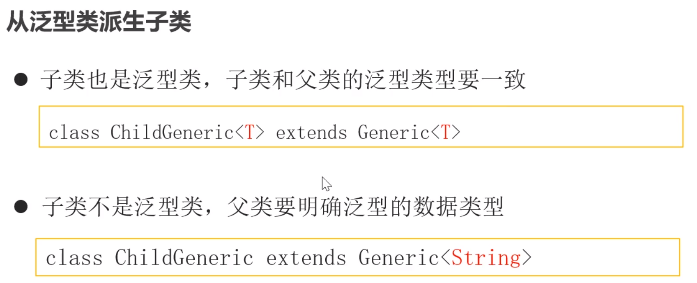

### 泛型接口

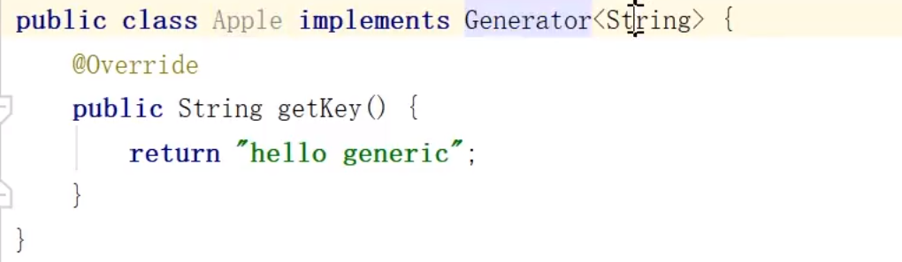

子类不是泛型类的时候，就需要自己来指定父类的泛型，否则就是Object

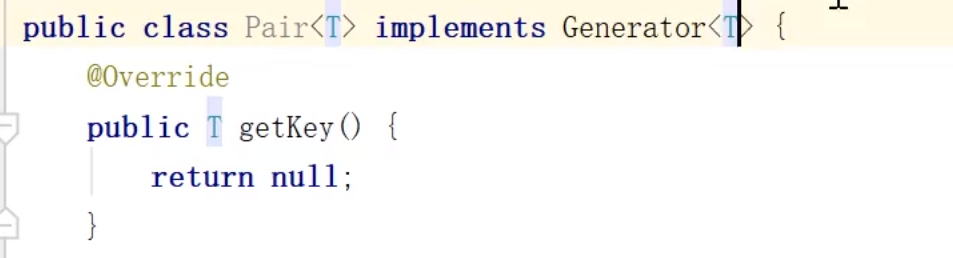

是泛型类的时候，子类和 父类需要相同。返回值类型和传入的类型一样。

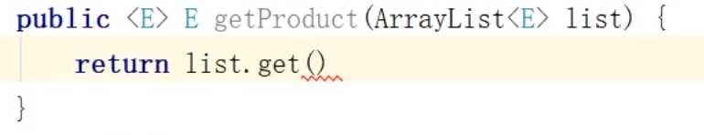 

泛型方法和泛型类是没有任何关系的

## 成员方法和泛型方法的区别

成员方法的类型是本来就确定的，泛型方法是和传入的值有关。成员方法不可以使用静态（是静态就不是成员方法，应该指的是类型从类获取来的方法），但是泛型方法可以是静态

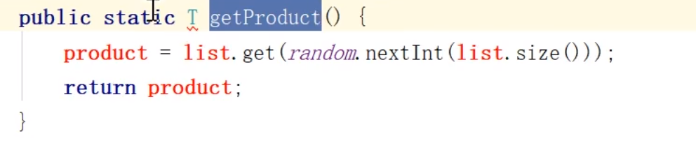

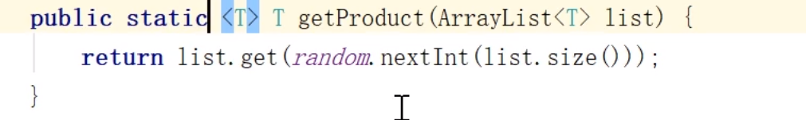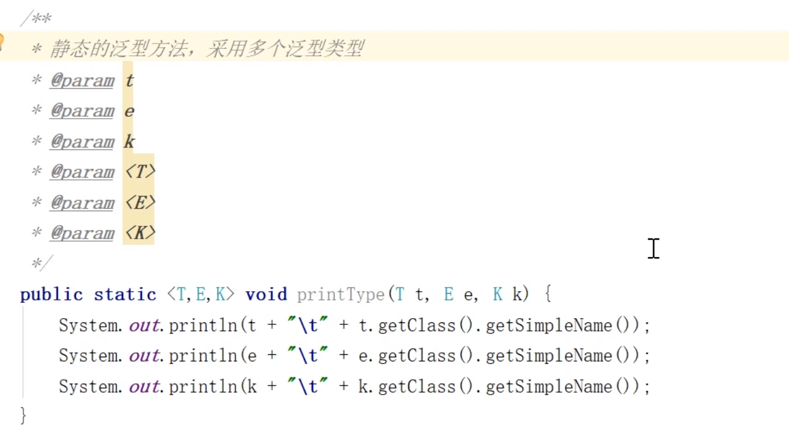

可变参数的泛型方法

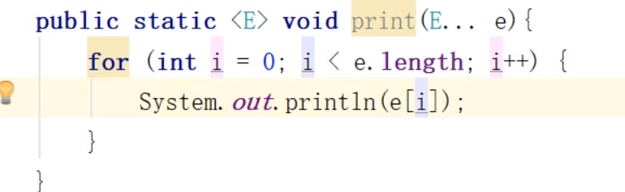

### 总结

泛型方法是独立于类存在的，并且它可以是静态的

## 类型通配符

类型通配符一般是使用一个问号。

泛型里的不可以理解为多态

eg:

```java
class Box<T>(){
    private int x ;
    set/get
}
main(){
    Box<Number> b = new Box<>();
    b.set(X);
    show(box);
    
 Box<Integer> b = new Box<>();
    b.set(X);
    show(box);//这里就会报错，原因是参数是Number，这里是Integer
}

public static void show(Box<Number> b){
    b.get();
}

//////////////////////////////////////
public static void show(Box<?> b){//?是实参，而不是形参
    Object o = b.get();//这里还是Object，所以还不如不传
}

```

类型通配符还可以指定上限

```java
public static void show(Box<? extends Number> box){
    //指定上限
}
```

可以传入的是它的子类。

下限:可以传入它的父类。

```java
class people{
    
} 
class student extends people{
    
}
class men extends people{
    
}

class Demo{
    main(){
        List<people> list1 = new ArrayList<people>();
        List<student> list2 = new ArrayList<student>();
        List<men> list3 = new ArrayList<men>();
        show(list1);
        show(list2);
        show(list3);//三个都可以
        
        
        show1(student);
        show1(people);//不可以
        
       
    }
    public void show(List<? extends people>){
		
    }
    //上限
    public void show1(List<? extends student>){
		
    }
    
    /**
    * 下限
    *  需要注意：它可以添加任何元素类型的
    */
    public void show2(List<? super student>){
		
    }
}

```

## 类型擦除

java1.5版本才引进的概念，，之前没有泛型，但是泛型可以和之前的代码兼容，泛型信息只存在于代码编译阶段，在进入到JVM之前，泛型类型相关的信息会被擦除

### 擦除类

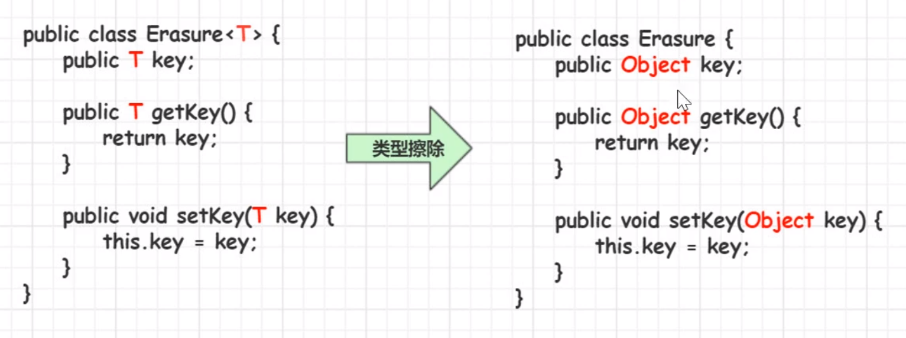

如果我们设置了上限，那么就会设置为我们设置的上限部分，

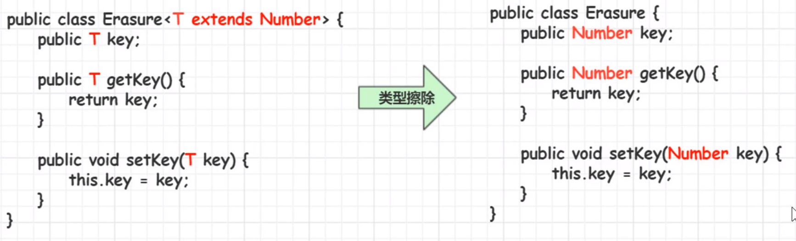

###  擦除方法上的泛型

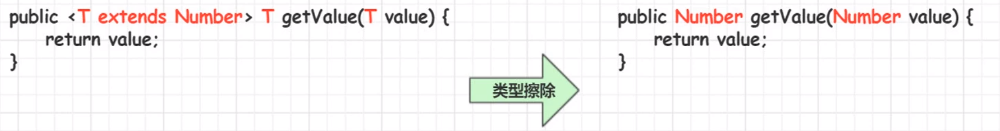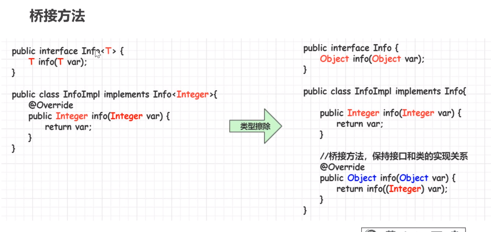

## 反射常用的泛型类

class<T>  constructor<T>

```java
class people{
    private int age;
    private String name;
}

class Demo{
    main(){
        
    }
}
```

## 泛型数组

可以创建泛型数组的引用，不可以创建泛型的实例。

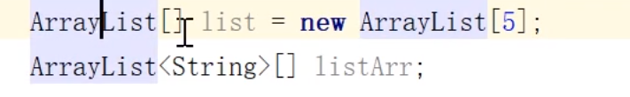

泛型的引用，不可以创建实例。 	

```java
T []t = new T[]; x
T [] t = (T[])new Object[100];

```

