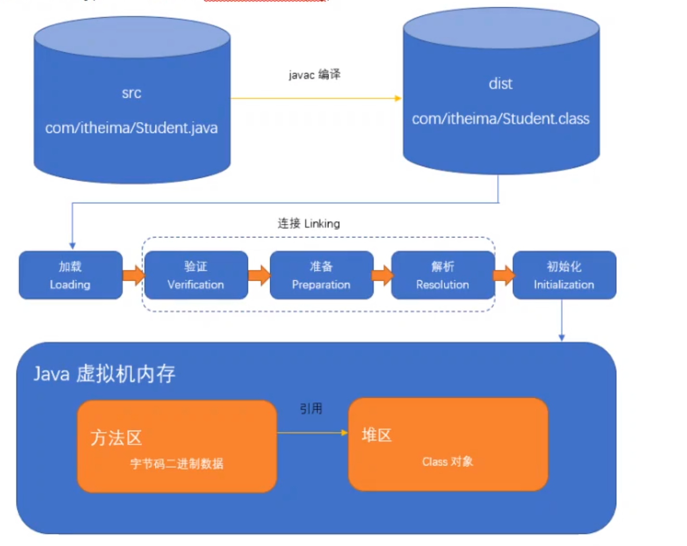

# 类加载



类加载的过程：首先java代码通过javac编译成为一个.class代码，虚拟机将.class文件加载到内存中，dotclass是二进制文件。

方法区域会存放着我们的二进制文件，在堆区会开辟空间引用方法区域的字节码信息。


## 加载器

根类加载器，他是虚拟机的一部分，没有父加载器，也不需要继承ClassLoader,主要负责由系统属性”sun.boot.class.path“指定的路径下的核心类库。

### 根加载器

根加载器打印的几个为null,如下

```java
package com.test;

public class Demo07 {
    public static void main(String[] args) {
        ClassLoader classLoader = Object.class.getClassLoader();
        System.out.println(classLoader);
    }
}

```

### 扩展加载器

是由sun公司提供的，父类加载器就是根加载器，加载的是ext目录下的类库或者 变量ext.dirs目录下的类库

ExtClassLoader加载的目录源码

```java
package com.test;

import sun.text.resources.ar.CollationData_ar;

public class Demo07 {
    public static void main(String[] args) {
        ClassLoader classLoader = Object.class.getClassLoader();
        System.out.println(classLoader);

        CollationData_ar ar = new CollationData_ar();
        System.out.println(CollationData_ar.class.getClassLoader());
    }
}

```


### 系统类加载器

系统类加载器也称为应用类加载器，纯java类，它的父类是扩展加载器，负责从classpath环境变量和系统属性java.class.path所指定的目录中加载类，他是用户自定义的类加载器的默认父加载器，一般的，该类加载器是程序的默认加载器，

```java
        ClassLoader classLoader1 = Demo07.class.getClassLoader();
        System.out.println(classLoader1);
```

java的三个类加载器，他们三个配合进行工作。

并且加载的时候是按需要加载，当需要使用的时候才会加载到内存生成对象。


## 类加载器的双亲委派机制

需要加载类的时候，会首先委派自己的父类加载器进行加载，如果父类加载器无法进行加载的时候就会自己去加载。

好处就是可以防止类被重复的加载。

可以防止类被串改，比如Object类，使用网络传递，但是发现父类对其已经被加载了，就不会再次的进行加载。

```java
while (classLoader1!=null){
    classLoader1 = classLoader1.getParent();
    System.out.println(classLoader1); 
}
```

## ClassLoader

除了跟加载器，其他的都需要继承这个类加载器。

```java
protected Class<?> loadClass(String var1, boolean var2) throws ClassNotFoundException {
    synchronized(this.getClassLoadingLock(var1)) {
        查询是否已经被记载
        Class var4 = this.findLoadedClass(var1);
        if (var4 == null) {
            long var5 = System.nanoTime();

            try {
                if (this.parent != null) {
                    //委派父类来加载
                    var4 = this.parent.loadClass(var1, false);
                } else {
                    //使用根加载器进行加载
                    var4 = this.findBootstrapClassOrNull(var1);
                }
            } catch (ClassNotFoundException var10) {
            }

            if (var4 == null) {
                //最后自己加载
                long var7 = System.nanoTime();
                var4 = this.findClass(var1);
                PerfCounter.getParentDelegationTime().addTime(var7 - var5);
                PerfCounter.getFindClassTime().addElapsedTimeFrom(var7);
                PerfCounter.getFindClasses().increment();
            }
        }

        if (var2) {
            this.resolveClass(var4);
        }

        return var4;
    }
}
```


