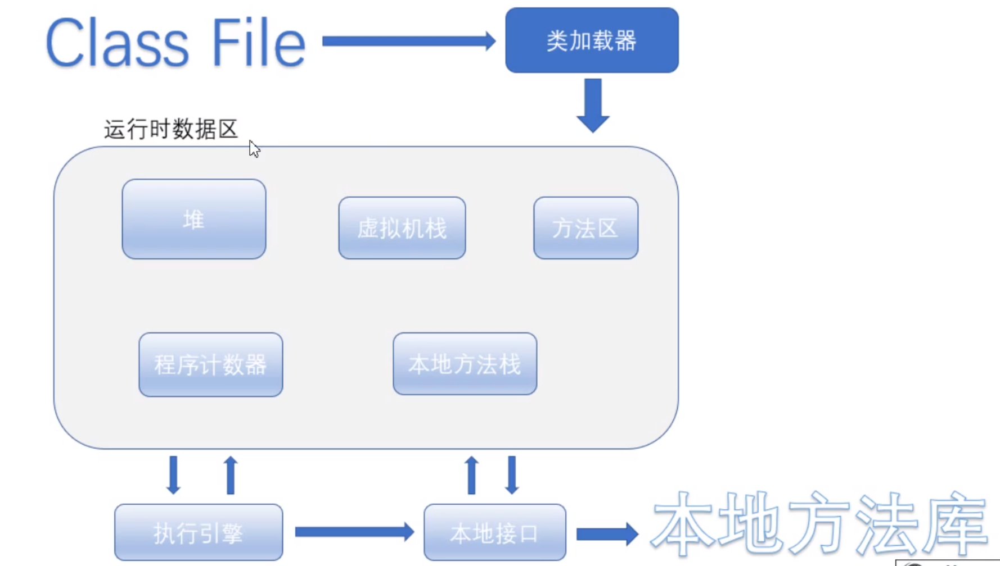
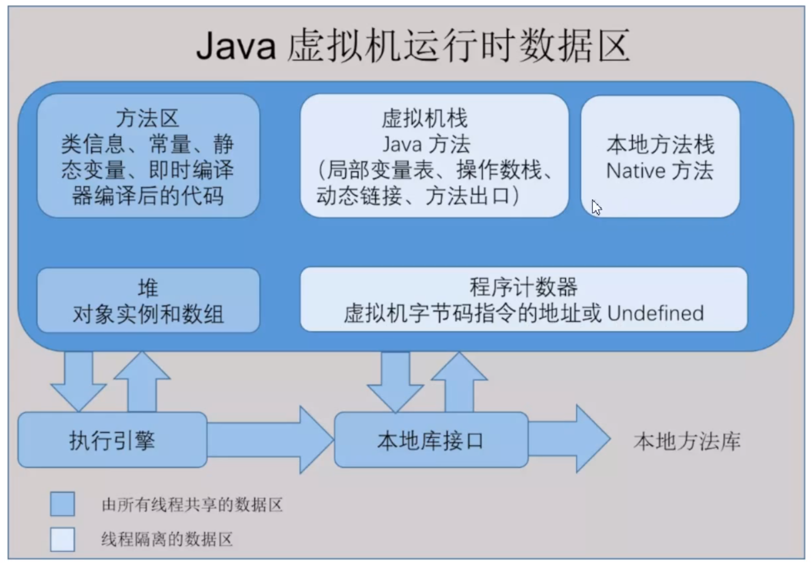

# jvm

## jvm的执行流程



class文件编译成字节码，通过类加载器进行加载，在运行数据区中进行分配空间等，执行时候需要一个执行引擎，调用本地接口。在本地库中将java变为操作系统可以执行的命令。




程序计数器指示程序执行的位置，程序计数器线程私有，并且不会发生内存溢出。

堆：存储数组和对象（new）会发生内存泄漏，是垃圾回收的主要部分。

虚拟机栈：入栈

```java
main(String[]args){
    int x1 = 2;
    int x2 =  3;
    int max = getMax(x1,x2);
    sout(max);
}

栈中先入栈main方法，然后入栈getMax()，输出结果，然后出栈。
```


本地方法栈：执行的是native方法，虚拟机栈是java方法，会发生内存溢出

方法区：

```java
static final 修饰的
    
String str1 = new String("xx");
String str2 = new String("XXX");
sout(str1 == str2); //false
sout(str1.intern() == str2.intern())//true
intern调用现在常量池中找，如果没有就放入一个
```

