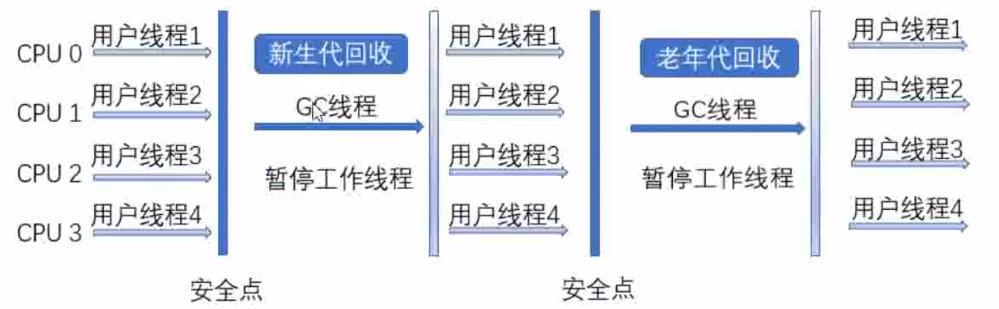
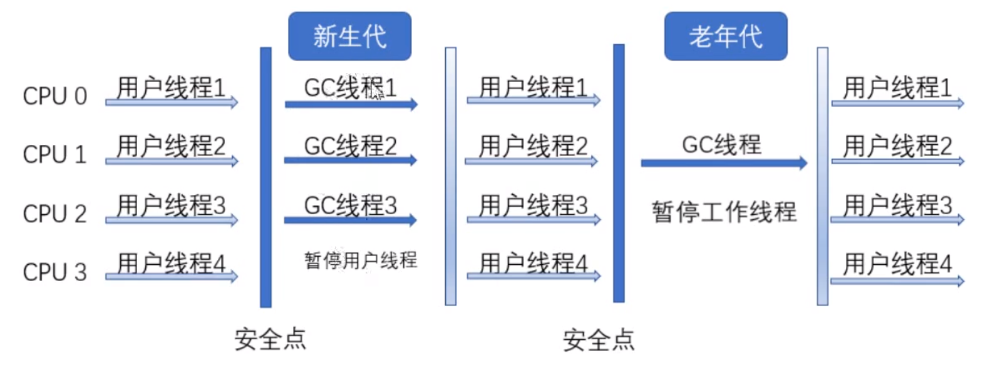
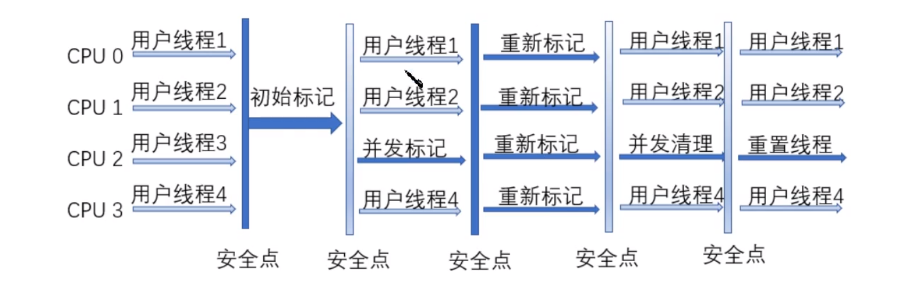

# 垃圾收集器

## Serial垃圾收集器

1.3之前是新生代的唯一选择，并且是单线程，并且是stw(直到垃圾回收之后),手机过程基本就是需要垃圾回收，用户线程先停下来，进行新生代 垃圾的回收，等收集结束之后就恢复。1.3之前一直为减少停顿时间而努力。

什么是安全点？

这样在每次收集比较少资源的时候，还是可以进行控制的，也是可以接受的 ，所以在client模式下仍然是一个比较号的选择

ParNew和serial相比，除了是一个多线程的，其他的都是一样的。它是server模式下的一个主要的收集器。原因是除了serial可以与CMS（标记并发清除，他是老年到的处理器）一起使用， 在1.4产生了一个收集器，但是1.5的使用CMS的时候是无法使用新生代1.4的收集器，所以只能回去继续选用之前的serial或者是ParNew.

ParNew  Vs  serial

- 单CPU：serial的单线程就不需要在线程之间进行切换，但是parNew就需要不停的进行切换。

- 多CPU：这个时候多线程的优势就显示出来了。

  多CPU下又一个参数- XX：parallelGCThreads来限制垃圾回收的线程数量

## Parllel Scavenge收集器

Parllel Scavenge新生代收集器   采用复制算法  并行的多线程收集器，它的关注点与和其他的收集器 不一样（都是想办法减少垃圾收集的时间 ），它主要是cpu运行时间与总时间的一个比值，也就是吞吐量。

### Serial old收集器

老年代   单线程   标记整理    在client下使用    service模式下，1.5之前配合parallel scavenge收集器使用，另一种是作为CMS的备用，并发收集时候发生Concurrent Mode Failure时使用。

为例最大的使用CPU的效率，可以使用Parallel old收集器

### Parallel Old收集器

parallel old收集器是Parallel scavenge收集器的老年版本，使用多线程的标记清除。1.6开始使用这种方式，最佳的组合是新生代和老年代都使用多线程进行。

### CMS

并发标记清除   会产生垃圾碎片（标记清楚）

四个步骤

- 初始标记----仅仅关联GC roots能直接关联到的对象，速度块

- 并发标记----进行GC Roots Tracing的过程

- 重新标记

- 并发清除

  

缺点：

占用CPU资源（会占用用户资源）

无法清除浮动垃圾（并发清理的时候，也会产生垃圾，这一阶段的垃圾是无法进行回收的）

并发模式失败，如果浮动垃圾太多，预留空间无法存放，就会有并发收集失败，使用serial old

需要预留空间   有大量的碎片。

### G1收集器

