# tool

常用的jdk工具

- jps:虚拟机进程
- jstat：虚拟机各方面的运行数据
- jinfo：显示虚拟机的配置信息
- jmap：生成虚拟机的内存快照
- jhat：用于分析heaphump文件，建立一个http/html服务器，使用浏览器进行查看结果
- jstack：显示虚拟机的线程快照

## jps 

### 命令格式

jps [option] [hostid]

### 参数解释

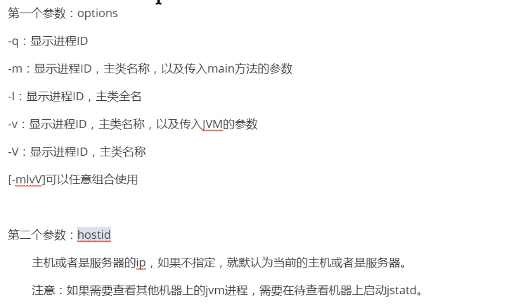

## 实战

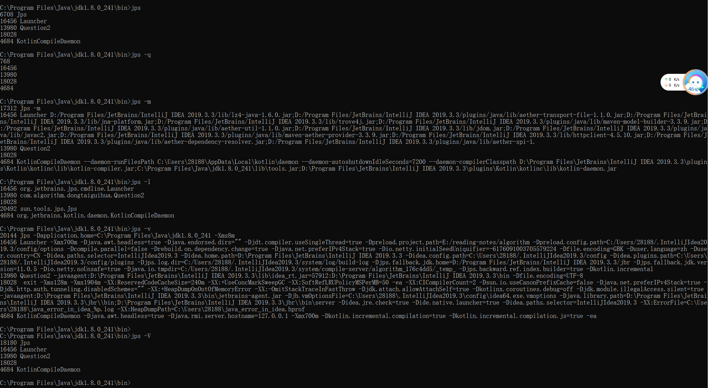

## jstat

监听虚拟机各种运行状态的信息，可以显示本地或者是远程虚拟机进程中的类装载。内存/垃圾回收集等数据。

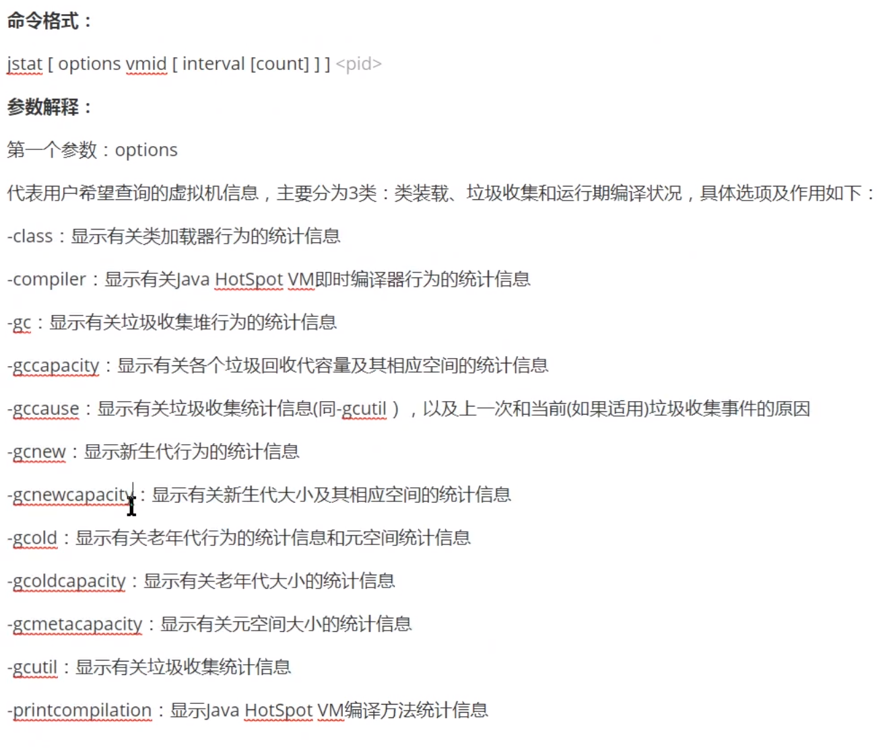

1.打印gc信息，相隔250ms,打印5次

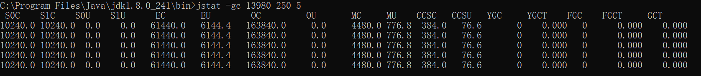

2.打印类的信息

Loaded ：一共加载的类

Bytes:占用的空间

Unloaded:卸载的类

Bytes:占用的空间

Time:装载卸载一共使用的空间

3.编译信息

compiled:编译任务次数

Failed：失败次数

Invalid：无效次数

Time:使用的时间

FailedType:失败的类型  

FailedMathod:

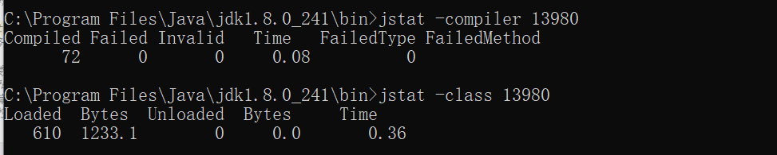

4.gc信息

幸存区	幸存区使用	eden   eden使用状况	老年代	元空间（1.8之前永久的）  ygc的次数 ygc时间 

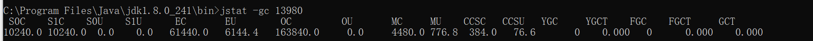

gcutil：显示的是使用的百分比

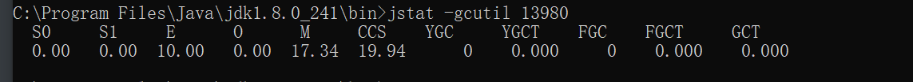

## iinfo

可以实时的设置或者修改参数

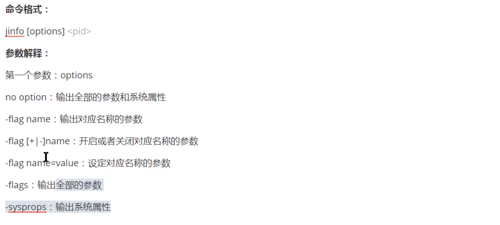

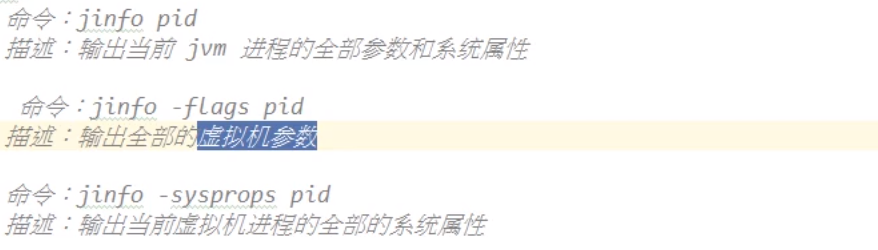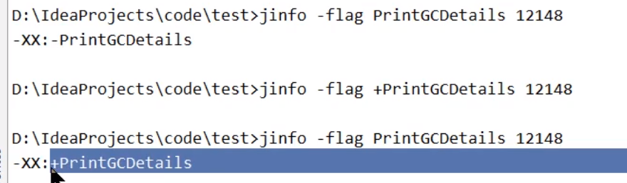

查看开关是不是已经打开

### jmap

多功能命令，生成java程序的dump文件，查看堆内对象信息/查看classLoader的信息以及finalizer队列

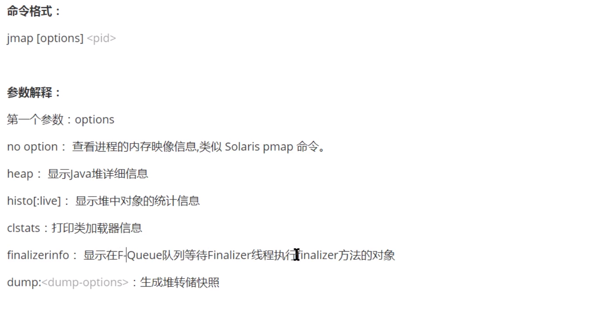

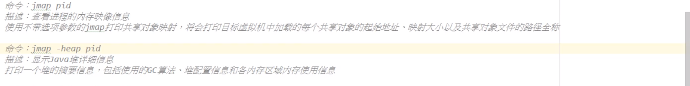

1.查看内存映像

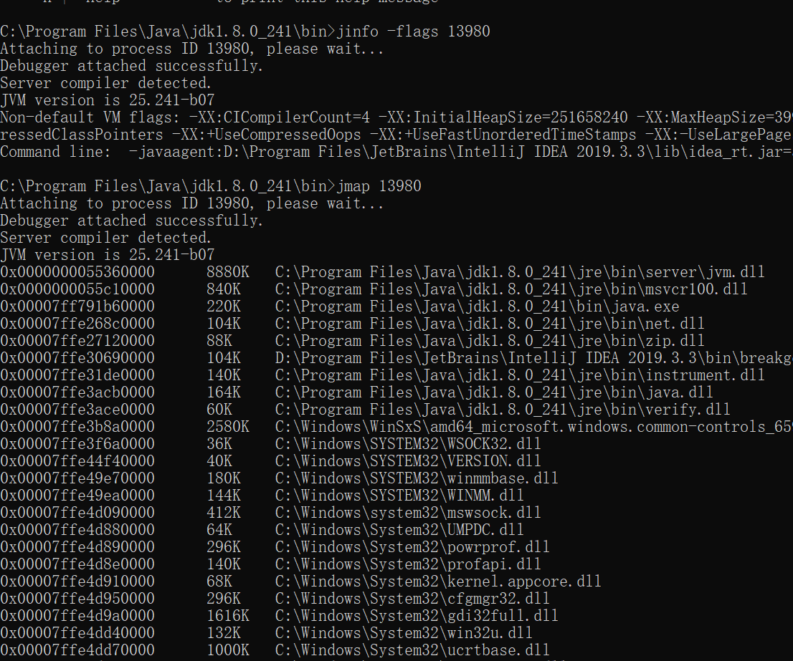

2.查看堆信息

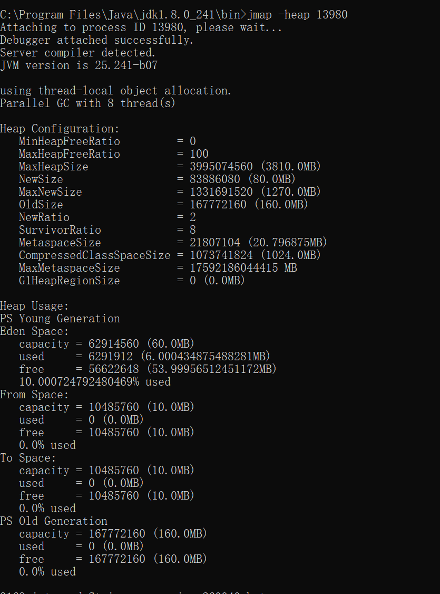

3.统计类的信息

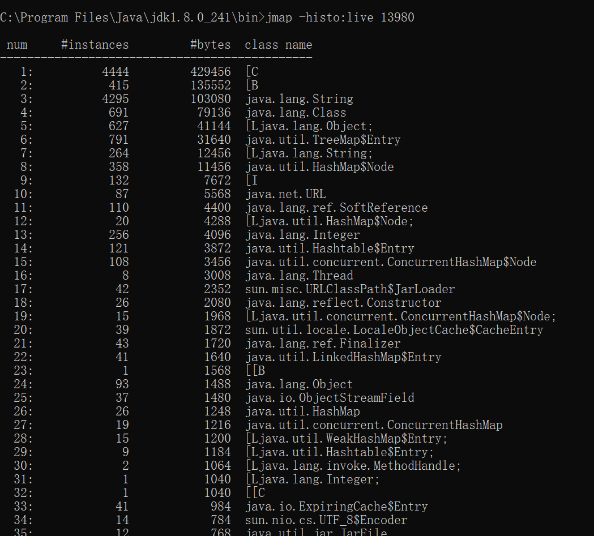

5.显示类加载信息

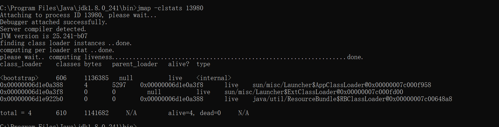

6.打印等待终结对象的信息

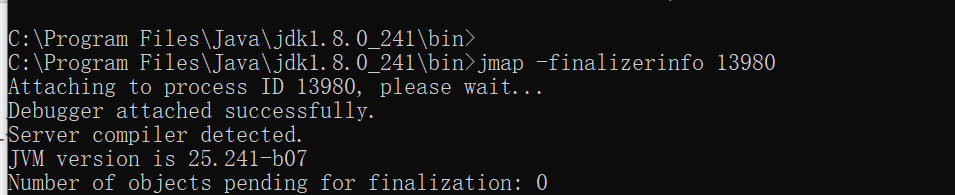

7.生成堆快照

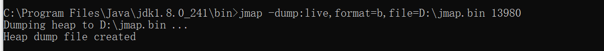

这个文件时看不明白的，需要一个jhat工具，进行查看，会将其放在一个内置的服务器上。

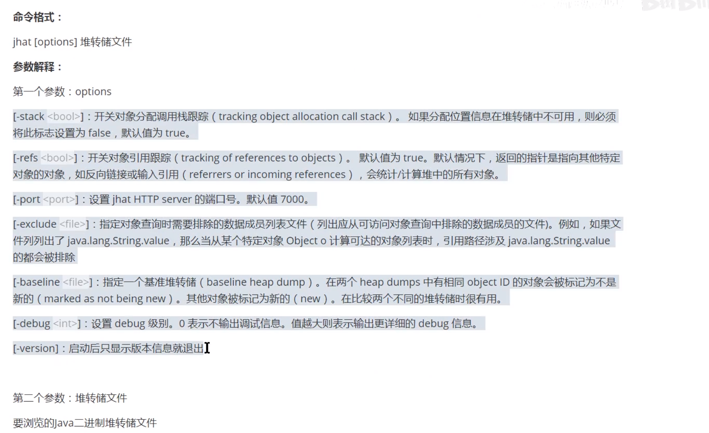

## jstack

查看和导出java程序中线程堆栈信息

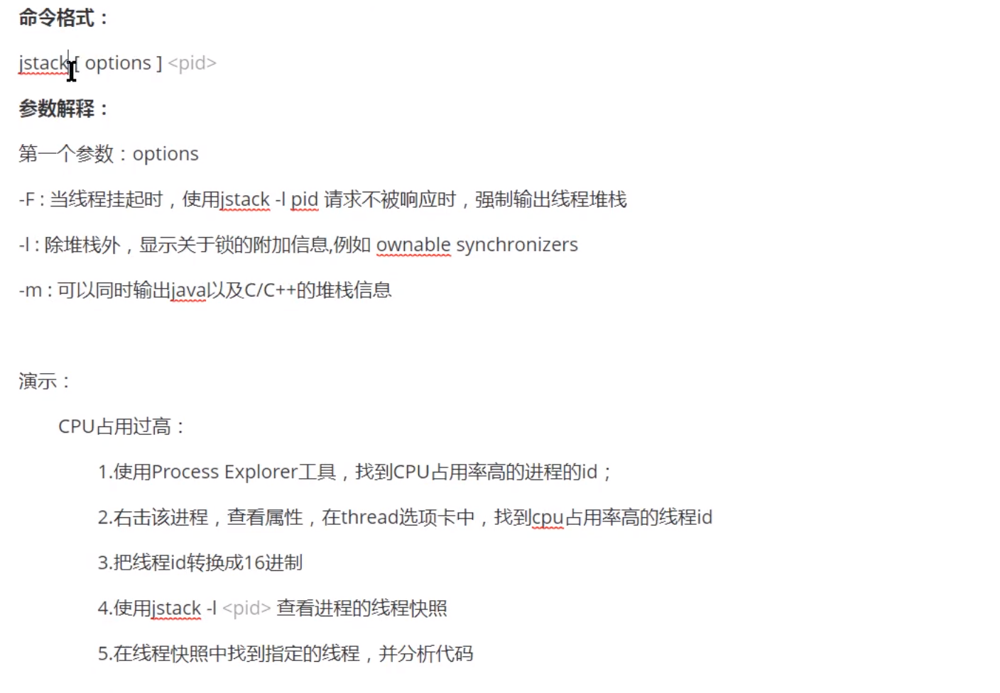

2.应用

- 死循环
- 死锁
- 控制台输入（阻塞）

死循环分析步骤：

- 使用Process Explor工具查看哪一个的进程使用率高，

- 然后在查看进程中，哪个线程的使用率高

- 然后jstack -F PID

- 寻找出使用率高的线程

- 定位到某一行具体代码

  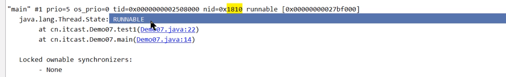

死锁的分析步骤

- 使用jps找出进程
- 列举出线程 jstack -l  PID
- 找出main函数的线程
- 找出问题

死锁的分析

## 扩展死锁写法

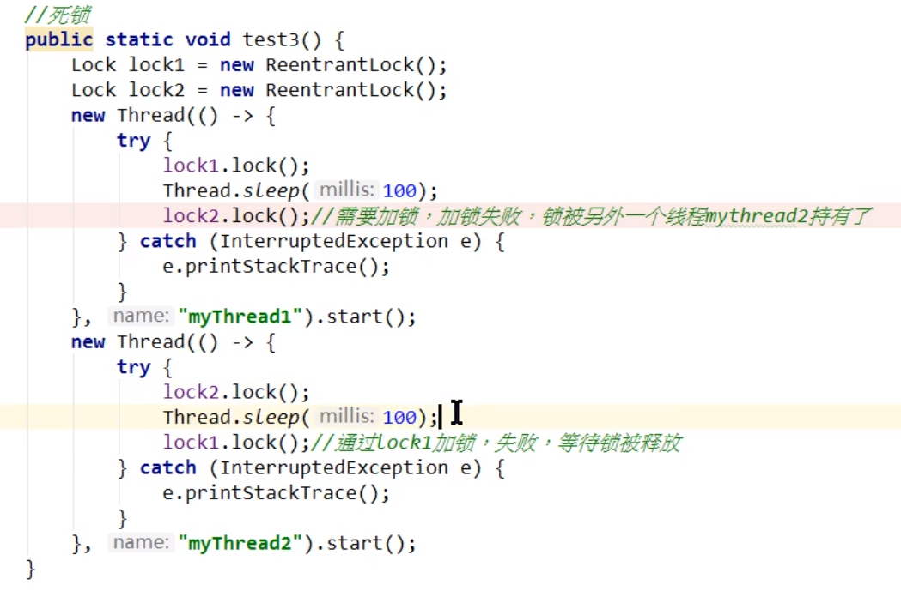