# Tomcat

## Tomcat基础

（1）软件架构

​	C/S：  B/S

（2）资源分类

- 动态资源：必须经过服务器解析之后才会发送给客户端。
- 静态资源：

## 常见的web服务器

### 概念

- 服务器：安装了服务器软件的计算机
- 服务器软件：接受用户请求，做出响应。
- web服务器软件：可以步数web服务的服务器

### tomcat目录

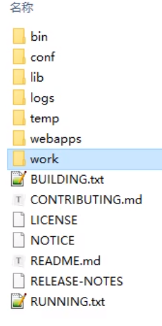

work:存储的是jsp文件编译之后的java源码一些字节码文件

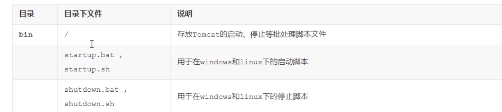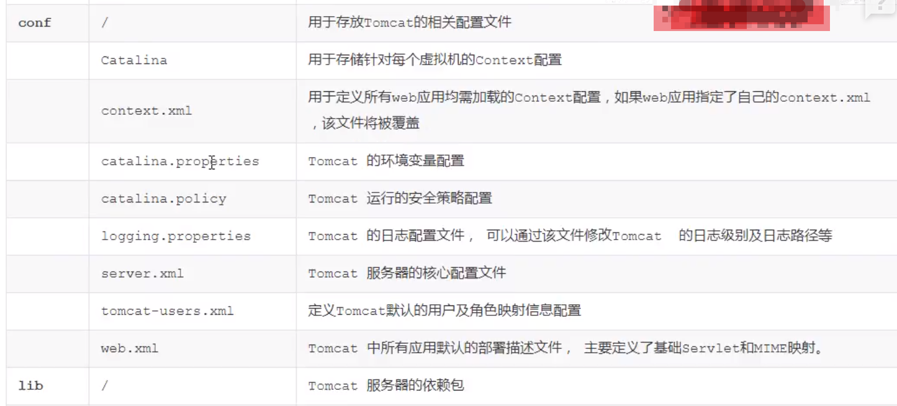

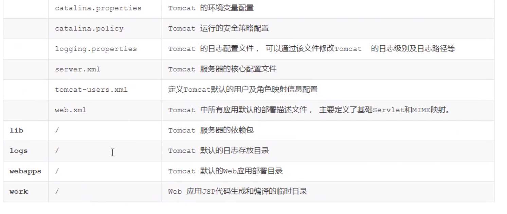

## 源码准备

#### 链接：https://tomcat.apache.org/download-80.cgi

#### 将源码放入到idea中打开

1.创建项目

2.将源代码解压

3.然后将其转换为maven项目

## 架构

###  http的工作原理

http是浏览器于服务器进行数据传输的一个服务，基于TCP IP进行数据传输的。http并不进行数据的传输，只是规定一种格式，具体传输时通过TCP进行传输的；

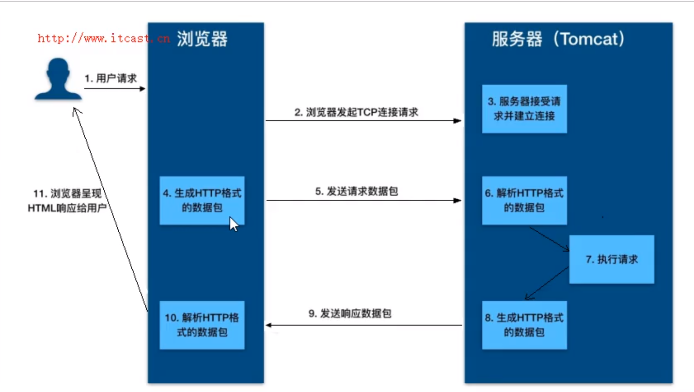

客户端发送请求 ，首先通过域名解析器解析IP,然后客户端与服务器建立TCP链接，服务器接受请求之后。客户端准备请求数据包，发送给服务器通知需要什么样的一个请求。执行请求，生成Http格式的数据包，发送响应请求数据包，浏览器进行解析进行一个展示。

### 2.Tomcat整体架构

####  2.1 Http服务器处理请求

浏览器发送给客户端的http请求的数据，http服务器接受到之后，需要调用程序来进行出理。

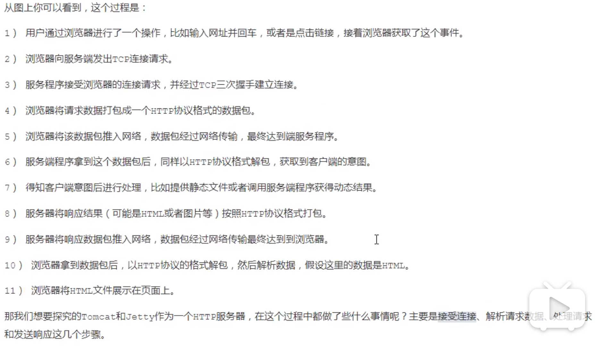

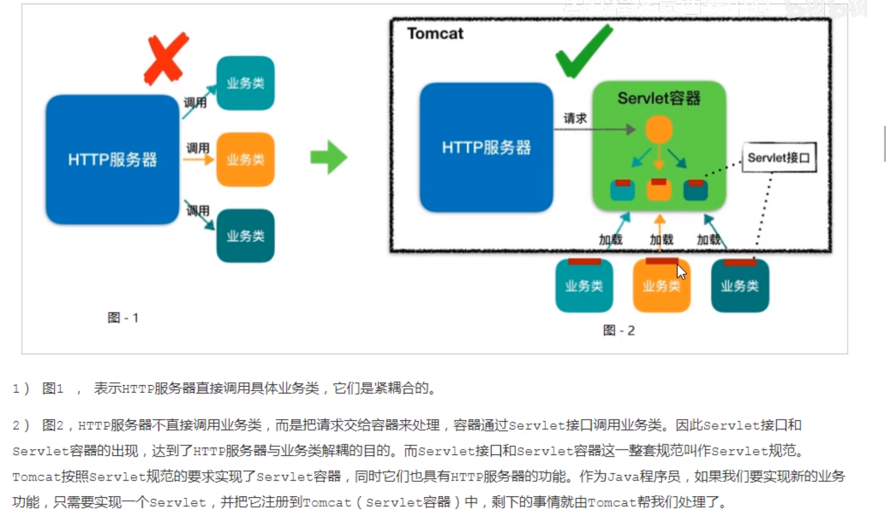

http到底服务器之后，就会请求servlet容器，servlet容器如果没有加载就会执行加载。

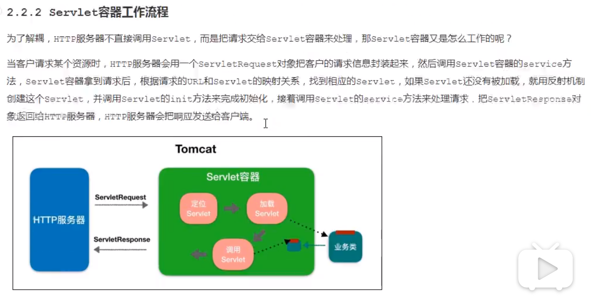

客户端请求到底服务器就会请求servlet容器，定位出请求的业务，如果没有加载就会加载我们的业务类，业务类是实现了servlet接口的。然后将结果封装到response中，通过http的服务器将数据返回给调用端。

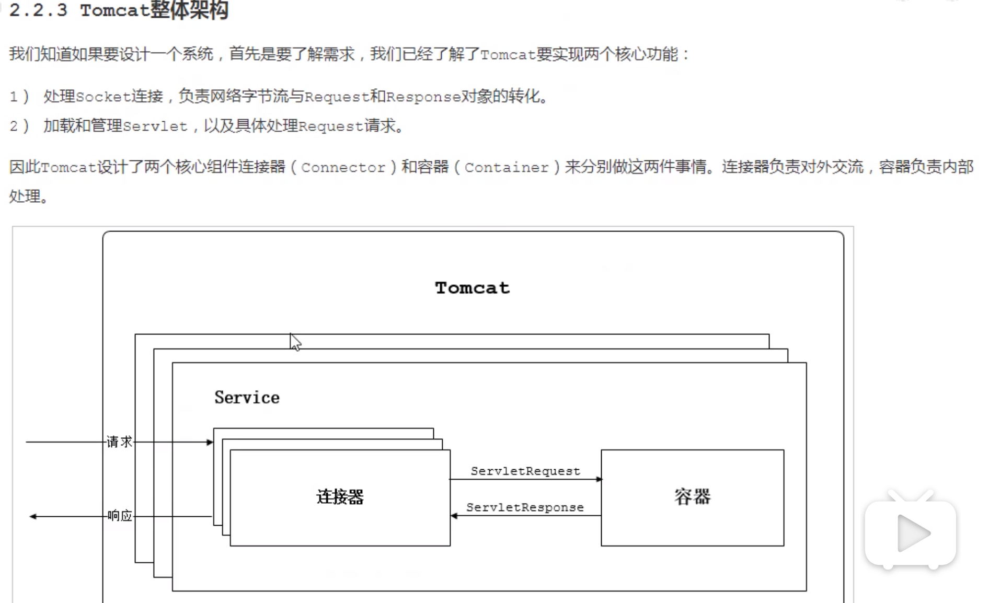

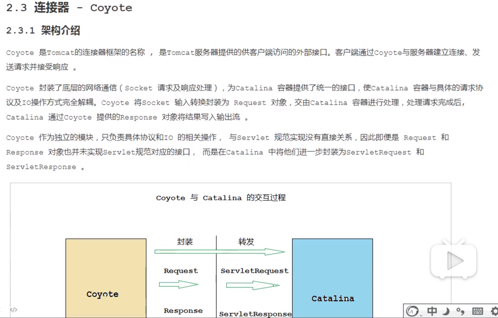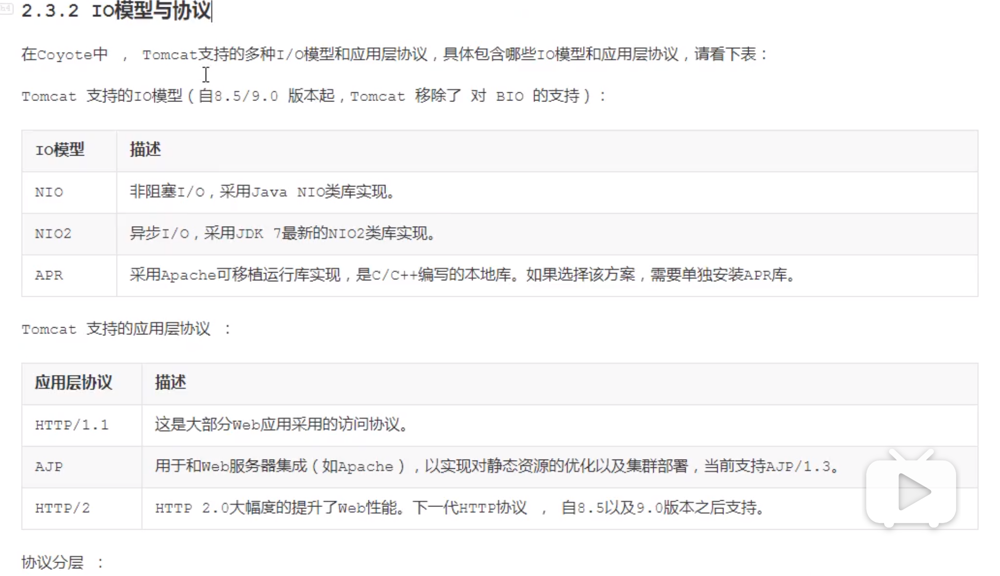

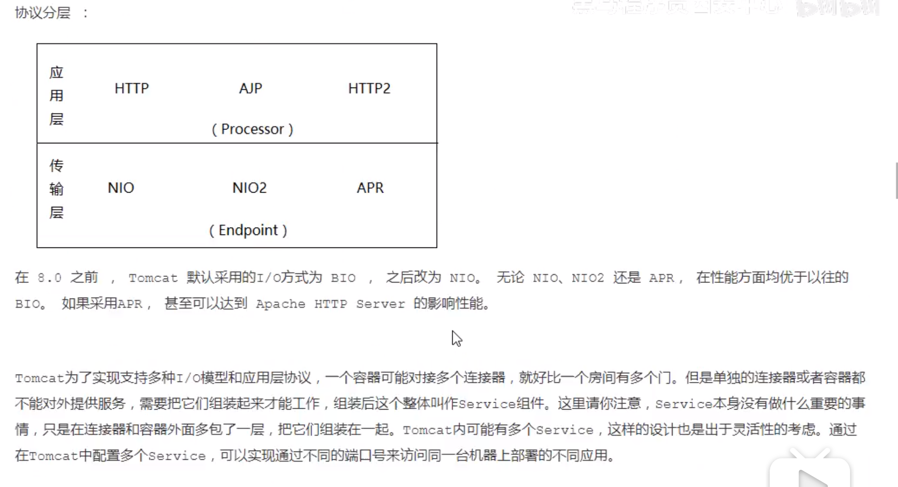

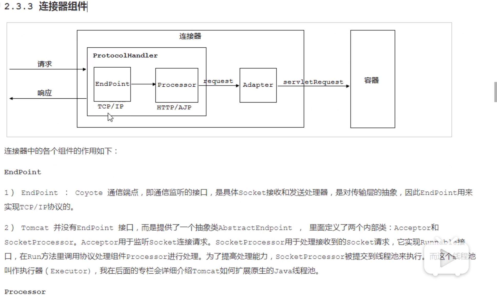

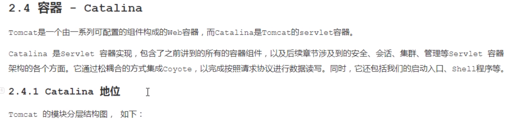

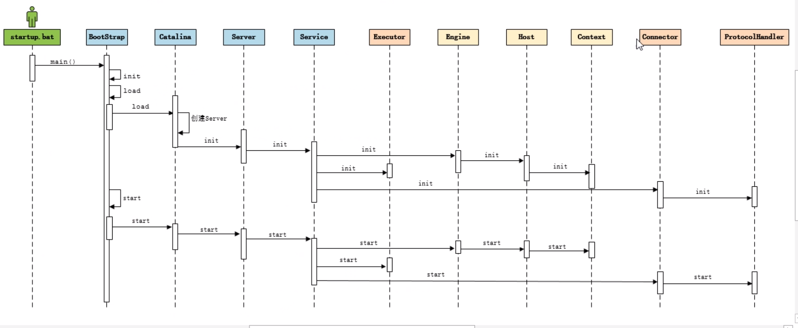

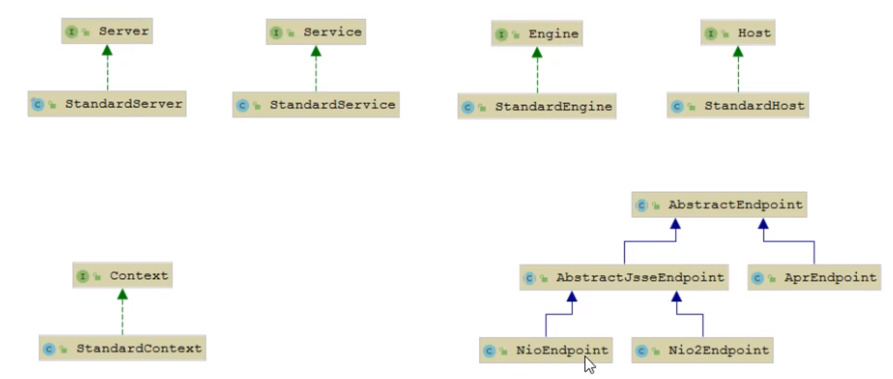

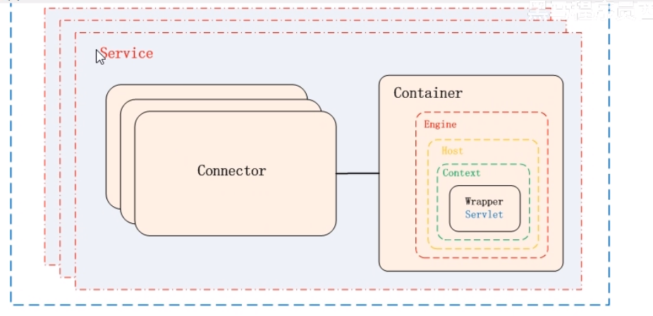

catelina里面是server，里面是service,里面包含了Connector和Container

Container里面是Engine  Host   Context  Wrapper   Servlet

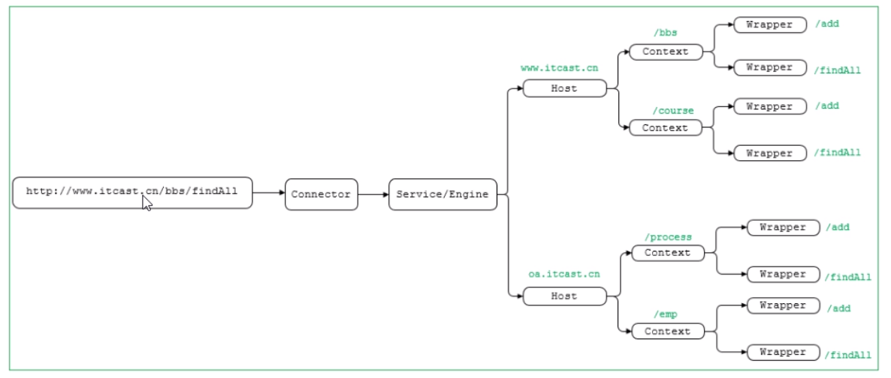

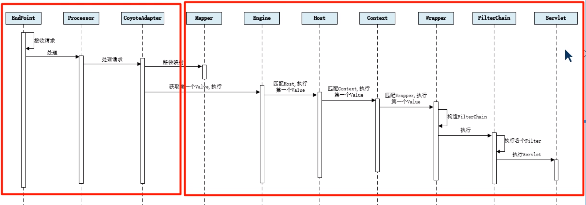 