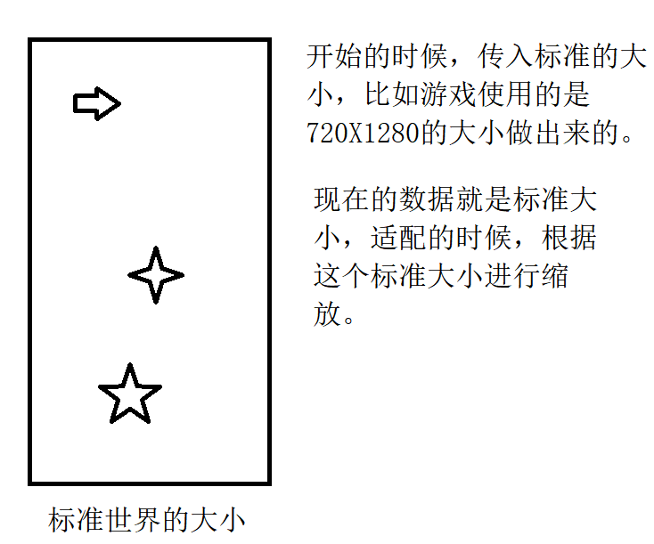
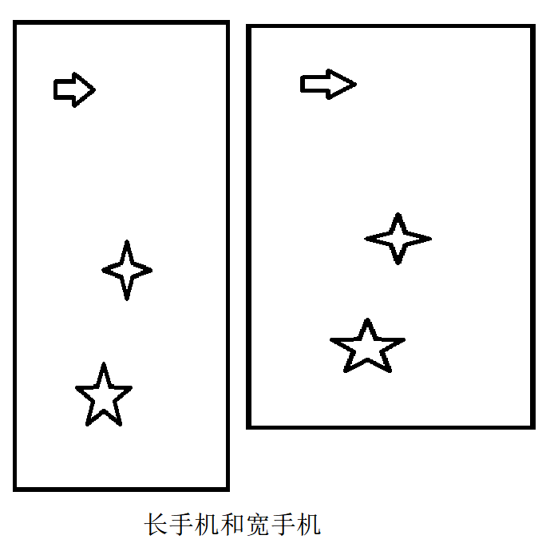

# 适配

## 窗口的选择

游戏中创建游戏的窗口，为了适配，可以根据手机的大小来使用不用的窗口。

```java
if(Gdx.graphics.getHeight()*1.0F/Gdx.graphics.getWidth()<800F/480){
    //大小是屏幕大小
    viewport = new StretchViewport(Configuration.std_width,
            Configuration.std_width*800/480F);
}else {
    //向左右 向上下扩展
    viewport = new ExtendViewport(Configuration.std_width, Configuration.std_height);
}
```

在小手机上，使用屏幕的大小作为游戏的大小，正常的手机上让数据显示到屏幕中，占满屏幕。

## 适配，在setSize()中适配

```
viewport.update(width,height,true);
if(viewport instanceof ExtendViewport) {
    float viewportWidth = viewport.getWorldWidth();
    if (viewportWidth > 720) {
        viewport.setWorldSize(720, 720 / viewportWidth * 1280);
        viewport.apply(true);
    }
}
Configuration.height  = viewport.getWorldHeight();
Configuration.width = viewport.getWorldWidth();
```

我们在创建的时候使用的是标准的大小。

### 从哪里开始

ExtendViewport:不会关心比例，会将器放满整个屏幕（适配还没有开始）。我们现在有一个标准的大小世界。



我们现在有一个不是标准的手机



### 适配

适配的所有需要写的代码不是很多

```java
viewport.update(width,height,true);
if(viewport instanceof ExtendViewport) {
    float viewportWidth = viewport.getWorldWidth();
    if (viewportWidth > 720) {
        viewport.setWorldSize(720, 720 / viewportWidth * 1280);
        viewport.apply(true);
    }
}
```

适配之前，先看看(ExtendViewport)

```java
//传入的值未屏幕的值，boolean是是否设置相机位置，默认在
public void update (int screenWidth, int screenHeight, boolean centerCamera) {
		// Fit min size to the screen.
		float worldWidth = minWorldWidth;
		float worldHeight = minWorldHeight;
		Vector2 scaled = Scaling.fit.apply(worldWidth, worldHeight, screenWidth, screenHeight);

		// Extend in the short direction.
		int viewportWidth = Math.round(scaled.x);
		int viewportHeight = Math.round(scaled.y);
		if (viewportWidth < screenWidth) {
			float toViewportSpace = viewportHeight / worldHeight;
			float toWorldSpace = worldHeight / viewportHeight;
			float lengthen = (screenWidth - viewportWidth) * toWorldSpace;
			if (maxWorldWidth > 0) lengthen = Math.min(lengthen, maxWorldWidth - minWorldWidth);
			worldWidth += lengthen;
			viewportWidth += Math.round(lengthen * toViewportSpace);
		} else if (viewportHeight < screenHeight) {
			float toViewportSpace = viewportWidth / worldWidth;
			float toWorldSpace = worldWidth / viewportWidth;
			float lengthen = (screenHeight - viewportHeight) * toWorldSpace;
			if (maxWorldHeight > 0) lengthen = Math.min(lengthen, maxWorldHeight - minWorldHeight);
			worldHeight += lengthen;
			viewportHeight += Math.round(lengthen * toViewportSpace);
		}

		setWorldSize(worldWidth, worldHeight);

		// Center.
		setScreenBounds((screenWidth - viewportWidth) / 2, (screenHeight - viewportHeight) / 2, viewportWidth, viewportHeight);

		apply(centerCamera);
	}

```

### 简单点的

#### 相机位置

相机设置在屏幕的中央位置

```java
if (centerCamera) camera.position.set(worldWidth / 2, worldHeight / 2, 0);
```

### 计算世界的宽高

###### 

## Screen

screen的显示

- 创建出来一个screen，然后将它设置到Game中，，设置完成后调用show方法。


**总结：**

游戏启动过程，先根据标准的尺寸，以及屏幕的尺寸，计算出世界的尺寸（ExtendViewport为例）。计算完成之后还需要设置相机的位置。然后创建screen，将screen设置到Game中。


## StretchViewport

这个实现简单粗暴，将传入的参数直接作为世界的宽高，将创建处理的相机java直接给相机就完事了。

```java
setWorldSize(worldWidth, worldHeight);
setCamera(camera);
```