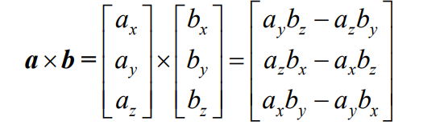

# 向量和标量

向量和标量，向量具有两种意义，一种是数学意义，一种是几何意义，数学意义，就是一个数字列表，也有一个相似的概念数组，数组大小有限的 。

一般可以使用方括号来进行表示[1,2,3],或者竖直的。

几何意义，向量有大小和方向，一般的向量是没有位置的，只有大小和方向。

## 向量的表达 

向量可以 使用笛卡尔或者是极坐标系的方式

v = [模cosx,模sinx]

## 点乘  x乘

a·b = ax*bx + ay * by;    

a·b = |a|\*|b|\*cosa;

x 乘

