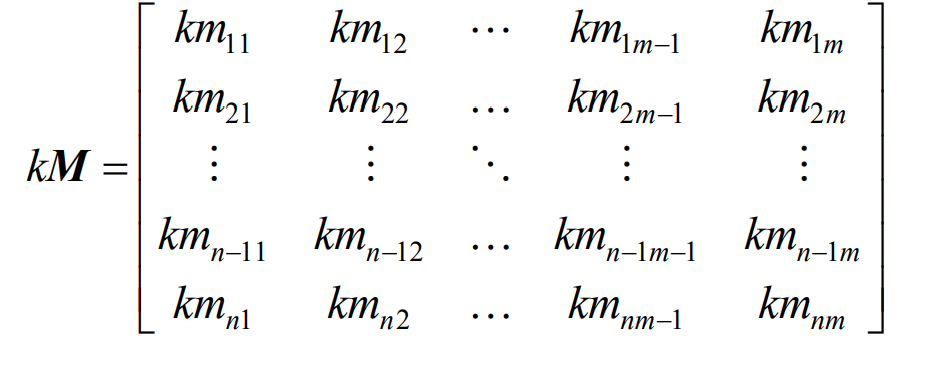

# 矩阵运算

矩阵在游戏中的主要作用是，利用矩阵的变换使得 一个坐标系可以转换到另一个坐标系中。

本节包括：

- 矩阵的数学定义，维数/方阵/相等矩阵/转置矩阵  矩阵加减  标量和矩阵的乘除法   矩阵与矩阵之间相乘   行列式 和 逆等。
- 深入分析向量与矩阵的关系

## 矩阵

矩阵包含了行列，之前使用一维数组定义向量，而矩阵 也可以被定义为2D数组。

**方阵**是特殊的矩阵，行列式相同的，行号 列号相同的可称为方阵中的对角线元素，其他元素称为非对角线。

**对角矩阵：**非对角线上的元素为0. 

**单位矩阵:**对角线上的元素值都为1.

**相等矩阵：**矩阵AB具有相等的维数，A使用aij   b使用bij,它们相等位置的称为对应矩阵。

**转置矩阵:**

**矩阵加减：**前提是维数相等，先判断行列是相等的

**标量与矩阵的运算**

**矩阵相乘：**

前提维数必须相等

**行列式：**

## 向量和矩阵

## 几何意义

旋转和拉伸

这个是图片旋转，一般的游戏使用变换坐标系的方法