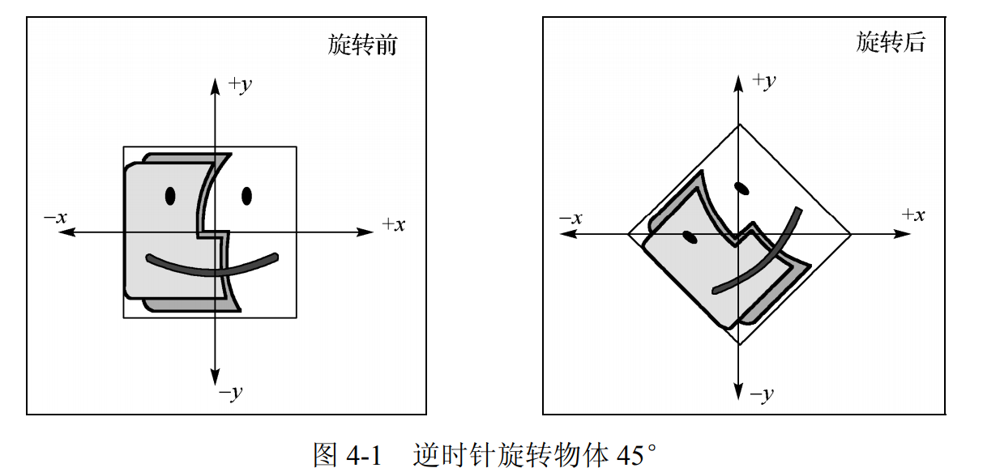
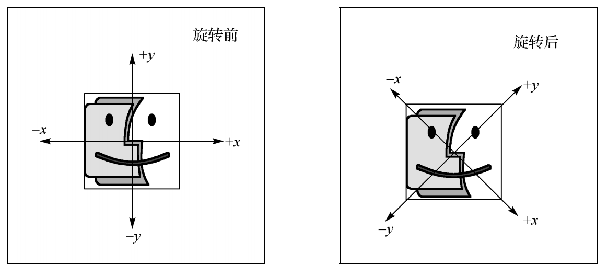
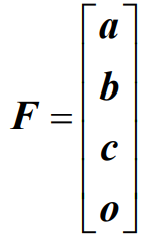
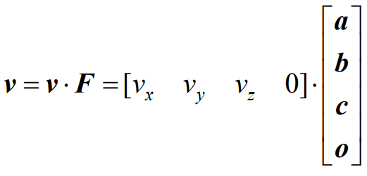
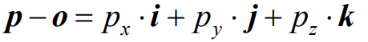
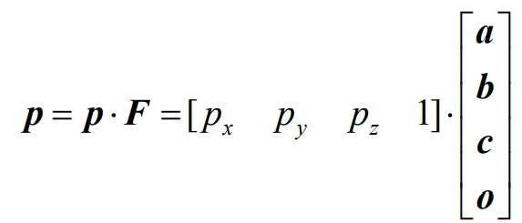
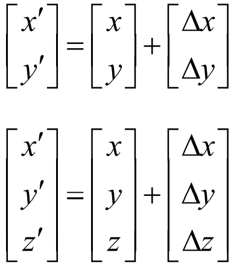
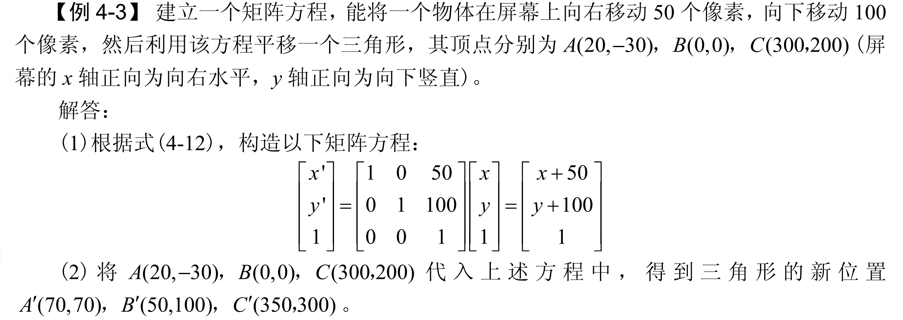
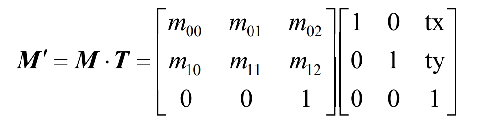
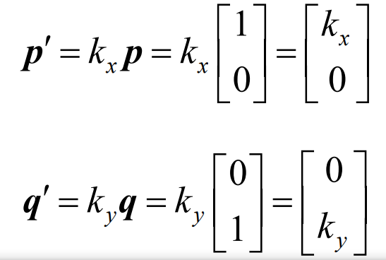

# 变换物体



坐标系不变，旋转物体。



物体不变，旋转坐标系

## 齐次坐标

它可以用来区分向量和点，也容易用于仿射几何变换。

```java
v = vi + vj + vk
```

为了区分坐标系，使用带原点的表示方法，前三个表示坐标，最后一个表示位置。



向量可以使用v=vF



表示某一点的坐标



转换为乘法：



4个分量代表了3D一个点，就是齐次坐标。

**2d表示**

（hx,hy,h）


## 平移

平移是将物体的每一个点向指定的方向移动相同的距离。不改变物体的大小和形状，x方向为正。

x方向的右边为正，y的上边为正。比如（3,3）,向上平移一个单位，向右移动3个单位。结果为（6，4）。






将每一个点都进行一次计算，得到最终的结果值、

## translate函数

平移变幻的实现，依靠矩阵函数。

- 2D的平移变换的函数：void translate（float x，float y）；
- x,y是平移的量，为其构造齐次函数矩阵。



3D平移变换函数类似。

```java
float x,y;
float dim = 80.0;
void setup(){
    size(640,360);
    noStroke();
}
```

绘制每一帧的时候需要将左边系进行重置。

##  缩放

对矩阵进行缩放，与其他变换类似，需要对所有的顶点进行变换。

最简单的就是均匀缩放，物体在各个方向上，根据缩放比例进行缩放。可以保持物体的角度不变，但是在不同方向上进行的缩放就是非均匀缩放。

缩放因子k的不同，还可以进行细分

- 如果K=0，物体的变换成为正交投影，
- 如果k = -1,物体的变换称为镜像
- 如果k>0,物体的变换一般就是；一般的缩放

### 沿着坐标轴进行缩放

因子p和q.



沿着任意轴进行缩放。


## 正交投影

缩放因子k =0，缩放物体上的所有点都被拉平到坐标系，这样的可以成为正交。

可以任意平面进行投影

## 镜像

镜像也叫翻转，反射，是将物体沿着直线或者平面进行翻转。


# 几何图元

## 直线、线段和直线

直线向两个方向进行延伸

直线有两个端点，是直线的有限部分。

射线一个是起点，可以无限延伸，射线可以理解为邮箱线段

## 直线和线段

第一中描述：

```java
y = mx + b`;
```


第二种描述：

```java
(y1 - y2) = m(x1 - x2);
```


