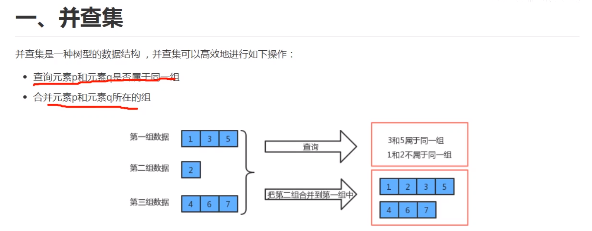
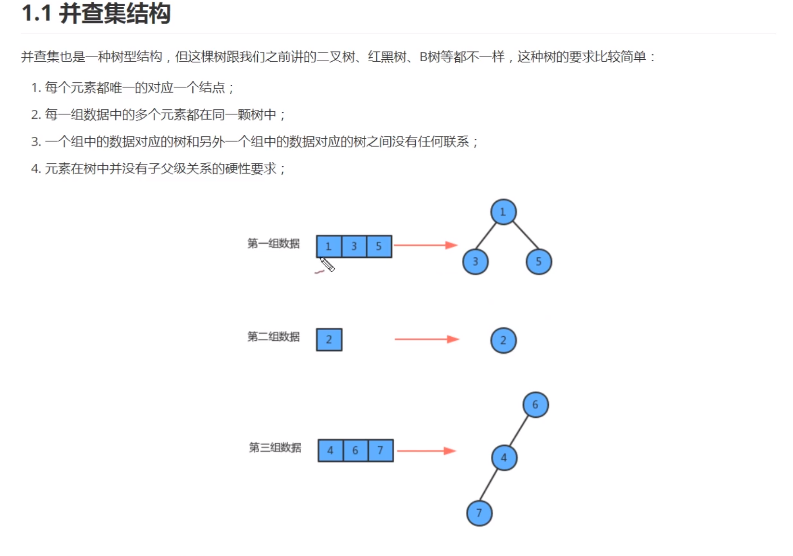
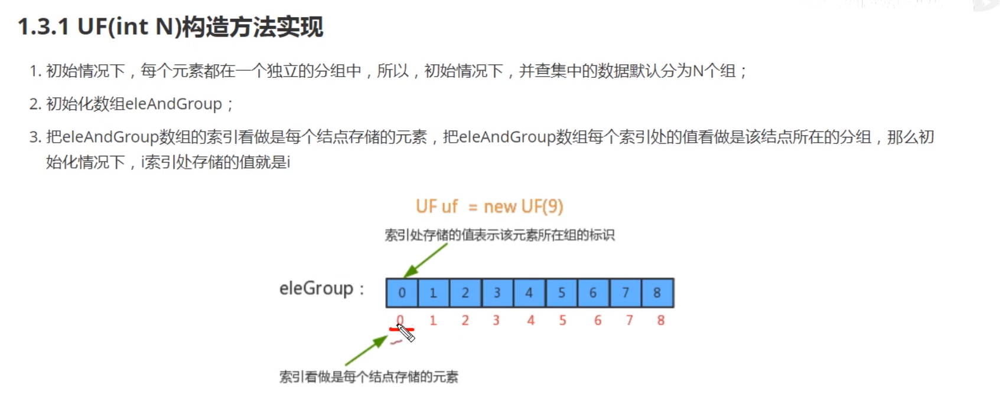
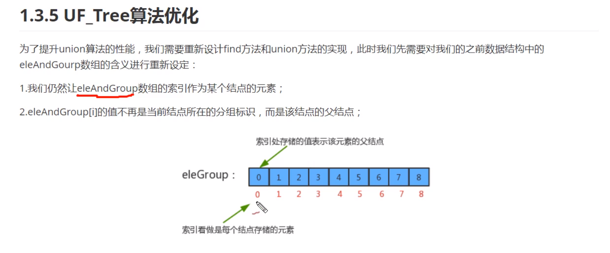

# 并查集



并查集每一组元素都对应一棵树，每一个结点都唯一对应一个数据，并且多个组是没有任何关系的，并且没有任何的子父关系。

## 树是否在同一个组

只需要查出数据所在的组，返回一个根节点，如果相同就是同一个，如果不是就不是同一个组（这个我是有疑问的，如果root的值相同怎么版）

## 合并树

也没有具体的要求，只需要将一个树的结点，作为另一课树的子节点就可以了。




## 应用场景

许多个分组需要合并成一个分组，就需要进行N-1次合并，比如，局域网，一个网络是一个分组，为了使得相互之间可以进行相互通信，就可以使用union方法将他们合并在一起，但是计算机组非常多的时候就需要N-1次合并，每一次合并都需要N次循环，所以总的union是N^2.


## 并查集的优化



之前是存储的值就是当前的分组，现在修改之后就是他的父节点。

我们的优化主要是优化两个东西，一个是find方法一个是union方法。

find查找当前分组,通过追溯父结点的方式进行追溯

```java
while(true){
    if(p == eleme[p]){
        return p;
    }
    p = eleme[p];
}
```


对于union方法

```java
//实现原理：找出两个跟，让另一个的父节点指向这个父亲结点。
int pRoot =  find(p);
int qRoot = find(q);
ele[pRoot] =  qRoot;
```


图的分类：分为有向图和无向图


深度遍历的原理：

先从需要搜索的地方开始，循环它的兄弟结点，然后进行深度遍历，如果没有被标记就继续进行深度遍历。