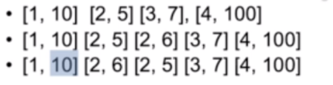

#  动态规划

序列型的动态规划，坐标型的动态规划的区别

- 序列：f从0到i-1的某种性质，以a0结尾的子序列的性质
- 坐标型：以ai结尾的某种性质，f[0]时候的性质。

### 案例

### 2/5/7面值组成目标使用硬币最小

```java
257 组成27  最少的数字、
    
/*    解题步骤：
 *  1.需要开一个数组（一维或者二维）   确定最后一步   子问题
 *    不知道前面是什么，但是最后一部分，是27 - ak是最少
 *    ak是几不知道，只需要知道27-ak是最少的，
 *
 *    子问题：
 *    最少的用多少个硬币得到27-ak（规模减少一次）
 *    f(27) = f(27 - N)+1;
 *
 *  2.转移方程
 *    f[X] = min{f[x-2]+1,f[x-5]+1,f[x - 7]+1}
 *
 *  3.初始条件和边界条件
 *    f[x] = min{f[x - 2]+1,f[x-5]+1,……}
 *    如果下标小于0
 *
 *  4.计算顺序
 */
public int coinChage(int []a,int m){
        int n = a.length;
        //0~27，需要取到27  0作为初始化
        int f[] = new int[m+1];
        //初始化
        f[0] = 0;
        for (int i = 1; i <= m; i++) {
            f[i] = Integer.MAX_VALUE;
            //需要租成的结果
            for (int i1 = 0; i1 < n; i1++) {
                //使用硬币
                //为什么不判断i-a[i1]是不是小于0    这个题肯定是不会大于的i>[a[i1]]
                /**
                1.判断需要组成的数字，是不是大于硬币的面值
                2.这个判断是使用的硬币是不是会组成这个值
                3.使用当前硬币会不会大于当前值（第一次一定的），后面在使用其他硬币来进行尝试
                */
                if (i>a[i1]&&f[i-a[i1]]!=Integer.MAX_VALUE&&f[i-a[i1]]+1<f[i]){
                    f[i] = f[i-a[i1]]+1;
                }
            }
        }
    	//说明无法组成这个数字
        if (f[m]==Integer.MAX_VALUE){
            return -1;
        }else {
            return f[m];
        }
    }

总结: 从第一个参数开始，我们遍历所有需要的答案，然后从最小的开始，尝试所提供的数据，找出最小。
    这个题初始化f[0] = 0,从低于个开始进行，所以是坐标型
```

还有一种做法，递归

```java
    public int digui(int x){
        if (x == 0)
            return 0;
        int res = Integer.MAX_VALUE;
        if (x >= 2){
            res = Math.min(digui(x - 2)+1,res);
        }
        if (x >= 5){
            res = Math.min(digui(x - 5)+1,res);
        }
        if (x >= 7){
            res = Math.min(digui(x - 7)+1,res);
        }
        return res;
    }
```

#### 机器人找路径，有多少方式

```java
分析： 路径从（0，0）走到（m,n），那么分解一下
    （m,n）  ----> (m-1,n)+(m,n-1)
    （m-1，n-1） --->(m-1,n-2)+
    ……
    （0，0） ----> 1
所以 i，j为0是为1； 转移方程是：f[m][n] = f[m][n-1]+f[m-1][n]
    public int un(int m,int n){
        int [][] f = new int[m][n];
        for (int i1 = 0; i1 < m; i1++) {
            for (int i2 = 0; i2 < n; i2++) {
                if (i1==0||i2 == 0){
                    f[i1][i2] = 1;
                }else {
                    f[i1][i2] = f[i1-1][i2]+f[i1][i2-1];
                }
            }

        }
        return f[m-1][n-1];
    }
这个属于序列型
```

扩展有障碍的寻路

```java
/**
 * 如果存在障碍物                坐标型
 * 障碍物出位0
 */
public int unTwo(int arr[][],int m,int n){
    if (m==0||n==0)return 0;
    int [][] f = new int[m][n];
    for (int i1 = 0; i1 < m; i1++) {
        for (int i2 = 0; i2 < n; i2++) {
            if (arr[i1][i2] ==1){
                f[i1][i2] = 0;
            }else {
                if (i1 == 0 || i2 == 0) {
                    f[i1][i2] = 1;
                } else {
                    f[i1][i2] = f[i1 - 1][i2] + f[i1][i2 - 1];
                }
            }
        }
    }
    return f[m-1][n-1];
}
```

例4：青蛙是否可以跳到最后一个

```java
/**
 * 确定状态
 * 考虑最后一块石头n-1      i<n-1
 * 青蛙跳到i
 * 最后一步不可以超过最大距离  n-1-i <=ai
 *
 * 属于胜负类型
 
 
 找出第一个石头到最后一个石头是否可以跳到
 目标位置：
 if 当前的可以跳到  ----->  当前位置加上当前的长度是不是大于等于目标，
 */
public boolean conJamp(int[]a){
    if (a==null||a.length==0){
        return false;
    }
    int n = a.length;
    boolean []f = new boolean[n];
    f[0] = true;
    for (int i = 1; i < n; i++) {
        for (int j = 0; j < i; j++) {
            //可以跳到   第j个首先可以跳到，j+当前值需要大于
            if (f[j]&&j+a[j]>=i){
                f[i] = true;
            }
        }
    }
    return f[n-1];
}
```

例5：房子染色

```java
/**
 * 序列
 * 房子染色问题，相邻的房子颜色不相同
 
 1.遍历所有的房子
 当前房子的颜色和前一个房子有关
 2.第i个房子 = i-1房子的钱数+当前房子的cost  
 n for 
 n-1  
 n-2
 */
public int minCost(int[][] costs){
    int n = costs.length;//房子的个数
    //如果房子个数为0，就返回0
    if (n == 0){
        return 0;
    }
    //创建数组，记录数值   0作为初始化，n个房子，考虑是前n-1,n-2,所以计算到N+1，才可以计算到N
    int f[][]=new int[n+1][3];
    for (int i = 0; i < n; i++) {
        //n-1房子
        for (int j = 0; j < 3; j++) {
            f[i][j] = Math.MAX_VALUE;
            //n-2房子
            for (int k = 0; k < 3; k++) {
                //不能让他们一样
                if (j==k){
                    continue;
                }
                //找出前两个的最小值
                if (f[i-1][k]+costs[i-1][j]<f[i][j]){
                    f[i][j] = f[i-1][k]+costs[i-1][j];
                }
            }
        }
    }
    return 0;
}
```

例7 ： 走过的路径和最短

数据从上或者从左边来，只需要关系上方或左边的数据加上当前的数据

```java
public void tets(){
    int arr[][] = new int[10][10];
    if (arr!=null&&(arr.length==0||arr[0].length==0)){
        return;
    }
    int [][] f= new int[arr.length][arr[0].length];
    for (int i = 0; i < arr.length; i++) {
        for (int i1 = 0; i1 < arr[0].length; i1++) {
            //第0行或者是第0列，它的值就是当前的值，中间从上和左取出最小值。
            if (i==0||i1==0){
                f[i][i1] = arr[i][i1];
            }else {
                f[i][i1] = Math.min(f[i-1][i1],f[i][i1-1])+arr[i][i1];
            }
        }
    }
    System.out.println(f[arr.length-1][arr[0].length]);
}
```

例8：将一个信封套到另一个信封的里面

```java
 public void maxCeng(int arr[][]){
        //先排序 ，排一列
        Arrays.sort(arr, new Comparator<int[]>() {
            @Override
            public int compare(int[] o1, int[] o2) {
                if (o1[0]==o2[0]){
                    return o1[1] - o2[1];
                }else {
                    return o1[0] - o2[0];
                }
            }
        });
//        [[1,2],[3,4]]  排序方式，先排序长  如果长符合条件  在接着比较宽    如果长不符合，那么就返回小
        int n = arr.length;
        int f[] = new int[n];
        int max = 0;
     //一共有n个信封  n个循环   
     //遍历信封  如果a1>a2，在比较b1>b2,
     for (int i = 0; i < n; i++) {
            f[i] = 1;
            for (int j = 0; j < i; j++) {
                if (arr[j][0]<arr[i][0]&&arr[j][1]<arr[j][1]){
                    f[i] = Math.max(f[i],f[j]+1);
                }
            }
            max = Math.max(f[i],max);
        }
    }

//相似的是最长增长序列
int f[] = new int[arr.length];
for(i …… N){
    //使用到第i个数据之前的最大值
    for(j…… i)
    if(arr[j]>arr[i]){
        if(f[j]+1>f[i]){
            f[i] = f[j]+1;     //简单理解，一堆数据，取出到第i个数据的时候，我们的最大值是多少。。
        }
    }
}

```

例9：买股票

```java
每一天记录，当天的最大值,找出最小值，并不断更新，前面的值在怎么大也没有什么关系，最后输出的最大值为
 public int maxLiRun1(int prices[]){
        if (prices.length==0){
            return 0;
        }
        int length = prices.length;
        int f[] = new int[length];
        f[0] = 0;
        int min = prices[0];
        for (int i = 1; i < prices.length; i++) {
            f[i] = 0;//卖入   买出
            f[i] = Math.max(f[i-1],prices[i]-min);
            if (min >prices[i]){
                min = prices[i];
            }
        }
        return f[length-1];
    }
```

例10：给一个正整数，  最少可以将它分为几个完全平方数之和

```java
/*
从0开始 
int f[] = new int[n+1];
for i --> n
f[i] = Max_VALUE;
for j*j<i
if(f[i-j*j]+1<f[i]){
	更新当前值
}
*/
public static int mathodOne(int n){
    int f[] = new int[n+1];
    f[0] = 0;
    for (int i = 1; i <= n; i++) {
        f[i] = Integer.MAX_VALUE;
        for (int j = 1; j*j <= i; j++) {
            if (f[i-j*j]+1<f[i]){
                f[i] = f[i-j*j]+1;
                System.out.println(f[i]+"--"+i);
            }
        }
    }
    return f[n];
}
```

## 序列

### 最长序列型的动态规划。

找出符号条件的最长子序列

- 例一：

  找出最长的子序列

  - 比如输入[4,2,4,5,3,7]
  - 输出 4

- 例二：

  

  一个信封可以装到另一个。

  - 先将信封按照长进行排序，但是将长一样的，按照宽的大到的顺序排序。


## 坐标型


## 坐标


## 博弈


## 背包

题目：给N个物品，重量分别为A0,A1,A2……，一个背包最大的称重为M,最多可以带走多重的物品


例子：

输入4个物品，2，3，5，7.最大承重为10

输出10  2 3 5


