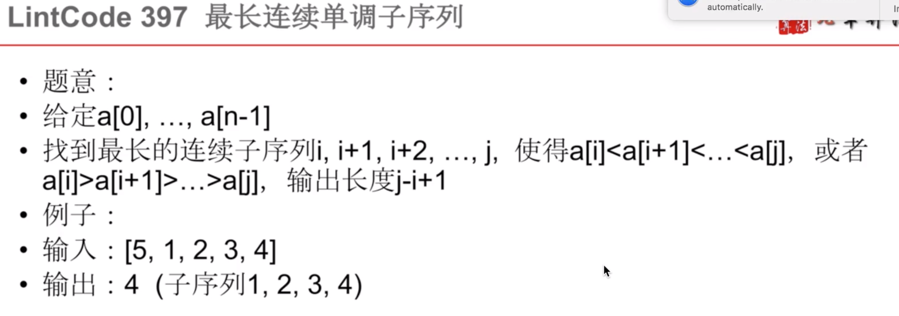

机器人寻找 路径，但是遇到了一个障碍，障碍的地方为0，本次走不通。


房子染色：n个房子 ，前一个房子和前两个房子不可以相同，其实可以理解为我现在需要染色的房子和前面的一个房子是不可以相同的。

遍历N个房子，遍历颜色，当前房子使用k染色，前一个房子使用j染色，求出最小值。

```java

//n个房子
i --> 1 ~ n
j --> 颜色  1 --> J
k --> 颜色  1 --> J
j != k
//相邻的房子不可以相同
//当前取得最小
			//当前房子 但是cost是从0开始的
f[i-1][k] + cost[i-1][j] < f[i][j];


```

坐标型


划分型：

- 将字符串进行划分  

  - 0 单独 的时候没有意义
  - 1-9可以单独为一种方式
  - 大于9小于26可以多一种方式

  ```java
  0单独存在没没有任何意义
  1-9，可以看作一种
   f[i] = 0;
   f[i] += f[i-1]
  10-26
   f[i] += f[i-1]
  ```

  




二维坐标型

找出从小到大或者是从大到小的一个顺序。

f[i] = 表示第i位的时候，最长的序列

```java
i - 1~n
因为有个比较，f[i]和f[i-1]进行比较，所以将0直接给值，循环从1开始
for i --> n
  	f[i] = 1;
	if (f[i] > f[i-1]){
        f[i] += f[i-1]
    }
```


每一步最小，最终最小

- i==j == 0, 值就等于数组相应位置的大小。
- 中间，从上或者左取出最小的，和当前的值相加即可。


空间优化：

一般的，只会用到当前的位置和上面的位置值，其他的位置都可以忽略，那么就可以值保留两个数组。

空间优化的终极方法：一个数组，从后向前


0 0      f[0] = 0

 1 1     f[1] = f[1/2]+1%2;

2  10   f[2] = f[2/2]+2%2;

3   11