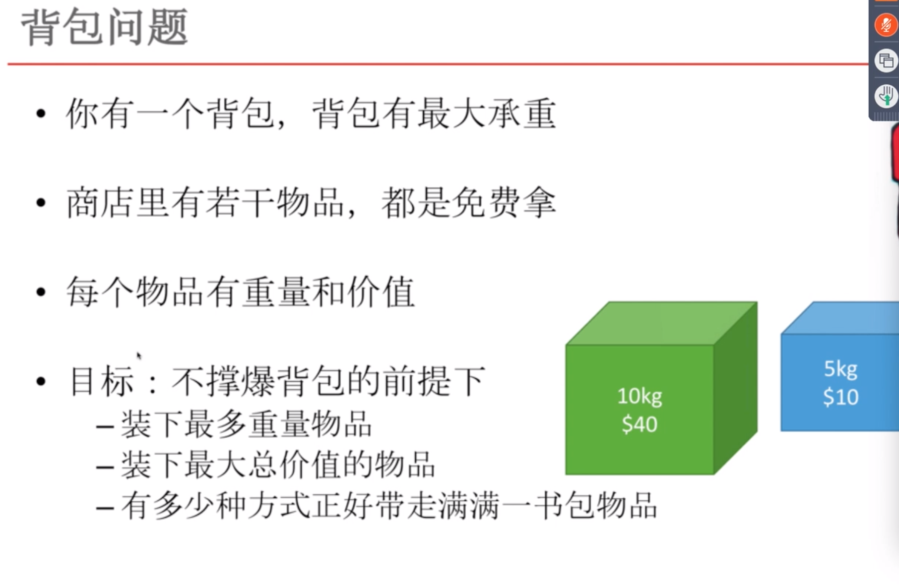
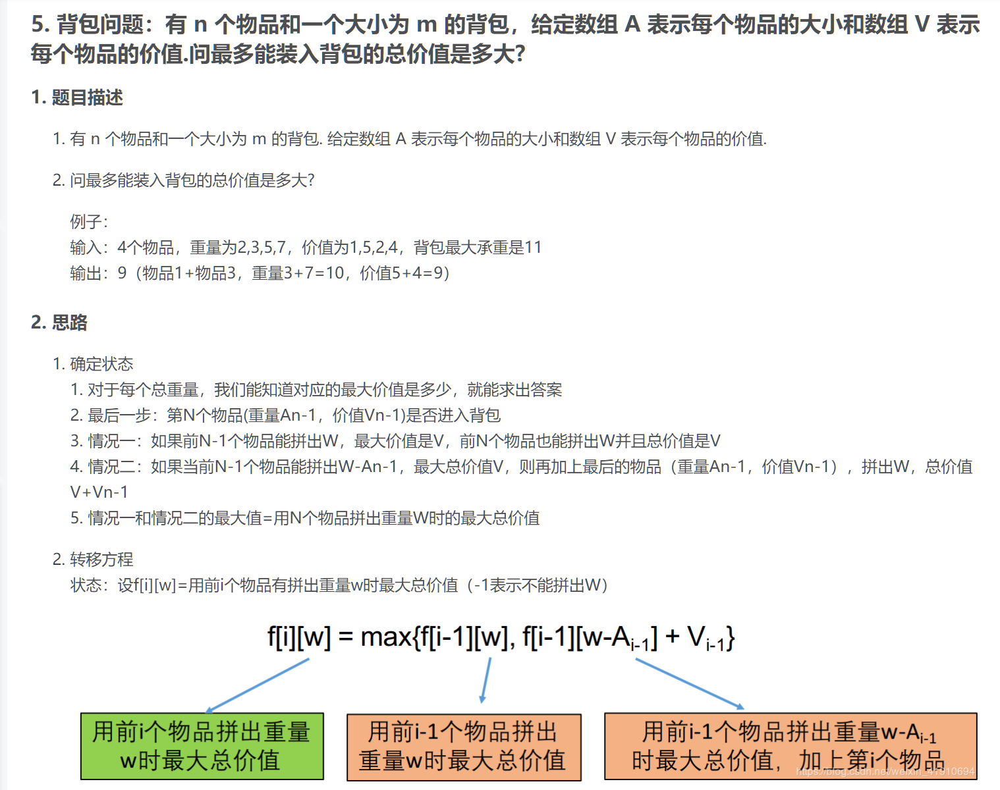
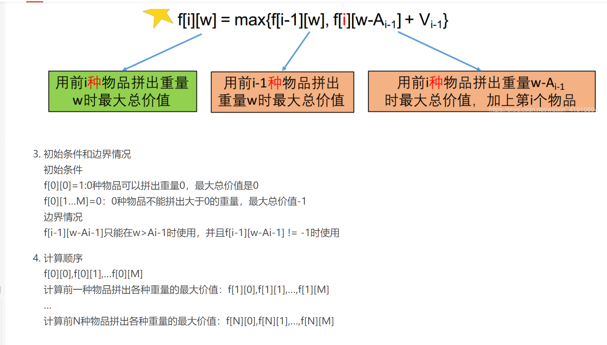

# 背包




**总结：**背包2

n个物品，没有物品的种类m，包的最大承重是m   


分析：

- n是长度，物品的个数
- w是重量，也就是可以存放的重量


物品可以存放无数多个，就可以在加一个循环，循环结束的条件是[w-kA[i-1]<0]

如果说这样是没有任何问题的，但是在计算的时候会有重复的计算，

## 背包总结

心中高大上的背包，也就这样的，真心不知道自己一天想啥呢。


## 可行性背包。

开始0个物体，0重量为true  0物体不0重量为false.

- 一个物品可以存放多满，n个物品可以存放多满。
- 如果重量小于物体，如果大于物体。

```java
//n个物品   w重量
dp[][] = new int[n+1][w+1];
for(i -> w){
    dp[0][i] = false;
}
dp[0][0] = true;
for(int i = 1;i<= n;i++){
    for(int j =0;j<=w;j++){
        //前i-1个已经得到了j值
        dp[i][j] = dp[i-1][j];
        if(j>=arr[i])
            //使用i-1个  或者i-1个加上第i个，
        	dp[i][j] = dp[i][j] | dp[i-1][j-arr[i]];
    }
}
```

## n个数据，多少种方式可以组成目标

n个数据，目标

```java
int dp[][] = new int[n+1][m+1];
dp[0][0] = 1;
for(int i=0;i<=m;i++){
    dp[0][i] = 0;
}
for(int i=1;i<=n;i++){
    for(int j=0;j<=m;j++){
        dp[i][j] = dp[i-1][j];
        if(j>=arr[i][j]){
            dp[i][j] += dp[i][j-arr[i]];
        }
    }
}
```

## 一个数组，找出所有可以组成target的组合

```java
//arr[]   target
f[0]=1;
for(int i=1;i<target;i++){
    f[i] = 0;
    for(int j=0;j<arr.length;j++){
        if(target >= arr[j]){
            f[i] += f[i-arr[j]];
        }
    }

```


## 价值最大


## 完全背包





