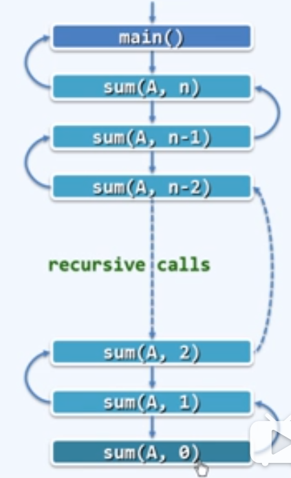
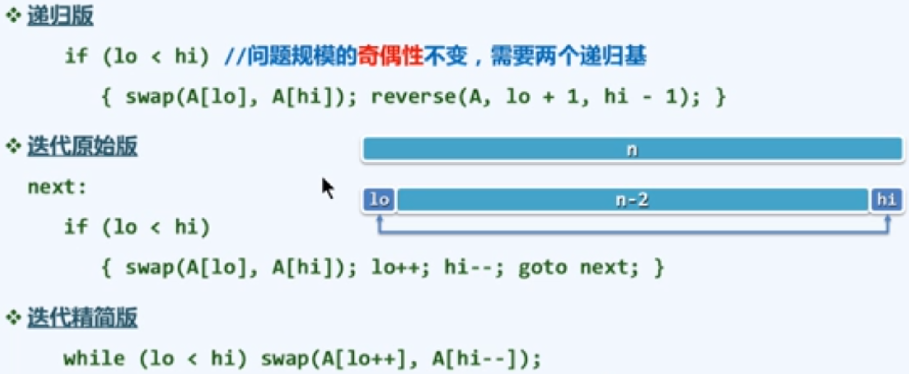
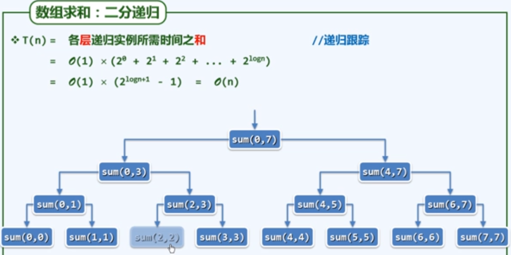
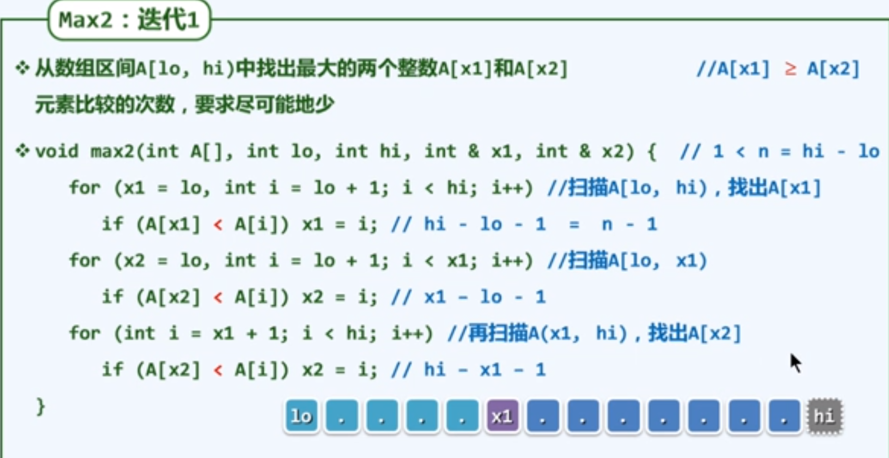
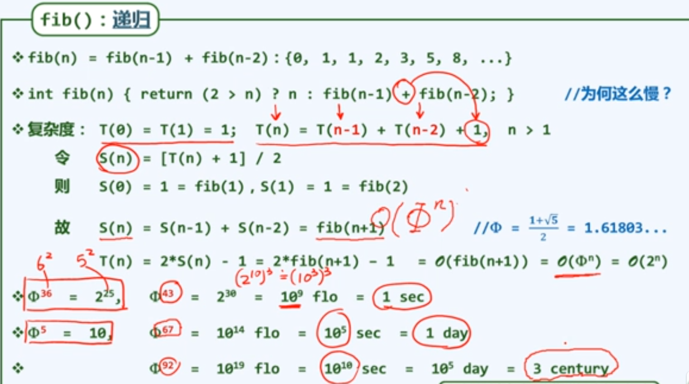
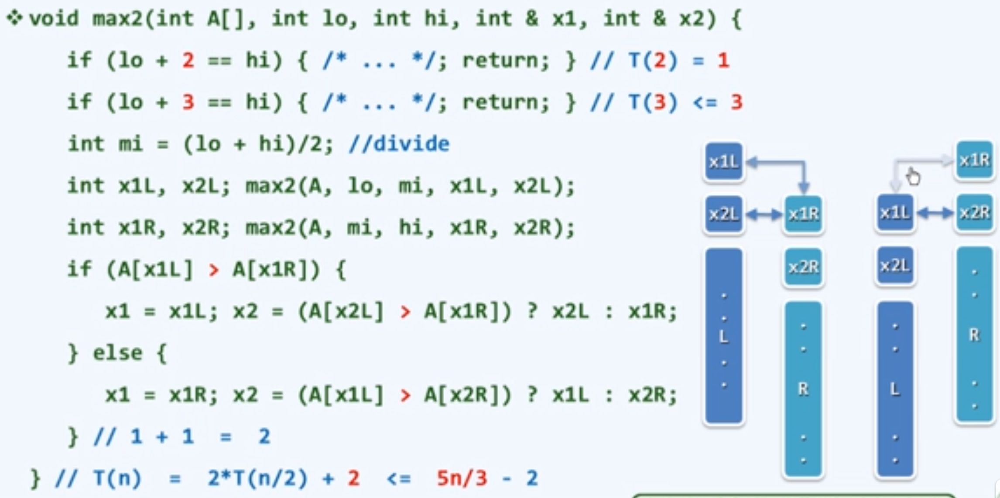
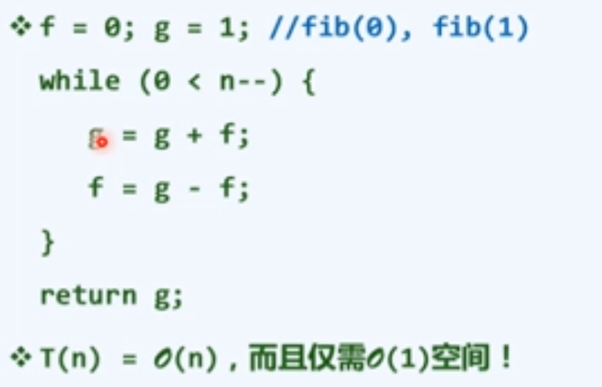

# 递归迭代

```
/**
 * 迭代
 *
 * 时间复杂度O(n)
 *
 * 空间复杂度：
 * 方式一：输入+输出+变量
 * 方式二：输出+变量    （sum + i）  一般采用的是这个方式
 *
 * 这个也就是一个减而知之，也可以使用递归的返回时来进行解决。
 */
```

```java
public class Diedai {
    int SumI(int A[],int n){
        int sum=0;
        for (int i = 0; i < n; i++) {
            sum+=A[i];
        }
        return sum;
    }

    public int sum(int A[],int n){
        if (n<1){
            return 0;
        }
        return sum(A,n-1)+A[n-1];
    }
}

```




对于递归我们需要明确两个：

- 结束条件
- 变化式子 

时间复杂度


## 反转数组



## 分而治之

数组求和



它的时间复杂都是2^n.因为前面的1到n-1次方都是可以忽略的。  


## 没看懂的部分






方式二：开始先定义x1和x2，让他们为最大和次大，目标是x1>x2,

```
x1= arr[0]   x2 = arr[1];   //初始化  
if（x2> x1）{
	swap(x1,x2);
}


for(i =0;i<arr.length;i++){
	//如果只大于x2,那么就将值给x1
	
	//x1和x2进行交换数据
}
```

最好的情况：

- 开始第一次进行比较

- 下来是两次比较，最好的时候是一次比较

  结果就是：1+（n-2）*1 = n-1   = n

- 最坏的结果：1+（n-2）*2 = 2n - 3

所以并没实质上的改进。

---

改进

使用递归和分治：将数据分为左右两个部分，都求出最大值

- 最大值是两个部分胜出的最大值，次大值为左右两边的最大值败下来的值，或者胜出部分的最大值。

代码



斐波那契使用的时间

登梯子

