# 第一章 介绍open gl es 2.0

OpenGL ES is an application programming interface (API) for advanced 3D graphics targeted at handheld and embedded devices such as cell phones, personal digital assistants (PDAs), consoles, appliances, vehicles, and avionics. OpenGL ES is one of a set of APIs created by the Khronos Group. The Khronos Group, founded in January 2000, is a member-funded industry consortium that is focused on the creation of open standard and royaltyfree APIs for handheld and embedded devices.

OpenGL ES是一个应用编程接口(API)，用于针对手机、个人数字助理(PDAs)、控制台、电器、车辆和航空电子设备等手持和嵌入式设备的高级3D图形。OpenGL ES是Khronos集团创建的一套API之一。Khronos集团成立于2000年1月，是一个由成员资助的行业联盟，专注于为手持设备和嵌入式设备创建开放标准和免版税的应用编程接口。

In the desktop world there are two standard 3D APIs, DirectX and OpenGL. DirectX is the de facto standard 3D API for any system running the Microsoft Windows operating system and is used by the majority of 3D games on that platform. OpenGL is a cross-platform standard 3D API for desktop systems running Linux, various flavors of UNIX, Mac OS X, and Microsoft Windows. It is a widely accepted standard 3D API that has seen significant real-world usage. The API is used by games such as the Doom and Quake series, user interfaces as in Mac OS X, workstation computer-aided design (CAD) applications like CATIA, and digital content creation applications such as Maya and SoftImage|XSI.

桌面世界有两个标准的3D APIs，DirectX和OpenGL。DirectX是运行微软视窗操作系统的任何系统的事实上的标准3D应用编程接口，被该平台上的大多数3D游戏使用。OpenGL是一个跨平台的标准3D应用编程接口，适用于运行Linux、各种风格的UNIX、Mac OS X和微软Windows的桌面系统。这是一个被广泛接受的标准3D应用编程接口，在现实世界中得到大量使用。Doom和Quake系列等游戏、Mac OS X等用户界面、CATIA等工作站计算机辅助设计(CAD)应用程序以及Maya和SoftImage|XSI等数字内容创建应用程序都使用该API。

Due to the widespread adoption of OpenGL as a 3D API, it made sense to start with the desktop OpenGL API in developing an open standard 3D API for handheld and embedded devices and modifying it to meet the needs and constraints of the handheld and embedded device space. The device constraints that OpenGL ES addresses are very limited processing capabilities and memory availability, low memory bandwidth2 Chapter 1: Introduction to OpenGL ES 2.0 consumption, and lack of floating-point hardware. The working group used the following criteria in the definition of the OpenGL ES specification(s): sensitivity to power

由于OpenGL作为3D API的广泛采用，在为手持和嵌入式设备开发开放标准3D  API并对其进行修改以满足手持和嵌入式设备空间的需求和限制时，从桌面OpenGL API开始是有意义的。OpenGL  ES解决的设备限制是非常有限的处理能力和内存可用性、低内存带宽、对电源的敏感性。

-  The OpenGL API is very large and complex and the goal of the OpenGL ES working group was to create an API suitable for constrained devices. To achieve this goal, the working group removed any redundancy from the OpenGL API. In any case where there was more than one way of performing the same operation, the most useful method was taken and the redundant techniques were removed. A good example of this is specifying geometry, where in OpenGL an application can use immediate mode, display lists, or vertex arrays. In OpenGL ES, only vertex arrays exist and immediate mode and display lists were removed.

  OpenGL API非常大且复杂，OpenGL ES工作组的目标是创建一个适用于受限设备的API。为了实现这个目标，工作组从OpenGL  API中移除了任何冗余。在任何情况下，如果执行相同操作的方式不止一种，则采用最有用的方法，并删除冗余技术。一个很好的例子是指定几何图形，在OpenGL中，应用程序可以使用立即模式、显示列表或顶点数组。在OpenGL  ES中，只有顶点数组存在，即时模式和显示列表被删除

-  Removing redundancy was an important goal, but maintaining compatibility with OpenGL was also important. As much as possible, OpenGL ES was designed such that applications that were written to the embedded subset of functionality in OpenGL would also run on OpenGL ES. The reason this was an important goal is it allows developers to leverage both APIs and develop applications and tools that use the common subset of functionality. Although this was an important goal, there are cases where it has deviated, especially with OpenGL ES 2.0. This is discussed in detail in later chapters.

  消除冗余是一个重要的目标，但保持与OpenGL的兼容性也很重要。OpenGL  ES的设计尽可能地使那些被写入OpenGL中嵌入式功能子集的应用程序也能在OpenGL  ES上运行。这是一个重要目标的原因是，它允许开发人员利用两个应用编程接口，并开发使用公共功能子集的应用程序和工具。虽然这是一个重要的目标，但也有偏离的情况，尤其是OpenGL  ES 2.0。这将在后面的章节中详细讨论。

- New features were introduced to address specific constraints of handheld and embedded devices. For example, to reduce the power consumption and increase the performance of shaders, precision qualifiers were introduced to the shading language.

  引入了新功能来解决手持设备和嵌入式设备的特定限制。例如，为了降低功耗和提高着色器的性能，在着色语言中引入了精度限定符。

- OpenGL  ES的设计者旨在确保图像质量的最小特征集。大多数手持设备的屏幕尺寸有限，因此屏幕上绘制的像素质量必须尽可能好。

  The designers of OpenGL ES aimed to ensure a minimum set of features for image  quality. Most handheld devices have limited screen sizes, making it essential  that the quality of the pixels drawn on the screen is as good as  possible.

- OpenGL  ES工作组希望确保任何OpenGL ES实现都将满足某些可接受的和一致同意的图像质量、正确性和鲁棒性标准。这是通过开发适当的一致性测试来实现的，OpenGL  ES实现必须通过这些测试才能被认为是兼容的。

  The OpenGL ES working group wanted to ensure that any OpenGL ES implementation  would meet certain acceptable and agreed-on standards for image quality,  correctness, and robustness. This is done by developing appropriate conformance  tests that an OpenGL ES implementation must pass to be considered  compliant.

到目前为止，Khronos已经发布了三个OpenGL  ES规范:OpenGL ES 1.0和ES 1.1规范(在本书中统称为OpenGL ES 1.x)和OpenGL ES 2.0规范。OpenGL ES  1.0和1.1规范实现了一个固定的功能管道，分别源自OpenGL 1.3和1.5规范。

There are three OpenGL ES specifications that have been released by Khronos so  far: the OpenGL ES 1.0 and ES 1.1 specifications (referred to jointly as OpenGL  ES 1.x in this book) and the OpenGL ES 2.0 specification. The OpenGL ES 1.0 and  1.1 specifications implement a fixed function pipeline and are derived from the  OpenGL 1.3 and 1.5 specifications, respectively.

OpenGL  ES 2.0规范实现了一个可编程的图形流水线，是从OpenGL  2.0规范衍生而来的。源自OpenGL规范的修订意味着相应的OpenGL规范被用作确定OpenGL  ES的特定修订中的特征集的基线。然后创建了一个不同的规范，描述了OpenGL ES相对于其派生的OpenGL规范的变化和增加

The OpenGL ES 2.0 specification implements a programmable graphics pipeline  and is derived from the OpenGL 2.0 specification. Being derived from a revision  of the OpenGL specification means that the corresponding OpenGL specification  was used as the baseline for determining the feature set in the particular  revision of OpenGL ES. A different specification was then created that described  the changes and additions to OpenGL ES versus the OpenGL specification from  which it is derived.

由于OpenGL  ES 2.0是从强大的OpenGL 2.0  API派生而来的，因此它能够实现极其丰富的可编程游戏内容。例如，彩色平板1中的图像(见本书中心)来自一个针对OpenGL ES  2.0的弹球游戏演示，它使用着色器来实现高级效果，如环境映射和每片段照明。这个例子展示了在OpenGL ES 2.0应用程序中常见的效果。有了OpenGL ES  2.0，桌面硬件的许多可编程图形功能现在都可以在嵌入式设备上使用。在接下来的章节中，我们将介绍OpenGL ES 2.0管道。

As OpenGL ES 2.0 is derived from the powerful OpenGL 2.0 API, it enables  extremely rich programmable game content. For example, the image in Color Plate  1 (see the center of this book) is from a demo of a pinball game targeted at  OpenGL ES 2.0 and it uses shaders for advanced effects such as environment  mapping and per-fragment lighting. This example demonstrates the kinds of  effects that will be commonplace in OpenGL ES 2.0 applications. With OpenGL ES  2.0, much of the programmable graphics capabilities of desktop hardware are now  available on embedded devices. In the sections that follow we give an  introduction to the OpenGL ES 2.0 pipeline.

OpenGL  ES 2.0是我们在这本书里涉及的API。我们的目标是全面详细地涵盖OpenGL ES 2.0规范(核心规范和Khronos批准的OpenGL ES  2.0扩展)，给出如何使用OpenGL ES 2.0中的特性的具体示例，并讨论各种性能优化技术。看完这本书，你应该对OpenGL ES 2.0  API有很好的把握，能够轻松编写引人注目的OpenGL ES 2.0应用，不必担心阅读多个规范就能理解一个特性是如何工作的。

OpenGL ES 2.0 is the API that we cover in this book. Our goal is to cover the  OpenGL ES 2.0 specification in thorough detail (both the core specification and  Khronos approved OpenGL ES 2.0 extensions), give specific examples of how to use  the features in OpenGL ES 2.0, and discuss various performance optimization  techniques. After reading this book, you should have an excellent grasp of the  OpenGL ES 2.0 API, be able to easily write compelling OpenGL ES 2.0  applications, and not have to worry about reading multiple specifications to  understand how a feature works.

OpenGL  ES 2.0实现了一个可编程着色的图形管道，由两个规范组成:OpenGL ES 2.0 API规范和OpenGL ES着色语言规范(OpenGL ES  SL)。图1-1展示了OpenGL ES 2.0图形流水线。图1-1中的阴影框表示OpenGL ES 2.0中流水线的可编程阶段。概述

OpenGL ES 2.0 implements a graphics pipeline with programmable shading and  consists of two specifications: the OpenGL ES 2.0 API specification and the  OpenGL ES Shading Language Specification (OpenGL ES SL). Figure 1-1 shows the  OpenGL ES 2.0 graphics pipeline. The shaded boxes in Figure 1-1 indicate the  programmable stages of the pipeline in OpenGL ES 2.0. 

接下来是OpenGL ES 2.0图形管道中每个阶段的概述。

An overview of each stage in the OpenGL ES 2.0 graphics pipeline is presented  next.

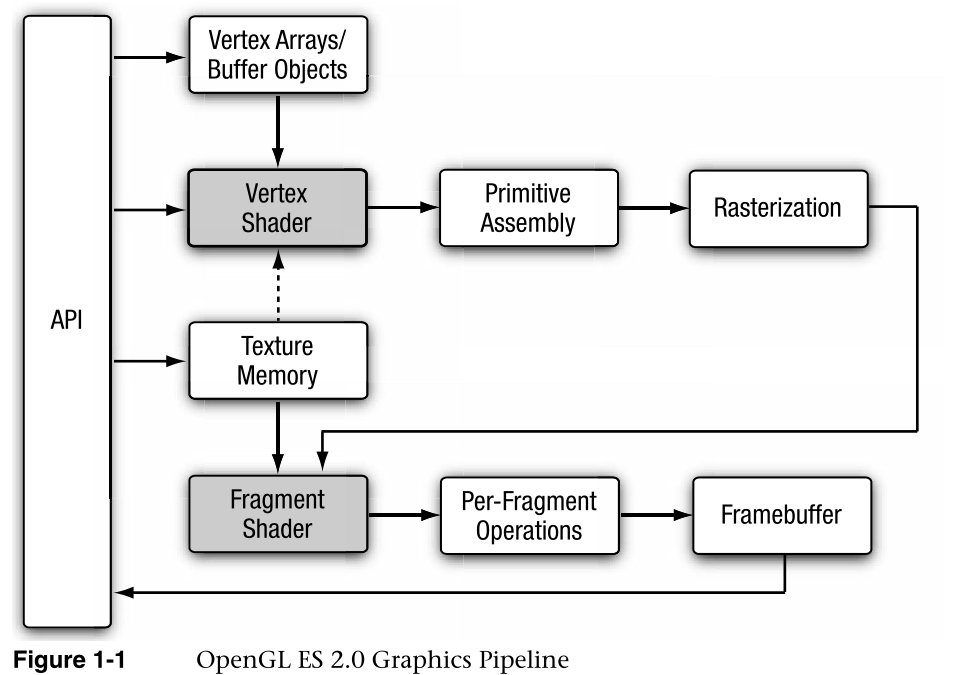

## 顶点着色器

## Vertex Shader

本节给出了顶点着色器的高级概述。顶点和片段着色器将在后面的章节中深入讨论。

 This section gives a high-level overview of what a vertex shader  is. Vertex and fragment shaders are covered in depth in later  chapters.

顶点着色器实现了对顶点进行操作的通用可编程方法。

The vertex shader implements a general purpose programmable method for  operating on vertices.

顶点着色器的输入包括以下内容:

The inputs to the vertex shader consist of the following:

- 属性—使用顶点数组提供的每个顶点的数据

  Attributes—Per-vertex data supplied using vertex arrays

- 统一-顶点着色器使用的恒定数据。

  Uniforms—Constant data used by the vertex shader.

- 采样器——代表顶点着色器使用的纹理的特定制服类型。顶点着色器中的采样器是可选的。

  Samplers—A specific type of uniforms that represent textures used by the  vertex shader. Samplers in a vertex shader are optional.

- 着色器程序-顶点着色器程序源代码或可执行文件，描述将在顶点上执行的操作。

  Shader program—Vertex shader program source code or executable that describes  the operations that will be performed on the vertex.

- 顶点着色器的输出称为可变变量。在图元光栅化阶段，为每个生成的片段计算变化的值，并将其作为输入传递给片段着色器。用于从分配给图元的每个顶点的变化值为每个片段生成变化值的机制称为插值。顶点着色器的输入和输出如图1-2所示。

  The outputs of the vertex shader are called varying variables. In the  primitive rasterization stage, the varying values are calculated for each  generated fragment and are passed in as inputs to the fragment shader. The  mechanism used to generate a varying value for each fragment from the varying  values assigned to each vertex of the primitive is called interpolation. The  inputs and outputs of the vertex shader are diagramed in Figure 1-2.

  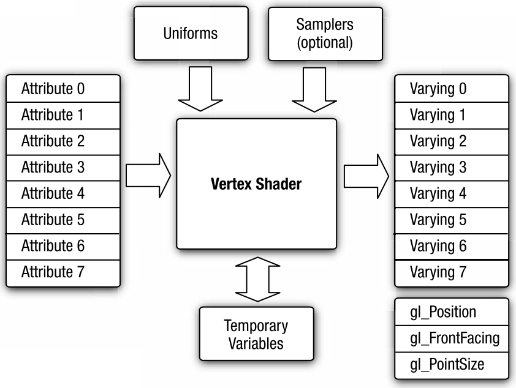

  顶点着色器可用于传统的基于顶点的操作，如通过矩阵变换位置、计算光照方程以生成逐顶点颜色，以及生成或变换纹理坐标。或者，因为顶点着色器是由应用程序指定的，所以顶点着色器可用于进行自定义顶点变换

  Vertex shaders can be used for traditional vertex-based operations such as  transforming the position by a matrix, computing the lighting equation to  generate a per-vertex color, and generating or transforming texture coordinates.  Alternately, because the vertex shader is specified by the application, vertex  shaders can be used to do custom vertex transformations。

  示例1-1显示了一个用OpenGL  ES着色语言编写的顶点着色器。我们将在本书后面详细解释顶点着色器。我们现在展示这个着色器，只是为了让您了解顶点着色器是什么样子的。示例1-1中的顶点着色器将位置及其相关的颜色数据作为输入属性，通过4  × 4矩阵转换位置，并输出转换后的位置和颜色

  Example 1-1 shows a vertex shader written using the OpenGL ES shading  language. We explain vertex shaders in significant detail later in the book. We  show this shader now just to give you an idea of what a vertex shader looks  like. The vertex shader in Example 1-1 takes a position and its associated color  data as input attributes, transforms the position by a 4 × 4 matrix and outputs  the transformed position and color。

  ```java
  Example 1-1 A Vertex Shader Example 
  示例 1-1 顶点着色器示例
  1.  // uniforms used by the vertex shader 固定值  是不会变化 
  2.  uniform mat4   u_mvpMatrix; // matrix to convert P from model
  3.                              // space to normalized device space.
  4.
  5.  // attributes input to the vertex shader   属性值 是可以进行变化的
  6.  attribute vec4   a_position; // position value
  7.  attribute vec4   a_color;    // input vertex color
  8.
  9.  // varying variables – input to the fragment shader
  10. varying vec4     v_color;    // output vertex color  值传输给片段着色器
  11.
  12. void
  13. main()
  14. {
  15.     v_color = a_color;
  16.     gl_Position = u_mvpMatrix * a_position;
  17. }
  ```

  第2行描述了存储组合模型视图和投影矩阵的统一变量u_mvpMatrix。第6行和第7行描述顶点着色器的输入，称为顶点属性。a_position是输入顶点位置属性，a_color是输入顶点颜色属性。在第10行，我们声明了可变的v_color来存储描述每个顶点颜色的顶点着色器的输出。称为gl_Position的内置变量是自动声明的，着色器必须将转换后的位置写入该变量。顶点或片段着色器有一个称为主函数的入口点。第12-17行描述了顶点着色器的主要功能。在第15行，我们读取顶点属性输入a_color，并将其写入顶点输出颜色v_color。在第16行，通过将变换后的顶点位置写入gl_Position来输出。

  Line 2 describes a uniform variable u_mvpMatrix that stores the combined model  view and projection matrix. Lines 6 and 7 describe the inputs to the vertex  shader and are referred to as vertex attributes. a_position is the input vertex  position attribute and a_color is the input vertex color attribute. On line 10  we declare the varying v_color to store the output of the vertex shader that  describes the per-vertex color. The built-in varying called gl_Position is  declared automatically, and the shader must write the transformed position to  this variable. A vertex or fragment shader has a single entry point called the  main function. Lines 12–17 describe the vertex shader main function. In line 15,  we read the vertex attribute input a_color and write it as the vertex output  color v_color. In line 16, the transformed vertex position is output by writing  it to gl_Position.

  ## 图元装配

  Primitive Assembly

  顶点着色器之后，管道中的下一个阶段是图元装配。图元是一种几何对象，可以使用OpenGL  ES中适当的绘制命令来绘制。这些绘图命令指定一组顶点属性，这些属性描述图元的几何图形和图元类型。每个顶点都用一组顶点属性来描述。这些顶点属性包含顶点着色器用来计算位置的信息以及可以传递给片段着色器的其他信息，如其颜色和纹理坐标。

  After the vertex shader, the next stage in the pipeline is primitive assembly.  A primitive is a geometric object that can be drawn using appropriate drawing  commands in OpenGL ES. These drawing commands specify a set of vertex attributes  that describes the primitive’s geometry and a primitive type. Each vertex is  described with a set of vertex attributes. These vertex attributes contain  information that the vertex shader uses to calculate a position and other  information that can be passed to the fragment shader such as its color and  texture coordinates.

  在图元组装阶段，着色顶点被组装成可以绘制的单个几何图元，如三角形、直线或点精灵。对于每个图元，必须确定图元是否位于视平截头体(屏幕上可见的3D空间区域)内。如果图元没有完全位于视图平截头体内部，则可能需要将图元裁剪到视图平截头体上。如果图元完全在外部，则被丢弃。裁剪后，顶点位置转换为屏幕坐标。还可以执行剔除操作，根据图元是面向前还是面向后来丢弃图元。在裁剪和剔除之后，图元准备好被传递到管道的下一阶段，即光栅化阶段。

  In the primitive assembly stage, the shaded vertices are assembled into  individual geometric primitives that can be drawn such as a triangle, line, or  point-sprite. For each primitive, it must be determined whether the primitive  lies within the view frustum (the region of 3D space that is visible on the  screen). If the primitive is not completely inside the view frustum, the  primitive might need to be clipped to the view frustum. If the primitive is  completely outside, it is discarded. After clipping, the vertex position is  converted to screen coordinates. A culling operation can also be performed that  discards primitives based on whether they face forward or backward. After  clipping and culling, the primitive is ready to be passed to the next stage of  the pipeline, which is the rasterization stage.

  ## 光栅化

  图1-3所示的下一个阶段是光栅化阶段，在此阶段绘制适当的图元(点精灵、线或三角形)。光栅化是将图元转换成一组二维片段的过程，这些片段由片段着色器处理。这些二维片段代表可以在屏幕上绘制的像素

  Rasterization The next stage, shown in Figure 1-3, is the rasterization phase  where the appropriate primitive (point-sprite, line, or triangle) is drawn.  Rasterization is the process that converts primitives into a set of  two-dimensional fragments, which are processed by the fragment shader. These  two-dimensional fragments represent pixels that can be drawn on the  screen。

  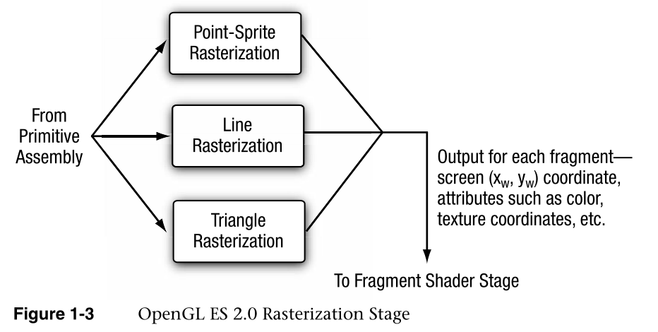

## 片段着色器

片段着色器实现了对片段进行操作的通用可编程方法。如图1-4所示，片段着色器由光栅化阶段为每个生成的片段执行，并接受以下输入:

Fragment Shader The fragment shader implements a general-purpose programmable  method for operating on fragments. The fragment shader, as shown in Figure 1-4,  is executed for each generated fragment by the rasterization stage and takes the  following inputs:

翻译：

- 可变变量-由光栅化单元使用插值为每个片段生成的顶点着色器的输出。
- uniforms-片段着色器使用的恒定数据。
- 采样器——代表片段着色器使用的纹理的特定制服类型。着色器程序—片段着色器程序源代码或可执行文件，描述将对片段执行的操作。

- Varying variables—Outputs of the vertex shader that are generated by the  rasterization unit for each fragment using interpolation. 
-  Uniforms—Constant  data used by the fragment shader. 
-  Samplers—A specific type of uniforms that  represent textures used by the fragment shader. 
- Shader program—Fragment shader  program source code or executable that describes the operations that will be  performed on the fragment.

片段着色器可以丢弃片段，也可以生成一个称为gl_FragColor的颜色值。由光栅化阶段生成的颜色、深度、模板和屏幕坐标位置(xw，yw)成为OpenGL  ES 2.0管道的每个片段操作阶段的输入。

The fragment shader can either discard the fragment or generate a color value  referred to as gl_FragColor. The color, depth, stencil, and screen coordinate  location (xw, yw) generated by the rasterization stage become inputs to the  per-fragment operations stage of the OpenGL ES 2.0 pipeline.

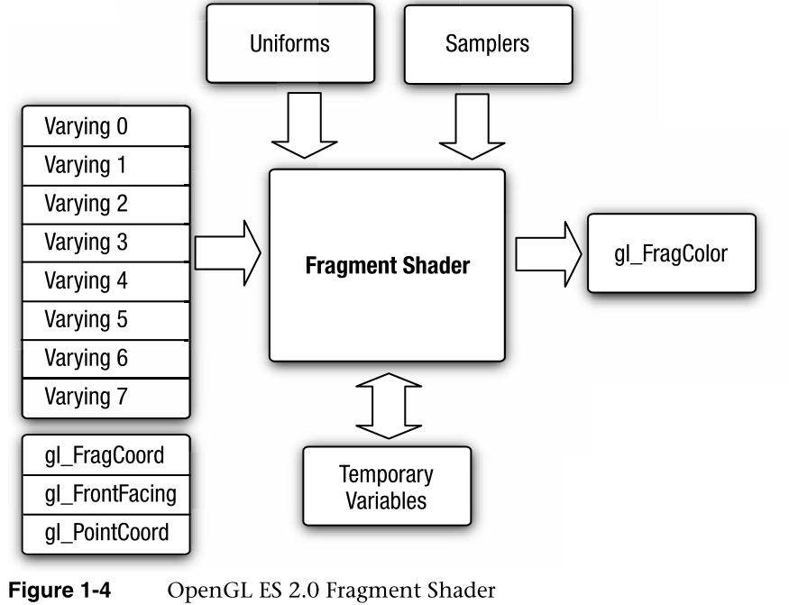

示例1-2描述了一个非常简单的片段着色器，它可以与示例1-1中描述的顶点着色器相结合来绘制gouraud着色三角形。同样，我们将在本书的后面详细讨论片段着色器。我们提出这个只是为了让你对片段着色器有一个基本的了解。

Example 1-2 describes a very simple fragment shader that can be coupled with  the vertex shader described in Example 1-1 to draw a gouraud shaded triangle.  Again, we will go into much more detail on fragment shaders later in the book.  We present this just to give you a basic idea of what a fragment shader looks  like.

```java
Example 1-2 A Fragment Shader Example
1. precision mediump float;
2.
3. varying vec4   v_color;  // input vertex color from vertex shader
4.
5.
6. void
7. main(void)
8. {
9.     gl_FragColor = v_color;
10.}
```

第1行设置默认精度限定符，这将在第4章“着色器和程序”中详细解释第3行描述了片段着色器的输入。顶点着色器必须写入片段着色器读取的同一组可变变量。第6-10行描述了片段着色器的主要功能。请注意，片段着色器中没有声明输出。这是因为唯一的输出变量是gl_FragColor，在本例中，它被设置为第9行中v_color给定的片段着色器的输入颜色。

Line 1 sets the default precision qualifier, which is explained in detail in  Chapter 4, “Shaders and Programs.” Line 3 describes the input to the fragment  shader. The vertex shader must write the same set of varying variables that are  read by the fragment shader. Lines 6–10 describe the fragment shader main  function. Note that no output is declared in the fragment shader. This is  because the only output variable is gl_FragColor, which in this example is set  to input color to the fragment shader given by v_color in line 9.

## 每片段操作

Per-Fragment Operations

在片段着色器之后，下一个阶段是每片段操作。用(xw，yw)屏幕坐标光栅化产生的片段只能修改帧缓冲区中位置(xw，yw)处的像素。图1-5描述了OpenGL  ES 2.0每片段操作阶段。

After the fragment shader, the next stage is per-fragment operations. A  fragment produced by rasterization with (xw, yw) screen coordinates can only  modify the pixel at location (xw, yw) in the framebuffer. Figure 1-5 describes  the OpenGL ES 2.0 per-fragment operations stage.

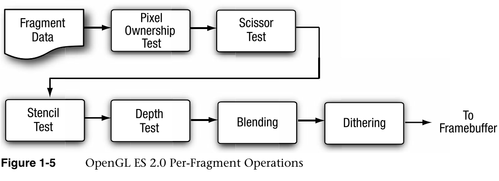

每个片段操作阶段对每个片段执行以下功能(和测试)，如图1-5所示:

The per-fragment operations stage performs the following functions (and tests)  on each fragment, as shown in Figure 1-5:

- 像素所有权测试—该测试确定帧缓冲区中位置(xw，yw)的像素当前是否属于OpenGL  ES。该测试允许窗口系统控制帧缓冲区中的哪些像素属于当前OpenGL ES上下文。例如，如果显示OpenGL  ES帧缓冲区窗口的窗口被另一个窗口遮挡，则窗口系统可以确定被遮挡的像素不属于OpenGL ES上下文，因此可能根本不显示

  Pixel ownership test—This test determines if the pixel at location (xw, yw) in  the framebuffer is currently owned by OpenGL ES. This test allows the window  system to control which pixels in the framebuffer belong to the current OpenGL  ES context. For example, if a window displaying the OpenGL ES framebuffer window  is obscured by another window, the windowing system may determine that the  obscured pixels are not owned by the OpenGL ES context and therefore might not  be displayed at all

- 剪式测试——剪式测试确定(xw，yw)是否位于定义为OpenGL  ES状态一部分的剪式矩形内。如果片段在剪式区域之外，则丢弃该片段。

  Scissor test—The scissor test determines if (xw, yw) lies within the scissor  rectangle defined as part of the OpenGL ES state. If the fragment is outside the  scissor region, the fragment is discarded.

- 模板和深度测试—这些测试对传入片段的模板和深度值进行测试，以确定该片段是否应该被拒绝。

  Stencil and depth tests—These perform tests on the stencil and depth value of  the incoming fragment to determine if the fragment should be rejected or  not.

- 混合—混合将新生成的片段颜色值与存储在帧缓冲区位置(xw，yw)的颜色值相结合。

  Blending—Blending combines the newly generated fragment color value with the  color values stored in the framebuffer at location (xw, yw).

- 抖动—抖动可用于最大限度地减少因使用有限精度在帧缓冲区中存储颜色值而产生的伪像。

  Dithering—Dithering can be used to minimize the artifacts that can occur from  using limited precision to store color values in the framebuffer.

在每片段阶段结束时，要么拒绝该片段，要么将片段颜色、深度或模板值写入帧缓冲区的位置(xw，yw)。片段颜色、深度和模板值的写入取决于是否启用了适当的写入掩码。写掩码允许对写入适当缓冲区的颜色、深度和模板值进行更好的控制。例如，可以设置颜色缓冲区的写掩码，使得没有红色值被写入颜色缓冲区。

At the end of the per-fragment stage, either the fragment is rejected or a  fragment color, depth, or stencil value is written to the framebuffer at  location (xw, yw). The fragment color, depth, and stencil values are written  depending on whether the appropriate write masks are enabled or not. Write masks  allow finer control over the color, depth, and stencil values written into the  appropriate buffers. For example, the write mask for the color buffer could be  set such that no red values get written into the color buffer.

此外，OpenGL  ES 2.0还提供了一个从帧缓冲区中回读像素的接口。请注意，只有像素可以从颜色缓冲区中回读。无法回读深度和模具值。

In addition, OpenGL ES 2.0 also provides an interface to read back the pixels  from the framebuffer. Note that only pixels can be read back from the color  buffer. The depth and stencil values cannot be read back.

注意:阿尔法测试和逻辑运算不再是每个片段操作阶段的一部分。OpenGL  2.0和OpenGL ES  1.x中存在这两个阶段，不再需要alpha测试阶段，因为片段着色器可以丢弃片段，因此alpha测试可以在片段着色器中执行。此外，删除了LogicOp,因为它很少被应用程序使用，并且OpenGL  ES工作组没有从独立软件供应商那里得到支持OpenGL ES 2.0中这一特性的请求.

Note: Alpha test and LogicOp are no longer part of the per-fragment operations  stage. These two stages exist in OpenGL 2.0 and OpenGL ES 1.x. The alpha test  stage is no longer needed because the fragment shader can discard fragments and  therefore the alpha test can be performed in the fragment shader. In addition,  LogicOp is removed as it is very infrequently used by applications and the OpenGL ES working  group did not get requests from independent software vendors (ISVs) to support  this feature in OpenGL ES 2.0.

## OpenGL  ES 2.0和OpenGL ES 1.x向后兼容

OpenGL ES 2.0 and OpenGL ES 1.x Backward Compatibility 

OpenGL  ES 2.0与OpenGL ES 1.x不向后兼容，不支持OpenGL ES 1.x支持的固定函数管道。OpenGL ES  2.0可编程顶点着色器取代了OpenGL ES  1.x中实现的固定函数顶点单元，固定函数顶点单元实现了特定的顶点变换和光照方程，可用于变换顶点位置、变换或生成纹理坐标、计算顶点颜色。类似地，可编程片段着色器取代了OpenGL  ES  1.x中实现的固定功能纹理组合单元。固定功能纹理组合单元为每个纹理单元实现一个纹理组合阶段。纹理颜色与漫射颜色以及前一个纹理组合阶段的输出相结合，并带有一组固定的操作，如添加、调制、减去和点。

OpenGL ES 2.0 is not backward compatible with OpenGL ES 1.x. It does not  support the fixed function pipeline that OpenGL ES 1.x supports. The OpenGL ES  2.0 programmable vertex shader replaces the fixed function vertex units  implemented in OpenGL ES 1.x. The fixed function vertex units implement a  specific vertex transformation and lighting equation that can be used to  transform the vertex position, transform or generate texture coordinates, and  calculate the vertex color. Similarly, the programmable fragment shader replaces  the fixed function texture combine units implemented in OpenGL ES 1.x. The fixed  function texture combine units implement a texture combine stage for each  texture unit. The texture color is combined with the diffuse color and the  output of previous texture combine stage with a fixed set of operations such as  add, modulate, subtract, and dot.

这与OpenGL  2.0不同，OpenGL 2.0实现了可编程管道，但也为实现固定功能管道的OpenGL旧版本提供了完全的向后兼容性。

This is a departure from OpenGL 2.0, which implements a programmable pipeline  but also provides full backward compatibility to older versions of OpenGL that  implement a fixed function pipeline.

- 在OpenGL  ES  2.0中支持固定功能管道意味着API将支持不止一种实现功能的方式，这违反了工作组在确定应该支持哪些功能时使用的标准之一。可编程管道允许应用程序使用着色器实现固定功能管道，因此没有令人信服的理由向后兼容OpenGL  ES 1.x。

  Supporting the fixed function pipeline in OpenGL ES 2.0 implies that the API  would support more than one way of implementing a feature, in violation of one  of the criteria used by the working group in determining what features should be  supported. The programmable pipeline allows applications to implement the fixed  function pipeline using shaders, so there is really no compelling reason to be  backward compatible with OpenGL ES 1.x.

- 独立软件开发商的反馈是，大多数游戏不混合可编程和固定功能管道。它们要么是为固定功能流水线编写的，要么是为可编程流水线编写的。一旦你有了一个可编程的管道，就没有理由使用一个固定的函数管道，因为你在你想要渲染的效果上有了更多的灵活性。

  Feedback from ISVs was that most games do not mix programmable and fixed  function pipelines. They are either written for a fixed function pipeline or for  a programmable pipeline. Once you have a programmable pipeline, there is no  reason to use a fixed function pipeline as you have a lot more flexibility in  the effects you want to render.

- 独立软件开发商的反馈是，大多数游戏不混合可编程和固定功能管道。它们要么是为固定功能流水线编写的，要么是为可编程流水线编写的。一旦你有了一个可编程的管道，就没有理由使用一个固定的函数管道，因为你在你想要渲染的效果上有了更多的灵活性。

  Feedback from ISVs was that most games do not mix programmable and fixed  function pipelines. They are either written for a fixed function pipeline or for  a programmable pipeline. Once you have a programmable pipeline, there is no  reason to use a fixed function pipeline as you have a lot more flexibility in  the effects you want to render.

还要注意，与OpenGL  ES 1.x不同，OpenGL ES 2.0没有配置文件或“强制扩展”。

Also note, unlike OpenGL ES 1.x, there are no profiles or “mandatory  extensions” for OpenGL ES 2.0.

## EGL

EGL

OpenGL  ES命令需要一个渲染上下文和一个绘图表面。渲染上下文存储适当的OpenGL  ES状态。绘图表面是图元将被绘制到的表面。绘图表面指定渲染所需的缓冲区类型，如颜色缓冲区、深度缓冲区和模具缓冲区。绘图面还指定了每个所需缓冲区的位深度。

OpenGL ES commands require a rendering context and a drawing surface. The  rendering context stores the appropriate OpenGL ES state. The drawing surface is  the surface to which primitives will be drawn. The drawing surface specifies the  types of buffers that are required for rendering such as a color buffer, depth  buffer, and stencil buffer. The drawing surface also specifies the bit depths of  each of the required buffers.

OpenGL  ES API没有提到渲染上下文是如何创建的，或者渲染上下文是如何附加到本机窗口系统的。EGL是OpenGL  ES等Khronos渲染APIs和原生窗口系统之间的一个接口。实现OpenGL  ES时不需要提供EGL。开发人员应该参考平台供应商的文档来确定支持哪个接口。

The OpenGL ES API does not mention how a rendering context is created or how  the rendering context gets attached to the native windowing system. EGL is one  interface between the Khronos rendering APIs such as OpenGL ES and the native  window system. There is no requirement to provide EGL when implementing OpenGL  ES. Developers should refer to the platform vendor’s documentation to determine  which interface is supported.

在开始渲染之前，任何OpenGL  ES应用程序都需要使用EGL执行以下操作:

Any OpenGL ES application will need to do the following using EGL before any  rendering can begin:

- 查询设备上可用的显示并初始化它们。例如，一个翻盖手机可能有两个液晶面板，我们可以使用OpenGL  ES渲染可以在其中一个或两个面板上显示的表面。

  Query the displays that are available on the device and initialize them. For  example, a flip phone might have two LCD panels and it is possible that we can  render using OpenGL ES to surfaces that can be displayed on either or both  panels.

- 创建渲染表面。在EGL创建的表面可以分为屏幕表面和屏幕外表面。屏幕上的表面被附加到本地窗口系统，而屏幕外的表面是像素缓冲区，不被显示，但可以用作渲染表面。这些表面可用于渲染成纹理，并可在多个Khronos  APIs之间共享。

  Create a rendering surface. Surfaces created in EGL can be categorized as  on-screen surfaces or off-screen surfaces. On-screen surfaces are attached to  the native window system, whereas off-screen surfaces are pixel buffers that do  not get displayed but can be used as rendering surfaces. These surfaces can be  used to render into a texture and can be shared across multiple Khronos  APIs.

- 创建渲染上下文。需要EGL来创建一个OpenGL  ES渲染上下文。在实际开始渲染之前，需要将此上下文附加到适当的表面上。

  Create a rendering context. EGL is needed to create an OpenGL ES rendering  context. This context needs to be attached to an appropriate surface before  rendering can actually begin.

EGL应用编程接口实现了刚才描述的特性和附加功能，如电源管理、支持一个进程中的多个渲染上下文、在一个进程中的渲染上下文之间共享对象(如纹理或顶点缓冲区)，以及获取给定实现支持的EGL或OpenGL  ES扩展函数的函数指针的机制。EGL规范的最新版本是EGL版本1.4。

The EGL API implements the features just described and additional  functionality such as power management, support for multiple rendering contexts  in a process, sharing objects (such as textures or vertex buffers) across  rendering contexts in a process, and a mechanism to get function pointers to EGL  or OpenGL ES extension functions supported by a given implementation. The latest  version of the EGL specification is EGL version 1.4.

## 使用opengl es 2.0 编程

要编写任何OpenGL  ES 2.0应用程序，您需要知道需要包含哪些头文件，以及您的应用程序需要链接哪些库。了解EGL和总帐命令名称和命令参数使用的语法也很有用。

To write any OpenGL ES 2.0 application, you will need to know which header  files need to be included and with which libraries your application needs to  link. It is also useful to understand the syntax used by the EGL and GL command  names and command parameters.

### 库和包含文件

Libraries and Include Files

OpenGL  ES 2.0应用程序将需要与以下库链接:*OpenGL ES 2.0*库名为*libGLESv2.lib*，EGL库名为*libEGL.lib*

OpenGL ES 2.0 applications will need to link with the following libraries: the  OpenGL ES 2.0 library named libGLESv2.lib and the EGL library named  libEGL.lib.

OpenGL  ES 2.0应用程序将需要包括适当的ES 2.0和EGL头文件。任何OpenGL ES 2.0应用程序都必须包含以下包含文件:

OpenGL ES 2.0 applications will need to include the appropriate ES 2.0 and EGL  header files. The following include files must be included by any OpenGL ES 2.0  application:

```java
#include <EGL/egl.h>
#include <GLES2/gl2.h>
#include <GLES2/gl2ext.h>
```

egl.h是egl头文件，gl2.h是OpenGL  ES 2.0头文件，gl2ext.h是描述OpenGL ES 2.0的Khronos批准的扩展列表的头文件。

egl.h is the EGL header file, gl2.h is the OpenGL ES 2.0 header file, and  gl2ext.h is the header file that describes the list of Khronos-approved  extensions for OpenGL ES 2.0.

头文件和库名依赖于平台。OpenGL  ES工作组试图定义库和头的名称，以及它们应该如何组织，但这可能不是所有OpenGL  ES平台的情况。但是，开发人员应该参考平台供应商的文档，了解如何命名和组织库和包含文件的信息。

The header file and library names are platform dependent. The OpenGL ES  working group has tried to define the library and header names and how they  should be organized but this might not be the case for all OpenGL ES platforms.  Developers should, however, refer to the platform vendor’s documentation for  information on how the libraries and include files are named and  organized.

## EGL命令语法

EGL Command Syntax

所有EGL命令都以前缀egl开头，并对组成命令名称的每个单词使用首字母大写(例如，eglCreateWindowSurface)。同样，EGL数据类型也以前缀EGL开头，除了EGLint和EGLenum之外，组成类型名称的每个单词都使用首字母大写。

All EGL commands begin with the prefix egl and use an initial capital letter  for each word making up the command name (e.g., eglCreateWindowSurface).  Similarly, EGL data types also begin with the prefix EGL and use an initial  capital letter for each word making up the type name except for EGLint and  EGLenum.

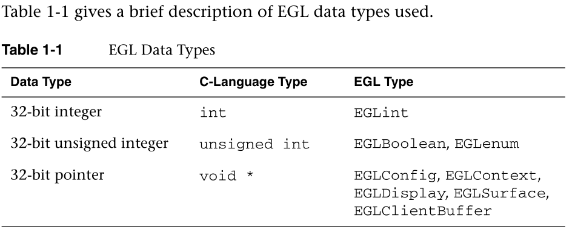

### OpenGLES系统命令语法

OpenGL ES Command Syntax

所有OpenGL  ES命令都以前缀GL开头，并为组成命令名称的每个单词使用一个首字母大写字母(例如glBlendEquation)。同样，OpenGL  ES数据类型也以前缀GL开头。

All OpenGL ES commands begin with the prefix gl and use an initial capital  letter for each word making up the command name (e.g., glBlendEquation).  Similarly, OpenGL ES data types also begin with the prefix GL.

此外，一些命令可能采用不同风格的参数。风格或类型因采用的参数数量(一到四个参数)、所用参数的数据类型(byte  [b]、无符号byte [ub]、short [s]、无符号short [us]、int [i]、fixed [x]和float  [f])以及参数是否作为向量(v)传递而异。OpenGL ES中允许的命令风格的几个例子如下。

In addition, some commands might take arguments in different flavors. The  flavors or types vary by the number of arguments taken (one to four arguments),  the data type of the arguments used (byte [b], unsigned byte [ub], short [s],  unsigned short [us], int [i], fixed [x], and float [f]), and whether the  arguments are passed as a vector (v) or not. A few examples of command flavors  allowed in OpenGL ES follow.

以下两个命令是等效的，除了一个将统一值指定为浮点，另一个指定为整数。glUniform2f(位置，1.0f，0.0f)；glUniform2i(位置，1，0)

The following two commands are equivalent except one specifies the uniform  value as floats and the other as integers. 

```java
glUniform2f(location, 1.0f, 0.0f);  glUniform2i(location, 1, 0)
```

下面几行描述的命令也是等价的，但是一行将命令参数作为向量传递，而另一行则不是。

The following lines describe commands that are also equivalent but one passes  command arguments as a vector and the other does not.

```java
GLfloat   coord[4] = { 1.0f, 0.75f, 0.25f, 0.0f };
glUniform4fv(location, coord);
glUniform4f(location, coord[0], coord[1], coord[2], coord[3]);
```

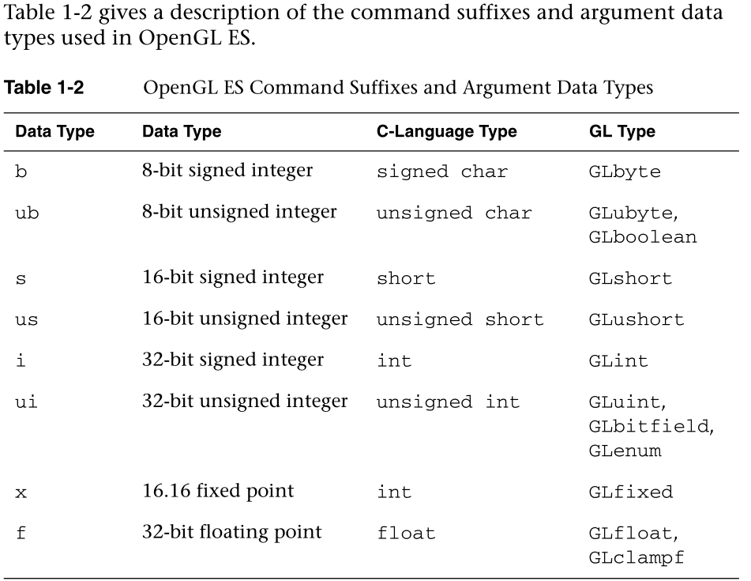

最后，OpenGL  ES定义了GLvoid类型。这用于接受指针的OpenGL ES命令。

Finally, OpenGL ES defines the type GLvoid. This is used for OpenGL ES  commands that accept pointers.

在本书的其余部分，OpenGL  ES命令仅通过它们的基本名称来引用，星号用于指示这是指命令名称的多种风格。例如，glUniform  *(v)代表用于指定制服的命令的所有变体，而glUniform*v()指的是用于指定制服的命令的所有矢量版本。如果需要讨论命令的特定版本，我们使用带有适当后缀的完整命令名。

In the rest of this book, OpenGL ES commands are referred to by their base  names only and an asterisk is used to indicate that this refers to multiple  flavors of the command name. For example, glUniform*() stands for all variations  of the command you use to specify uniforms and glUniform*v() refers to all the  vector versions of the command you use to specify uniforms. If a particular  version of a command needs to be discussed, we use the full command name with  the appropriate suffixes.

## 错误处理

Error Handling

应用程序不正确使用的OpenGL  ES命令会生成错误代码。该错误代码被记录下来，可以使用glGetError进行查询。在应用程序使用glGetError查询第一个错误代码之前，不会记录任何其他错误。一旦查询到错误代码，当前错误代码将被重置为GL_NO_ERROR。生成错误的命令被忽略，并且不影响OpenGL  ES状态，除了本节后面描述的GL_OUT_OF_MEMORY错误。

OpenGL ES commands incorrectly used by applications generate an error code.  This error code is recorded and can be queried using glGetError. No other errors  will be recorded until the application has queried the first error code using  glGetError. Once the error code has been queried, the current error code is  reset to GL_NO_ERROR. The command that generated the error is ignored and does  not affect the OpenGL ES state except for the GL_OUT_OF_MEMORY error described  later in this section.

接下来描述glGetError命令。

The glGetError command is described next.

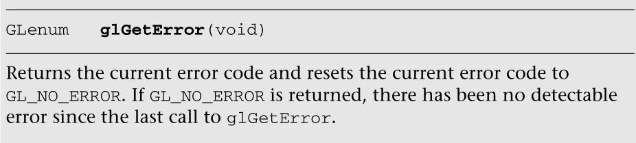


表1-3列出了基本错误代码及其描述。除了表1-3中列出的基本错误代码之外，还有其他错误代码，这些错误代码在涵盖生成这些特定错误的OpenGL  ES命令的章节中有所描述。

Table 1-3 lists the basic error codes and their description. There are other  error codes besides the basic error codes listed in Table 1-3 that are described  in the chapters that cover OpenGL ES commands that generate these specific  errors.

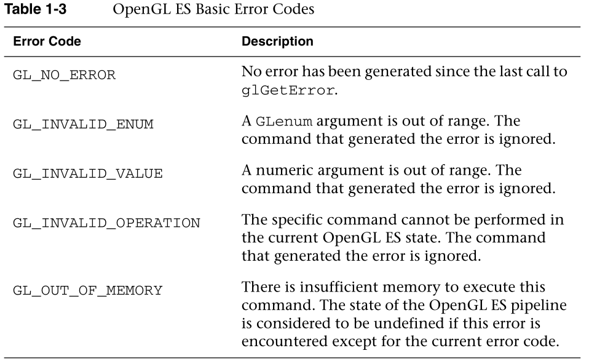

## 翻译：

刷新和完成

Flush and Finish


翻译：

OpenGL  ES 2.0 API继承了OpenGL客户端-服务器模型。应用程序或客户端发出命令，这些命令由OpenGL  ES实现或服务器处理。在OpenGL中，客户机和服务器可以通过网络驻留在不同的机器上。OpenGL  ES还允许客户端和服务器驻留在不同的机器上，但是因为OpenGL ES的目标是手持和嵌入式平台，所以客户端和服务器通常在同一台设备上。

The OpenGL ES 2.0 API inherits the OpenGL client–server model. The  application, or client, issues commands, and these commands are processed by the  OpenGL ES implementation or server. In OpenGL, the client and server can reside  on different machines over a network. OpenGL ES also allows the client and  server to reside on different machines but because OpenGL ES targets handheld  and embedded platforms, the client and server will typically be on the same  device. 	

在客户机-服务器模型中，客户机发出的命令不一定会立即发送到服务器。如果客户机和服务器在网络上，那么通过网络发送单独的命令将会非常低效。相反，命令可以在客户端缓冲，然后在稍后的时间点发送到服务器。因此，需要有一种机制，让客户机知道服务器何时完成了以前提交的命令的执行。考虑另一个例子，其中多个OpenGL  ES上下文(每个当前到不同的线程)共享对象。为了在这些上下文之间正确同步，来自上下文A的命令在依赖于由上下文A修改的OpenGL  ES状态的上下文B之前被发布到服务器是很重要的。glFlush命令用于刷新当前OpenGL  ES上下文中的任何未决命令，并将它们发布到服务器。请注意，glFlush只向服务器发出命令，不等待它们完成。如果客户端要求完成命令，应该使用glFinish命令。但是，除非绝对必要，否则我们不建议使用glFinish。因为在服务器完全处理完上下文中所有排队的命令之前，glFinish不会返回，所以调用glFinish会强制客户端和服务器同步它们的操作，从而对性能产生不利影响。

In the client–server model, the commands issued by the client do not  necessarily get sent to the server immediately. If the client and server are  over a network, it will be very inefficient to send individual commands over the  network. Instead, the commands can be buffered on the client side and then  issued to the server at a later point in time. As a result, there needs to be a  mechanism that lets the client know when the server has completed execution of  previously submitted commands. Consider another example where multiple OpenGL ES  contexts (each current to a different thread) are sharing objects. To  synchronize correctly between these contexts, it is important that commands from  context A be issued to the server before context B that depends on OpenGL ES  state modified by context A. The glFlush command is used to flush any pending  commands in the current OpenGL ES context and issue them to the server. Note  that glFlush only issues the commands to the server and does not wait for them  to complete. If the client requires that the commands be completed, the glFinish  command should be used. We, however, do not recommend using glFinish unless  absolutely necessary. Because glFinish does not return until all queued commands  in the context have been completely processed by the server, calling glFinish  can adversely impact performance by forcing the client and server to synchronize  their operations.

```java
void   glFlush(void)
void   glFinish(void)
```

## 翻译：

基本状态管理

Basic State Management

图1-1显示了OpenGL  ES  2.0中的各个管道阶段。每个管道阶段都有可以启用或禁用的状态，以及针对每个上下文维护的适当状态值。状态的示例有混合启用、混合因子、剔除启用和剔除面。当OpenGL  ES上下文(EGLcontext)初始化时，该状态用默认值初始化。状态使能可以使用glEnable和glDisable命令来设置。

Figure 1-1 showed the various pipeline stages in OpenGL ES 2.0. Each pipeline  stage has state that can be enabled or disabled and appropriate state values  that are maintained per context. Examples of state are blending enable, blend  factors, cull enable, and cull face. This state is initialized with default  values when an OpenGL ES context (EGLcontext) is initialized. The state enables  can be set using the glEnable and glDisable commands.


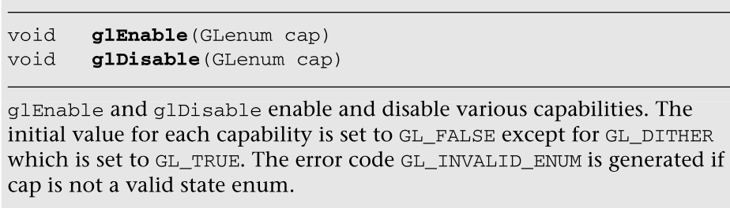


接下来的章节将描述图1-1所示的每个流水线阶段的具体状态。您还可以使用glIsEnabled命令检查当前状态是启用还是禁用。

The chapters that follow will describe the specific state enables for each  pipeline stage shown in Figure 1-1. You can also check if a state is currently  enabled or disabled by using the glIsEnabled command.

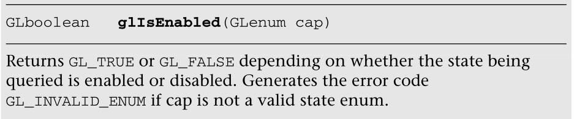

也可以使用适当的glGet***命令查询特定的状态值，如混合因子、深度测试值等。这些命令在第14章“状态查询”中有详细描述

Specific state values such as blend fac

tor, depth test values, and so on can  also be queried using appropriate glGet*** commands. These commands are  described in detail in Chapter 14, “State Queries.”

## 进一步阅读

Further Reading

OpenGL  ES  1.0、1.1和2.0规范可以在www.khronos.org/opengles/.找到。此外，Khronos网站(www.khronos.org)有关于所有Khronos规范、开发人员留言板、教程和示例的最新信息。

- 1.Khronos  OpenGL ES 1.1网站:www.khronos.org/opengles/1_X/ 
- 2.Khronos OpenGL ES  2.0网站:www.khronos.org/opengles/2_X/
- 3.克鲁诺斯·EGL网站:www.khronos.org/egl/

The OpenGL ES 1.0, 1.1, and 2.0 specifications can be found at  www.khronos.org/opengles/. In addition, the Khronos Web site (www.khronos.org)  has the latest information on all Khronos specifications, developer message  boards, tutorials, and examples. 1. Khronos OpenGL ES 1.1 Web site:  www.khronos.org/opengles/1_X/ 2. Khronos OpenGL ES 2.0 Web site:  www.khronos.org/opengles/2_X/ 3. Khronos EGL Web site:  www.khronos.org/egl/