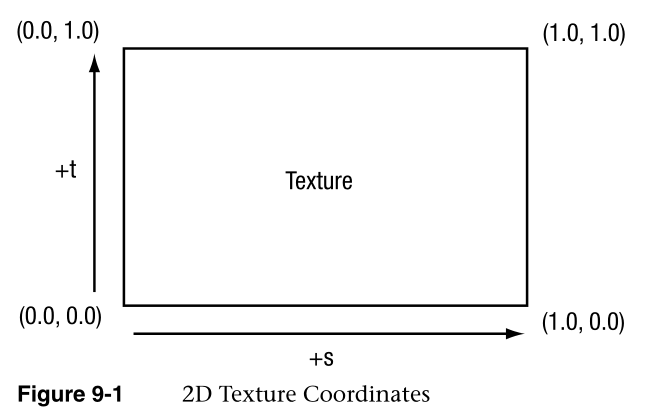
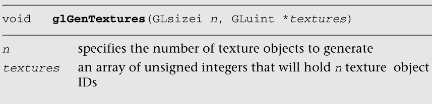
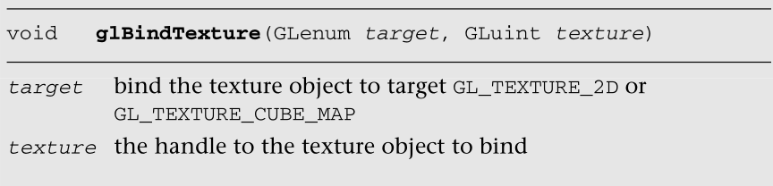
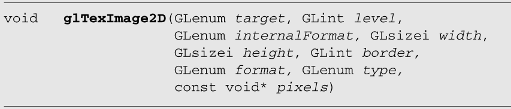
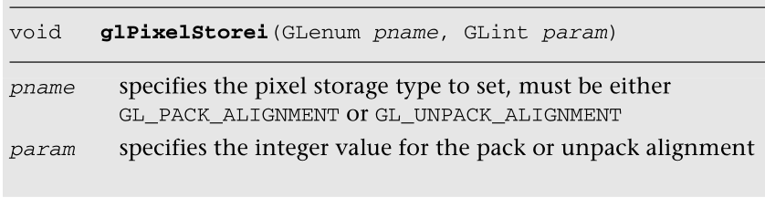

现在我们已经详细介绍了顶点着色器，你应该熟悉在转换顶点和准备渲染基元时的所有细节。管道中的下一步是片段着色器，OpenGL ES  2.0的大部分视觉魔法都发生在这里。可编程的片段着色器是生产包括纹理、逐像素照明和阴影效果的基础。碎片着色器的一个基本方面是对表面纹理的应用。本章涵盖了创建、加载和应用纹理的所有细节:

- T e x T u r i n g b a s i c  s。

- 加载纹理和mipmapping。
- 纹理过滤和包装。
- 在碎片着色器中使用纹理。
- 纹理子图像规范。
- 从颜色缓冲区复制纹理数据。
- 可选的纹理扩展。

## 纹理基础

渲染3D图形中最基本的操作之一是在表面上应用纹理。纹理允许额外的细节的表现，不能仅仅从一个网格的几何。OpenGL ES  2.0中的纹理有两种形式:2D纹理和立方体贴图纹理。纹理通常是通过使用纹理坐标应用到表面上的，纹理坐标可以被认为是纹理数组数据的索引。下面的章节介绍了OpenGL  ES中不同的纹理类型，以及它们是如何加载和访问的。

### 2D纹理

2D纹理是OpenGL  ES中最基本、最常见的纹理形式。二维纹理——正如您可能猜到的那样——是图像数据的二维数组。纹理的单个数据元素被称为texels。texel是描述纹理像素的简称。OpenGL  ES中的纹理图像数据可以用多种不同的基本格式表示。纹理数据的基本格式如表9-1所示。

可以使用rgb  rgba   亮度   亮度+a   a

图像中的每个texel都是根据其基本格式和数据类型指定的。稍后，我们将更详细地描述表示texel的各种数据类型。现在，需要理解的重点是，2D纹理是图像数据的二维数组。当使用2D纹理渲染时，纹理坐标被用作纹理图像的索引。一般来说，网格将在3D内容创作程序中创建，每个顶点都有一个纹理坐标。2D纹理的纹理坐标由一对2D坐标(s,  t)给出，有时也称为(u, v)坐标。这些坐标表示用于查找纹理映射的标准化坐标，如图9-1所示。、纹理图像的左下角由st-坐标(0.0,0.0)指定。纹理图像的右上角由st-坐标(1.0,1.0)指定。范围外的坐标[0.0,1.0]是允许的，范围外的纹理获取行为由纹理包装模式定义(在纹理过滤和包装一节中描述)。

、

### 立方体贴图

除了2D纹理，OpenGL ES  2.0还支持立方贴图纹理。从最基本的角度来看，立方体地图是由6个独立的2D纹理面组成的纹理。立方体地图的每个面代表立方体的六个边中的一个。立方体地图在3D渲染中有各种各样的高级用途，但最基本的用途是一种称为环境映射的效果。为了达到这个效果，环境反射到对象上是通过使用立方映射来表示环境的。为环境映射生成立方体地图的典型方法是，将摄像机放置在场景中心，从6个轴方向(+X、-X、+Y、-Y、+Z、-Z)捕获场景图像，并存储在每个立方体面中。

从立方贴图中提取texel的方法是使用3D向量(s,t,r)作为纹理坐标来查看立方贴图。使用3D矢量首先选择立方体地图的一个面进行提取，然后将该坐标投影到一个2D  (s,t)坐标中，从立方体地图的面进行提取。计算2D  (s,t)坐标的实际数学计算超出了我们的范围，但是我们可以用一个3D矢量来查看立方体地图。你可以通过画一个从立方体内部的原点出发的三维矢量来想象它的工作方式。该矢量与立方体相交的点是将从立方体映射中获取的texel。如图9-2所示，三维矢量与立方体面相交。立方体贴图的面以与2D纹理相同的方式指定。每个面都必须是方形的(例如，宽度和高度必须相等)，每个面都必须有相同的宽度和高度。

用于纹理坐标的3D矢量通常不是(0.0,1.0)(0.0,0.0)(1.0,1.0)(1.0,0.0)相反，获取立方贴图的最常见方法是使用法向量作为计算立方贴图纹理坐标的基础。通常，法向量和人眼的向量一起用于计算反射向量，然后用于查看立方贴图。这种计算在第13章“OpenGL  ES 2.0高级编程”的环境映射示例中进行了描述。

## 纹理对象和加载纹理

应用纹理的第一步是创建一个纹理对象。纹理对象是一个容器对象，它保存渲染所需的纹理数据，如图像数据、过滤模式和包装模式。在OpenGL  ES中，纹理对象由一个无符号整数表示，这个整数是纹理对象的句柄。用于生成纹理对象的函数是glGenTextures



当应用程序不再需要纹理对象时，也需要删除它们。这通常是在应用程序关闭或更改游戏关卡时完成的。这可以使用glDeleteTextures来完成。

一旦纹理对象id用glGenTextures生成，应用程序就必须绑定纹理对象来操作它。一旦纹理对象被绑定，后续的操作如glTexImage2D和glTexParameter会影响被绑定的纹理对象。用于绑定纹理对象的函数是glBindTexture。



一旦纹理被绑定到一个特定的纹理目标，这个纹理对象将一直绑定到那个目标，直到它被删除。在生成一个纹理对象并绑定它之后，使用纹理的下一步是实际加载图像数据。用于加载纹理的主要函数是glTexImage2D。



target指定纹理目标，要么GL_TEXTURE_2D，要么cubemap面目标之一(例如，GL_TEXTURE_CUBE_MAP_POSITIVE_X,  GL_TEXTURE_CUBE_MAP_NEGATIVE_X，等等)

level指定加载哪个mip级别。基础级别由0指定，后面跟着每个后续mipmap的递增级别

内部格式的纹理存储，可以是:GL_RGBA、GL_RGB、 GL_LUMINANCE_ALPHA 、GL_LUMINANCE 、GL_ALPHA

width图像的宽度(像素)。height图像的高度(像素)

border这个参数在OpenGL ES中被忽略，但为了与桌面OpenGL界面兼容而保留;应该是0

格式化传入的纹理数据的格式。注意，在OpenGL  ES中，format和internalFormat参数必须具有相同的值。支持的格式与内部格式相同

type输入像素数据的类型，包括:GL_UNSIGNED_BYTE GL_UNSIGNED_SHORT_4_4_4_4  GL_UNSIGNED_SHORT_5_5_5_1 GL_UNSIGNED_SHORT_5_6_5

像素包含图像的实际像素数据。数据必须包含(宽*高)像素数，每个像素必须包含基于格式和类型规范的适当字节数。像素行必须与glPixelStorei设置的GL_UNPACK_ALIGNMENT(下一个定义)


在代码的第一部分中，像素数组使用简单的2 × 2纹理数据进行初始化。数据由范围为[0,255]的无符号字节RGB三元组组成。当数据从着色器中的8位无符号字节纹理组件中获取时，值会从范围[0,255]映射到浮点范围[0.0,1.0]。通常，应用程序不会以这种简单的方式创建纹理数据，而是从图像文件中加载数据。提供这个示例是为了演示API的使用。

注意，在调用glTexImage2D之前，应用程序会调用glPixelStorei来设置解包对齐方式。当纹理数据通过glTexImage2D上传时，假设像素行与GL_UNPACK_ALIGNMENT设置的值对齐。默认情况下，该值为4，这意味着假设每行像素从4字节边界开始。此应用程序将解压对齐设置为1，意味着每一行像素从字节边界开始(换句话说，数据被紧密地打包)。下面给出glPixelStorei的完整定义。



glPixelStorei的GL_PACK_ALIGNMENT参数对纹理图像上传没有任何影响。包装对齐是由glReadPixels使用的，在第11章“片段操作”中有描述。由glPixelStorei设置的pack和unpack对齐是全局状态，不存储或与纹理对象关联。

回到示例程序，在定义图像数据之后，使用glGenTextures生成一个纹理对象，然后使用glBindTexture将该对象绑定到GL_TEXTURE_2D目标。最后，使用glTexImage2D将图像数据加载到纹理对象中。格式设置为GL_RGB，表示图像数据由(R,G,B)三联体组成。该类型被设置为GL_UNSIGNED_BYTE，这表示数据的每个通道存储在一个8位无符号字节中。加载纹理数据还有许多其他选项，包括表9-1中所描述的不同格式。此外，texel中的所有组件可以使用GL_UNSIGNED_SHORT_4_4_4_4、GL_UNSIGNED_SHORT_5_5_5_1或GL_UNSIGNED_SHORT_5_6_5打包成16位

代码的最后一部分使用glTexParameteri将缩小和放大过滤模式设置为GL_NEAREST。这段代码是必需的，因为我们还没有为纹理加载完整的mipmap链，所以我们必须选择一个非mipmap的缩小过滤器。另一种选择是使用GL_LINEAR的缩小和放大模式，它提供双线性非mipmap滤波。纹理过滤和mipmapping的细节将在下一节中解释。


## 纹理过滤和Mipmapping

到目前为止，我们对2D纹理的解释仅限于描述单个2D图像。虽然这允许我们解释纹理的概念，但实际上还有更多关于如何在OpenGL  ES中指定和使用纹理的内容。原因与视觉工件和性能有关由于使用单个纹理映射而出现的问题。正如我们到目前为止所描述的纹理，纹理坐标用于生成2D索引来从纹理映射中获取数据。当缩小和放大滤镜设置为GL_NEAREST时，将会发生这样的情况:在提供的纹理坐标位置获取单个texel。这就是所谓的点抽样或最近抽样。

然而，最近的抽样可能会产生显著的视觉伪影。产生伪影的原因是，当三角形在屏幕空间中变得更小时，纹理坐标在像素间进行插值时将出现较大的跳跃。因此，从一个大的纹理图中提取少量的样本，导致了混叠工件。在OpenGL  ES中，用来解决这类工件的解决方案称为mipmapping。mipmapping背后的想法是建立一个被称为mipmap链的图像链。mipmap链从最初指定的图像开始，然后继续，每个后续图像在每个维度上都是前一个图像的一半大。这条链一直延续，直到我们在链的底部看到一个1  × 1纹理。mip级别可以通过编程方式生成，通常是将mip级别中的每个像素计算为其上面mip级别中相同位置的4个像素的平均值(框过滤)。

在Chapter_9/MipMap2D示例程序中，我们提供了一个示例，演示如何使用框过滤技术为纹理生成mipmap链。生成mipmap链的代码由GenMipMap2D函数给出。这个函数以RGB8图像作为输入，并通过对前一个图像执行框过滤来生成下一个mipmap级别。请参阅示例中的源代码，了解如何进行框过滤的详细信息。然后使用glTexImage2D加载mipmap链，如例9-2所示。

```java
Example 9-2Loading a 2D Mipmap Chain
// Load mipmap level 0
glTexImage2D(GL_TEXTURE_2D, 0, GL_RGB, width, height, 
             0, GL_RGB, GL_UNSIGNED_BYTE, pixels);
   
level = 1;
prevImage = &pixels[0];
   
while(width > 1 && height > 1)
{
   int newWidth,
       newHeight;
190Chapter 9: Texturing
   // Generate the next mipmap level
   GenMipMap2D(prevImage, &newImage, width, height, 
               &newWidth, &newHeight);
   // Load the mipmap level
   glTexImage2D(GL_TEXTURE_2D, level, GL_RGB, 
                newWidth, newHeight, 0, GL_RGB,
                GL_UNSIGNED_BYTE, newImage);
   // Free the previous image
   free(prevImage);
   // Set the previous image for the next iteration
   prevImage = newImage;
   level++;
   // Half the width and height
   width = newWidth;
   height = newHeight;
}
free(newImage);
```


加载了mipmap链之后，我们可以设置过滤模式来使用mipmap。结果是，我们在屏幕像素和纹理像素之间实现了更好的比例，从而减少了混叠伪影。混叠也减少了，因为mipmap链中的每幅图像都被依次过滤，这样高频元素在我们沿着链往下移动时就会越来越弱。

有两种不同类型的过滤发生在纹理:缩小和放大。缩小是指当屏幕上的投影多边形的大小小于纹理的大小时发生的情况。放大是指屏幕上投影多边形的大小大于纹理的大小。使用哪种过滤类型的决定都是由硬件自动完成的，但是API提供了在每种情况下使用哪种过滤类型的控制。对于放大，mipmapping是不相关的，因为我们总是从可用的最大水平取样。对于缩小，有各种不同的采样模式可以使用。选择使用哪种模式取决于您需要达到的视觉质量，以及您愿意为纹理过滤放弃多少性能。

指定过滤模式的方式是使用glTexParameter[i  |f][v]

```java
void   glTexParameteri(GLenum target, GLenum pname,GLint param)
void   glTexParameteriv(GLenum target, GLenum pname, const GLint *params)
void   glTexParameterf(GLenum target, GLenum pname,GLfloat param)
void   glTexParameterfv(GLenum target, GLenum pname,const GLfloat *params)
target：bind the texture object to target GL_TEXTURE_2D or GL_TEXTURE_CUBE_MAP
pname：the parameter to set, one of:
GL_TEXTURE_MAG_FILTER
GL_TEXTURE_MIN_FILTER
GL_TEXTURE_WRAP_S
GL_TEXTURE_WRAP_T
paramsthe value (or array of values for the “v” entrypoints) to set the 
texture parameter to  
Ifpname is GL_TEXTURE_MAG_FILTER, then param can be:
GL_NEAREST
GL_LINEAR
Ifpname is GL_TEXTURE_MIN_FILTER, then param can be:
GL_NEAREST
GL_LINEAR
GL_NEAREST_MIPMAP_NEAREST
GL_NEAREST_MIPMAP_LINEAR
GL_LINEAR_MIPMAP_NEAREST
GL_LINEAR_MIPMAP_LINEAR
Ifpname is GL_TEXTURE_WRAP_S or GL_TEXTURE_WRAP_R, then 
param can be:
GL_REPEAT
GL_CLAMP_TO_EDGE
GL_MIRRORED_REPEAT
```

放大滤波器可以是GL_NEAREST或GL_LINEAR。在GL_NEAREST放大滤波中，一个单点采样将从离纹理坐标最近的纹理中获取。在GL_LINEAR放大滤波中，一个双线性(四个样本的平均值)将从纹理坐标的纹理中提取。

缩小过滤器可以设置为以下任意值:

- gl_nearest -一个单点样本将从离纹理坐标最近的纹理中获取。
- gl_linear  -一个双线性样本将从离纹理坐标最近的纹理中获取。
- gl_nearest_mipmap_nearest  -一个单点样本将从最近的mip级别选择。
- gl_nearest_mipmap_linear  -将从两个最接近的mip水平取一个样本，并在这些样本之间进行插值。
- gl_linear_mipmap_nearest  -将从选择的最近的mip级别取一个双线性取回。
- gl_linear_mipmap_linear  -将从两个最接近的mip水平取一个双线性，然后在它们之间插值。最后一种模式通常被称为三线性滤波，并产生所有模式的最佳质量。


GL_NEAREST和GL_LINEAR是唯一不需要为纹理指定完整的mipmap链的纹理缩小模式。所有其他模式都要求纹理存在一个完整的mipmap链。